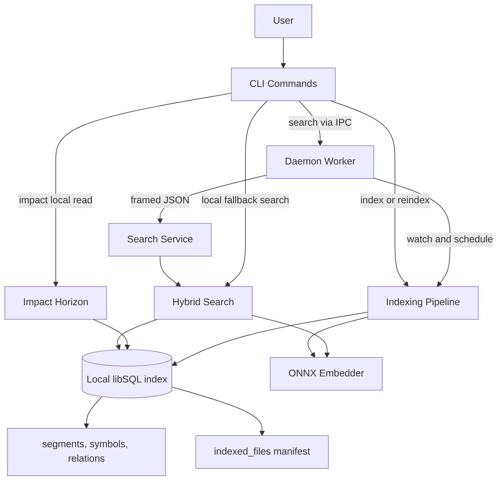

# 1up — Architecture

## Summary

1up keeps its layered two-process model: a short-lived CLI, an optional long-lived daemon for warm search, and a project-local libSQL index. The `impact` workflow remains a separate local-only read path for bounded advisory exploration. `segment_relations` persists raw, canonical, lookup-tail, qualifier-fingerprint, and normalized `edge_identity_kind` evidence, while `ImpactHorizonEngine` derives definition-side owner fingerprints, shortlists owner-aligned candidates before truncation, and requires corroborating structural signals before ambiguous or low-signal matches can reach primary `results`. The indexing path is tuned with connection-level PRAGMAs, an `indexed_files` manifest for metadata-based file skipping, and batched multi-value writes, all behind schema v11.

## Key Architecture Patterns

| Pattern | Meaning | Evidence |
|---|---|---|
| Layered two-process model | CLI and daemon share local state through the project index and status files, not in-process runtime state. | `src/cli/mod.rs`, `src/daemon/search_service.rs` |
| Staged single-writer indexing | Parse work can fan out, but persisted segment, symbol, vector, relation, and manifest mutations converge through batched multi-value INSERTs in the transactional file-batch seam. | `src/storage/segments.rs`, `src/storage/schema.rs` |
| Candidate-first retrieval | Search ranks lightweight vector, FTS, and exact-first symbol candidates before hydrating full segment data. | `src/search/hybrid.rs`, `src/storage/queries.rs` |
| Local-only advisory impact path | `1up impact` reads the current index directly and avoids daemon IPC so discovery behavior remains unchanged. | `src/cli/impact.rs`, `src/search/impact.rs` |
| Descriptor-backed relation resolution | Unresolved relation rows persist canonical, lookup-tail, qualifier, and edge-identity evidence at write time, then resolve bounded definition candidates through owner-aware shortlisting and corroboration gating only for active seeds. | `src/storage/relations.rs`, `src/search/impact.rs` |
| Trust-bucketed impact results | Confident relation-backed candidates stay in primary `results`; ambiguous, low-signal, same-file, and test-only observations move to `contextual_results` or explicit empty outcomes. | `src/search/impact.rs`, `src/cli/output.rs` |
| Additive search handoff | Search results expose optional `segment_id` values for exact impact follow-up without changing ranking. | `src/shared/types.rs`, `src/search/hybrid.rs`, `src/cli/output.rs` |
| Schema-gated local state | Schema v11 requires `indexed_files` table and lookup-target, qualifier, and `edge_identity_kind` columns on `segment_relations`; stale indexes fail closed with explicit reindex guidance. | `src/shared/constants.rs`, `src/storage/schema.rs` |
| Interactive guardrails | Benchmarks and black-box tests encode latency, contract, and rollout-gate expectations for the new workflow. | `benches/search_bench.rs`, `tests/integration_tests.rs`, `scripts/benchmark_parallel_indexing.sh`, `scripts/benchmark_vector_index_size.sh` |

## Layers

| Layer | Purpose | Key Components | Depends On |
|---|---|---|---|
| CLI | Parse commands, pick output mode, dispatch discovery or impact work. | `src/cli/mod.rs`, `src/cli/impact.rs`, `src/cli/output.rs` | Search, Storage, Daemon, Shared |
| Daemon | Keep indexes warm and serve bounded search IPC. | `src/daemon/search_service.rs`, `src/daemon/worker.rs`, `src/daemon/registry.rs` | Indexer, Search, Storage, Shared |
| Indexer | Scan, parse, embed, and persist repository state. | `src/indexer/pipeline.rs`, `src/indexer/parser.rs`, `src/indexer/embedder.rs` | Storage, Shared |
| Search | Execute hybrid retrieval, exact-first symbol lookup, and impact expansion. | `src/search/hybrid.rs`, `src/search/impact.rs`, `src/search/symbol.rs` | Storage, Shared |
| Storage | Own schema validation and local DB access for segments, symbols, and relations. | `src/storage/schema.rs`, `src/storage/segments.rs`, `src/storage/relations.rs`, `src/storage/queries.rs` | Shared |
| Shared | Define cross-layer constants, types, config, and errors. | `src/shared/types.rs`, `src/shared/constants.rs`, `src/shared/config.rs` | None |

## Main Flows

### Index Build

1. CLI or daemon resolves project-local DB/config paths and opens a tuned connection (`connect_tuned`) that applies WAL, synchronous=NORMAL, cache_size, mmap_size, and temp_store PRAGMAs.
2. Callers capture pre-pipeline setup timing (`SetupTimings`) for DB preparation and model loading so `total_ms` reflects end-to-end wall-clock time.
3. Indexer scans files, enriches them with filesystem metadata (size, mtime), and compares against the `indexed_files` manifest to skip metadata-unchanged files before content reads. Files that pass the metadata prefilter still go through content-hash comparison as the correctness backstop.
4. Storage writes segments, vectors, canonical symbols, relation descriptors, and `indexed_files` manifest rows through chunked multi-value INSERTs within the existing transactional seam.
5. Schema validation ensures later reads only proceed against schema v11 with the required `indexed_files` table and relation evidence columns.

### Daemon-Backed Refresh And Scope Fallback

1. Daemon worker opens tuned connections and tracks per-project `ProjectRunState` with `pending_fallback_reason` for scope promotions caused by ambiguous paths or unscoped errors.
2. When a scoped refresh promotes to full, the daemon records the promotion reason and passes it through to the pipeline as `daemon_fallback_reason`.
3. `IndexProgress` persists optional `scope` (requested vs executed scope, changed-path count, fallback reason) and `prefilter` (discovered, metadata-skipped, content-read, deleted) counters additively alongside existing fields.
4. Human, plain, and JSON formatters render the new scope and prefilter fields without breaking existing output contracts.

### Daemon-Backed Search

1. CLI sends a framed `SearchRequest` over the Unix socket when daemon search is available.
2. Daemon authorizes the peer, sanitizes the request, and enforces payload limits.
3. Hybrid search ranks vector, FTS, and exact-first symbol candidates.
4. Daemon returns ranked `SearchResult` values with optional `segment_id` and optional `daemon_version`.
5. CLI falls back to local execution on unavailable or rejected daemon requests.

### Impact Horizon Query

1. CLI requires exactly one anchor: file, symbol, or segment.
2. `impact` opens the current index read-only and requires schema compatibility.
3. Anchor resolution either yields bounded seed segments or a refusal envelope with hints.
4. Expansion traverses descriptor-backed `segment_relations`, fetches bounded definition candidates by `lookup_canonical_symbol`, derives definition-side owner fingerprints from path, breadcrumb, and enclosing symbols, and scores owner alignment, edge identity, scope/path affinity, and role evidence while keeping same-file plus test heuristics contextual.
5. Primary promotion only happens for confident non-ambiguous, non-`IMPORT`/`DOCS` matches with at least two corroborating structural signals; weak leaf-only or edge-mismatched relation evidence stays contextual or falls through to `empty` / `empty_scoped` without anchor echoes.
6. Formatter and rollout-evidence surfaces keep the existing envelope shape while rendering and validating primary versus contextual output separately.

### Search-to-Impact Handoff

1. Hybrid search hydrates indexed hits into `SearchResult` values.
2. Machine-readable output exposes optional `segment_id`.
3. Callers feed that handle into `1up impact --from-segment`.
4. Integration tests verify the round trip and confirm the original search top hits stay stable.

## Data And State

| Area | Location | Notes |
|---|---|---|
| Global runtime state | `dirs::data_dir()/1up` | Registry, PID/socket files, cache, models, update metadata. |
| Project-local state | `<project>/.1up/` | `project_id`, `index.db`, `index_status.json`, `daemon_status.json`. |
| Search persistence | `segments`, `segment_vectors`, `segment_symbols` | Discovery retrieval inputs. `segment_vectors.embedding_vec` is declared `FLOAT8(384)` (schema v12); the HNSW index `idx_segment_vectors_embedding` is created via `libsql_vector_idx(..., 'metric=cosine', 'compress_neighbors=float8')`. Writes go through the typed `vector8(?)` constructor so libSQL quantizes server-side. |
| File manifest | `indexed_files` | Stores per-file path, extension, content hash, size, and mtime for metadata-based unchanged-file prefiltering. |
| Impact persistence | `segment_relations` | Stores `raw_target_symbol`, `canonical_target_symbol`, `lookup_canonical_symbol`, `qualifier_fingerprint`, and `edge_identity_kind` for bounded outbound and inbound expansion. |
| End-to-end timing | `SetupTimings` -> `IndexStageTimings` | Callers pass pre-pipeline DB and model setup durations; pipeline tracks `input_prep_ms` and computes `total_ms` from the caller's wall-clock start. |
| Compatibility gate | `SCHEMA_VERSION = 12` | Validation requires `indexed_files` table, lookup-target, qualifier, and edge-identity columns, plus the `FLOAT8(384)` vector column and `compress_neighbors=float8` HNSW index; stale indexes require `1up reindex`. |

## Integrations

| Integration | Purpose | Notes |
|---|---|---|
| libSQL | Embedded local index storage | Search and impact read the same local DB. |
| ONNX Runtime | Local embedding inference | Search benefits from daemon warm reuse; impact does not depend on it. |
| tree-sitter | Structured parsing | Produces segment, symbol, and relation source metadata. |
| GitHub Actions / release-please | CI/CD and packaging | Preserved from prior architecture. |
| Homebrew / Scoop / GitHub Releases | Distribution | Self-update remains separate from impact work. |

## Deployment Model

- Deployment type: single-binary CLI with optional background daemon.
- Environment: local developer machines on macOS, Linux, and Windows.
- Installation: project init creates `<project>/.1up/`; daemon and self-update remain optional runtime capabilities.

## Diagram

## What Changed With Impact Horizon

- Added a separate local-only `impact` command path instead of extending daemon search.
- Upgraded `segment_relations` to schema v10 with lookup-tail, qualifier-fingerprint, and `edge_identity_kind` evidence for relation resolution.
- Added definition-side owner-fingerprint derivation, owner-aware target shortlisting, and corroboration gating before relation candidates reach primary results.
- Kept trust-bucketed impact envelopes with explicit `empty` and `empty_scoped` outcomes plus additive `contextual_results`.
- Added additive `segment_id` exposure on machine-readable search results for exact follow-up.
- Added dedicated trust and performance gate entry points through `just impact-eval` and `just impact-bench`.

## What Changed With Faster Indexing

- Tuned project-local libSQL connections with WAL, synchronous=NORMAL, cache_size, mmap_size, and temp_store PRAGMAs via `connect_tuned`.
- Added `indexed_files` manifest table (schema v11) for metadata-based unchanged-file prefiltering before content reads.
- Batched segment, symbol, relation, and vector writes into chunked multi-value INSERTs within the existing transactional seam.
- Added `SetupTimings`, `IndexScopeInfo`, and `IndexPrefilterInfo` structs for end-to-end timing and scope/prefilter visibility in status output.
- Daemon worker tracks scope promotion reasons (`ambiguous_paths`, `has_unscoped_error`) via `pending_fallback_reason` on `ProjectRunState`.
- Benchmark script expanded to cover daemon refresh wall-clock medians and scope evidence (fallback, scoped, full counts) in summary JSON.
- Added release profile with LTO, single codegen unit, and symbol stripping.

## What Changed With Shrunk Vector Index

- Switched `segment_vectors.embedding_vec` from `FLOAT32(384)` to `FLOAT8(384)` and enabled `'compress_neighbors=float8'` on the `idx_segment_vectors_embedding` HNSW index, both declared in `src/storage/queries.rs`.
- Bumped `SCHEMA_VERSION` 11 -> 12 (`src/shared/constants.rs`) so existing indexes fail closed with the standard reindex hint instead of silently reading a format-mismatched column.
- Switched the write and query SQL sites (`UPSERT_SEGMENT_VECTOR`, `SELECT_VECTOR_CANDIDATES`, and the chunked multi-value INSERT in `segments::batch_upsert_vectors`) from `vector(?)` to the typed `vector8(?)` constructor because libSQL rejects element-type mismatches at insert time ("vector type differs from column type"). Embedder output, batching, and call-site Rust remain unchanged; libSQL quantizes server-side.
- Measured on the 1up repo: `index.db` 281 MB -> ~94.9 MB (~3x shrink) and cold indexing ~81 s -> ~37 s. Recall envelope is pinned by a deterministic harness (`evals/suites/1up-search/recall.ts`, `just eval-recall`) against REQ-002's 2 pt gate; v11 baseline is recall@10 = 0.889, recall@20 = 0.978.
- Added `scripts/benchmark_vector_index_size.sh` plus `scripts/baselines/vector_index_size_baseline.json` as a REQ-001/REQ-003/REQ-005 gate that reports `db_size_bytes`, `indexing_ms`, and `schema_version` after a fresh reindex.
