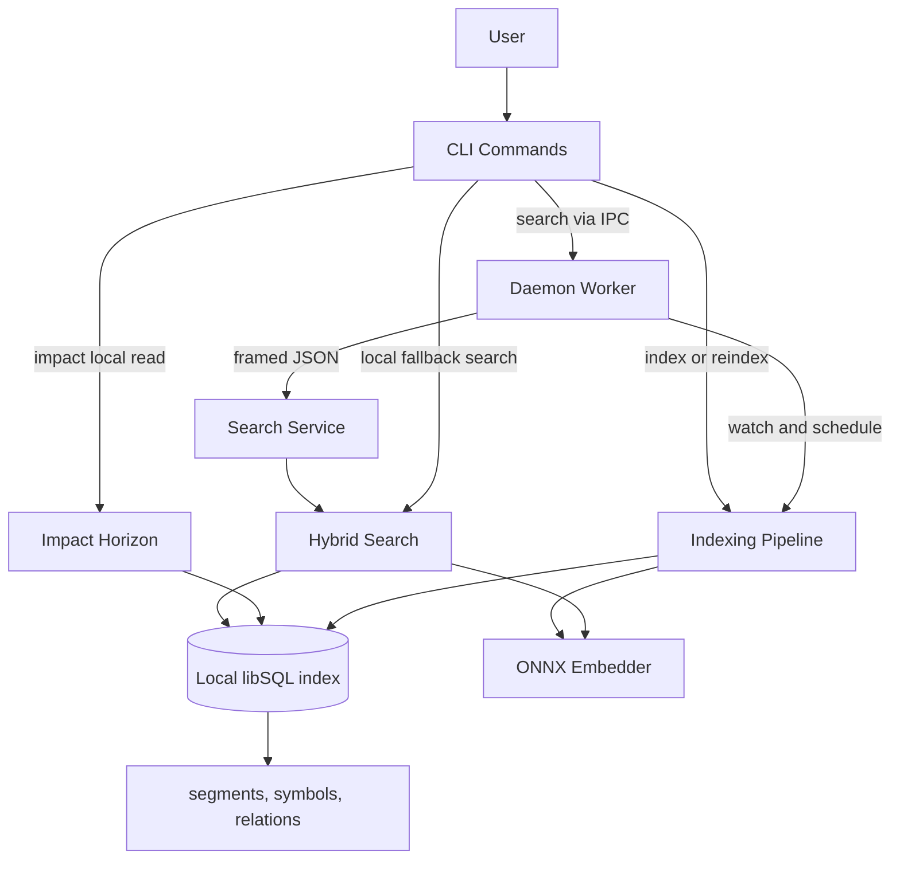

# 1up — Architecture

## Summary

1up keeps its layered two-process model: a short-lived CLI, an optional long-lived daemon for warm search, and a project-local libSQL index. The `impact-horizon` feature adds a separate local-only read path for bounded advisory impact exploration, relation-backed storage, a primary-versus-contextual trust split, explicit empty outcomes, and an additive `search -> segment_id -> impact` handoff.

## Key Architecture Patterns

| Pattern | Meaning | Evidence |
|---|---|---|
| Layered two-process model | CLI and daemon share local state through the project index and status files, not in-process runtime state. | `src/cli/mod.rs`, `src/daemon/search_service.rs` |
| Staged single-writer indexing | Parse work can fan out, but persisted segment, symbol, vector, and relation mutations converge through transactional storage helpers. | `src/storage/segments.rs`, `src/storage/schema.rs` |
| Candidate-first retrieval | Search ranks lightweight vector, FTS, and exact-first symbol candidates before hydrating full segment data. | `src/search/hybrid.rs`, `src/storage/queries.rs` |
| Local-only advisory impact path | `1up impact` reads the current index directly and avoids daemon IPC so discovery behavior remains unchanged. | `src/cli/impact.rs`, `src/search/impact.rs` |
| Relation-backed expansion | Unresolved relation rows are persisted at write time and resolved against current definitions only for bounded seed sets. | `src/storage/relations.rs`, `src/search/impact.rs` |
| Trust-bucketed impact results | Relation-backed candidates stay in primary `results`; same-file and test-only observations move to `contextual_results`. | `src/search/impact.rs`, `src/cli/output.rs` |
| Additive search handoff | Search results expose optional `segment_id` values for exact impact follow-up without changing ranking. | `src/shared/types.rs`, `src/search/hybrid.rs`, `src/cli/output.rs` |
| Schema-gated local state | Schema v8 requires `segment_relations` and fails stale indexes closed with explicit reindex guidance. | `src/shared/constants.rs`, `src/storage/schema.rs` |
| Interactive guardrails | Benchmarks, black-box tests, and trust/perf scripts encode latency, contract, and rollout-gate expectations for the new workflow. | `benches/search_bench.rs`, `tests/integration_tests.rs`, `scripts/evaluate_impact_trust.sh`, `scripts/benchmark_impact.sh` |

## Layers

| Layer | Purpose | Key Components | Depends On |
|---|---|---|---|
| CLI | Parse commands, pick output mode, dispatch discovery or impact work. | `src/cli/mod.rs`, `src/cli/impact.rs`, `src/cli/output.rs` | Search, Storage, Daemon, Shared |
| Daemon | Keep indexes warm and serve bounded search IPC. | `src/daemon/search_service.rs`, `src/daemon/worker.rs`, `src/daemon/registry.rs` | Indexer, Search, Storage, Shared |
| Indexer | Scan, parse, embed, and persist repository state. | `src/indexer/pipeline.rs`, `src/indexer/parser.rs`, `src/indexer/embedder.rs` | Storage, Shared |
| Search | Execute hybrid retrieval, exact-first symbol lookup, and impact expansion. | `src/search/hybrid.rs`, `src/search/impact.rs`, `src/search/symbol.rs` | Storage, Shared |
| Storage | Own schema validation and local DB access for segments, symbols, and relations. | `src/storage/schema.rs`, `src/storage/segments.rs`, `src/storage/relations.rs`, `src/storage/queries.rs` | Shared |
| Shared | Define cross-layer constants, types, config, and errors. | `src/shared/types.rs`, `src/shared/constants.rs`, `src/shared/config.rs` | None |

## Main Flows

### Index Build

1. CLI or daemon resolves project-local DB/config paths.
2. Indexer scans files and parses them into segments.
3. Storage writes segments, vectors, canonical symbols, and unresolved relation rows.
4. Schema validation ensures later reads only proceed against schema v8.

### Daemon-Backed Search

1. CLI sends a framed `SearchRequest` over the Unix socket when daemon search is available.
2. Daemon authorizes the peer, sanitizes the request, and enforces payload limits.
3. Hybrid search ranks vector, FTS, and exact-first symbol candidates.
4. Daemon returns ranked `SearchResult` values with optional `segment_id` and optional `daemon_version`.
5. CLI falls back to local execution on unavailable or rejected daemon requests.

### Impact Horizon Query

1. CLI requires exactly one anchor: file, symbol, or segment.
2. `impact` opens the current index read-only and requires schema compatibility.
3. Anchor resolution either yields bounded seed segments or a refusal envelope with hints.
4. Expansion traverses `segment_relations` plus same-file and test heuristics, then separates observations into primary likely impact and contextual guidance buckets.
5. Outcome selection returns `expanded`, `expanded_scoped`, `empty`, `empty_scoped`, or `refused`, and empty outcomes do not echo the anchor as a synthetic result.
6. Formatter and rollout-evidence surfaces render and validate primary versus contextual output separately.

### Search-to-Impact Handoff

1. Hybrid search hydrates indexed hits into `SearchResult` values.
2. Machine-readable output exposes optional `segment_id`.
3. Callers feed that handle into `1up impact --from-segment`.
4. Integration tests verify the round trip and confirm the original search top hits stay stable.

## Data And State

| Area | Location | Notes |
|---|---|---|
| Global runtime state | `dirs::data_dir()/1up` | Registry, PID/socket files, cache, models, update metadata. |
| Project-local state | `<project>/.1up/` | `project_id`, `index.db`, `index_status.json`, `daemon_status.json`. |
| Search persistence | `segments`, `segment_vectors`, `segment_symbols` | Discovery retrieval inputs. |
| Impact persistence | `segment_relations` | Unresolved call/reference rows resolved at query time for bounded seeds. |
| Compatibility gate | `SCHEMA_VERSION = 8` | Stale indexes require `1up reindex`. |

## Integrations

| Integration | Purpose | Notes |
|---|---|---|
| libSQL | Embedded local index storage | Search and impact read the same local DB. |
| ONNX Runtime | Local embedding inference | Search benefits from daemon warm reuse; impact does not depend on it. |
| tree-sitter | Structured parsing | Produces segment, symbol, and relation source metadata. |
| GitHub Actions / release-please | CI/CD and packaging | Preserved from prior architecture. |
| Homebrew / Scoop / GitHub Releases | Distribution | Self-update remains separate from impact work. |

## Deployment Model

- Deployment type: single-binary CLI with optional background daemon.
- Environment: local developer machines on macOS, Linux, and Windows.
- Installation: project init creates `<project>/.1up/`; daemon and self-update remain optional runtime capabilities.

## Diagram

## What Changed With Impact Horizon

- Added a separate local-only `impact` command path instead of extending daemon search.
- Added `segment_relations` and schema v8 to support bounded relation-backed expansion.
- Added trust-bucketed impact envelopes with explicit `empty` and `empty_scoped` outcomes plus additive `contextual_results`.
- Added additive `segment_id` exposure on machine-readable search results for exact follow-up.
- Added dedicated trust and performance gate entry points through `just impact-eval` and `just impact-bench`.
