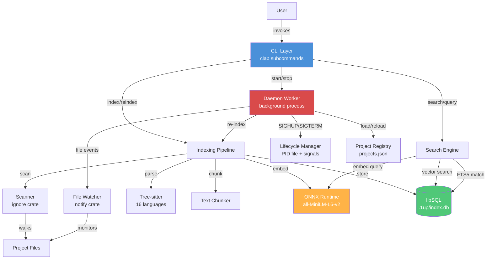

# System Architecture

**Project**: 1up
**Architecture Pattern**: Layered + Two-Process Model
**Last Updated**: 2026-04-03

## High-Level Architecture



## Architectural Patterns

### Two-Process Model
CLI process (per-invocation) and detached daemon worker (background) share no runtime state. Communication is exclusively through the libSQL database, PID file, project registry (JSON), and Unix signals (SIGHUP/SIGTERM).

### Layered Architecture
Clear separation: CLI (presentation) -> Indexer/Search (processing) -> Storage (persistence), with daemon as a parallel entry point into the same pipeline.

### Incremental Processing
SHA-256 file hashing in pipeline; skip if hash unchanged; deleted file detection via set difference.

### Graceful Degradation
Embedder is `Optional<&mut Embedder>`; missing model degrades to FTS-only; `SqlVectorV2` falls back to `FtsOnly` on failure.

### Schema-Gated Access
`schema::ensure_current()` validates version + required objects before any read/write; stale schemas require explicit `1up reindex`.

## Layer Details

| Layer | Purpose | Key Files |
|-------|---------|-----------|
| CLI | User-facing command parsing and output formatting | `src/main.rs`, `src/cli/` |
| Daemon | Background file watching, registry management, auto re-indexing | `src/daemon/` |
| Indexer | File scanning, parsing, chunking, embedding, pipeline orchestration | `src/indexer/` |
| Search | Query execution, intent detection, RRF fusion, result ranking | `src/search/` |
| Storage | Database lifecycle, schema management, segment CRUD, queries | `src/storage/` |
| Shared | Cross-cutting: config paths, constants, error types, data types | `src/shared/` |

## Data Flows

### Indexing Pipeline
```
Scanner walks directory (ignore crate, .gitignore-aware)
  -> For each file: read content, compute SHA-256 hash, skip if unchanged
  -> Route to tree-sitter parser (structural) or text chunker by extension
  -> Optionally generate 384-dim embeddings via ONNX
  -> Store segments in libSQL via INSERT OR REPLACE in transaction
```

### Search Query
```
Parse query text -> detect intent (DEFINITION, FLOW, USAGE, DOCS, GENERAL)
  -> Lookup symbol candidates (definitions/usages)
  -> Generate query embedding if ONNX model available
  -> Select retrieval backend: SqlVectorV2 (vector) or FtsOnly (full-text)
  -> RRF fusion with intent-based boosting, dedup, per-file caps, penalties
```

### Daemon File Watch Loop
```
Worker loads project registry, watches directories via notify crate
  -> tokio::select! multiplexes: SIGHUP (reload), SIGTERM (shutdown), timer (drain events)
  -> On file change: filter paths, identify owning project, run indexing pipeline
  -> On SIGHUP: reload registry, add/remove watched directories
  -> On SIGTERM: unwatch all, clean up PID file, exit
```

### Daemon Lifecycle
```
CLI `start` or auto-start registers project in projects.json
  -> Spawns detached `1up __worker` child process (setsid for session leader)
  -> Worker writes PID file, enters event loop
  -> CLI `stop` deregisters project; sends SIGTERM if no projects remain, SIGHUP otherwise
  -> Stale PID files detected and cleaned on next startup
```

## Integration Points

| Integration | Purpose | Type |
|-------------|---------|------|
| libSQL (Turso) | Segment storage, FTS5 search, native vector search | Embedded database |
| ONNX Runtime (ort) | Local ML inference for 384-dim sentence embeddings | Embedded inference |
| Tree-sitter | Multi-language AST parsing (16 language grammars compiled in) | Compiled-in library |

## State Management

- **PID file**: `~/.local/share/1up/daemon.pid`
- **Project registry**: `~/.local/share/1up/projects.json`
- **Per-project DB**: `<project>/.1up/index.db`
- **Model cache**: `~/.local/share/1up/models/`

## Deployment

- **Type**: Single binary CLI
- **Environment**: Local developer machine (macOS/Linux)
- **Distribution**: `cargo build --release`, installed to `~/.local/bin/1up` with codesign on macOS
- **Installation**: `just install` (builds release, copies to `~/.local/bin`, codesigns)
