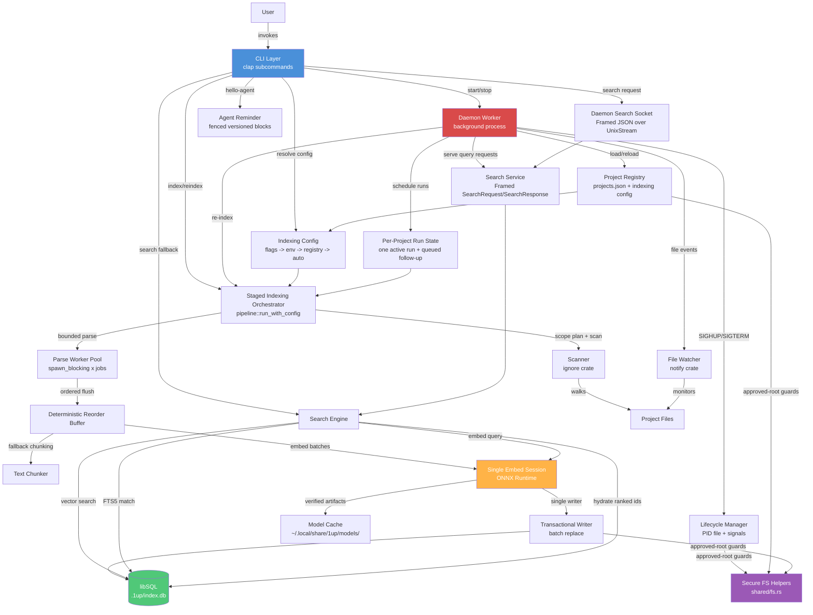

# System Architecture

**Project**: 1up
**Architecture Pattern**: Layered + Two-Process Model
**Last Updated**: 2026-04-10

## High-Level Architecture



CLI and daemon runs converge on the same `IndexingConfig` resolution path before entering the
indexing pipeline. Search now has two entry points: the CLI can search locally, or it can send a
framed JSON request to the daemon over a Unix domain socket so repeated searches reuse the
daemon's warm embedding runtime. The daemon only serves same-UID peers, bounds frame sizes and
per-frame deadlines, and sheds excess load with safe fallback responses. Only file-local parse
work fans out; embeddings stay in one ONNX session and all database mutation flows through a
single transactional writer so replacement semantics remain deterministic.

## Architectural Patterns

### Two-Process Model
Short-lived CLI commands and a long-lived daemon worker share no in-process state. Communication is exclusively through the libSQL database, PID file, project registry (JSON), Unix domain socket IPC, and Unix signals (SIGHUP/SIGTERM).

### Layered Architecture
Presentation (CLI), processing (Indexer/Search), persistence (Storage), and cross-cutting concerns (Shared) form distinct layers with one-directional dependencies. Daemon acts as a parallel entry point into the same pipeline.

### Staged Single-Writer Pipeline
Indexing is split into scan, delete cleanup, bounded parse, embed, and write phases. Parse workers run concurrently, but completed files are reordered by sequence ID before any storage mutation so one writer owns all segment replacement work. Write batch size is configurable via `write_batch_files` to tune transaction granularity.

### Scoped Incremental Scheduling
Daemon watcher events accumulate into `RunScope::Paths` so follow-up runs scan only changed files and known deletions. When a changed path can alter ignore semantics or cannot be reconciled precisely, the pipeline falls back to a full scan. `ProjectRunState` collapses change bursts via `mark_dirty` + `pending_scope` merge, ensuring at most one active run and one queued follow-up per project.

### Incremental Processing
SHA-256 file hashing in pipeline; skip if hash unchanged; deleted file detection via set difference.

### Exact-First Symbol Index
Parsed definition and usage symbols are persisted into `segment_symbols` with normalized `canonical_symbol` values. Search checks exact canonical matches first, then widens into prefix/contains candidate loads and fuzzy matching only when needed.

### Candidate-First Search Hydration
Search ranks lightweight candidate IDs across three retrieval channels (vector, FTS, symbol) before hydrating only the top-ranked segments, avoiding expensive full-row reads for discarded results.

### Warm Search Runtime Reuse
The daemon maintains a per-project `EmbeddingRuntime` that stays warm across indexing and search requests. `EmbeddingLoadStatus::Warm` indicates the ONNX session was reused without rebuilding when model fingerprint and thread count are unchanged.

### Graceful Degradation
Every optional component (embeddings, daemon socket, model download) has a defined fallback path so the system continues operating at reduced capability rather than failing. Embedding failures degrade to FTS-only; daemon unavailability triggers local search.

### Schema-Gated Access
`schema::ensure_current()` validates version + required objects (15 tables, indexes, triggers, and the `embedding_vec` column) before any read/write; stale schemas require explicit `1up reindex`. `check_embedding_model_compatible` validates model provenance before mixing embeddings.

### Shared Config Resolution
Indexing settings (jobs, embed_threads, write_batch_files) resolve in one chain: CLI flags -> environment variables -> persisted registry config -> automatic defaults. Manual and daemon-triggered runs share the same concurrency model.

### Transient Failure Retry
Database lock contention is handled with bounded retries (10 attempts, 50ms delay) rather than failing immediately, supporting concurrent CLI and daemon access to the same database.

### Approved-Root Filesystem Guards
`shared/fs.rs` implements secure filesystem operations: all operations reject symlink components, enforce root clamping, and set owner-only permissions (0o700 dirs, 0o600 files/sockets). This prevents symlink-escape and TOCTOU attacks on daemon state.

### Framed IPC with Load Shedding
Daemon search uses length-prefixed JSON over a same-UID-authenticated Unix socket with bounded sizes (16 KiB request, 4 KiB query, 2 MiB response), 250ms deadlines, and semaphore-based load shedding (8 concurrent slots).

### Platform-Conditional Compilation
`daemon/mod.rs` uses `#[cfg(unix)]` and `#[cfg(not(unix))]` to swap between full implementations and stub modules that return unsupported-platform errors. ONNX Runtime links statically on Unix and loads dynamically on Windows.

### Fenced Agent Reminders
`shared/reminder.rs` manages versioned fence markers in AGENTS.md and CLAUDE.md files. The `hello_agent` CLI subcommand outputs a condensed agent instruction compiled from `src/reminder.md`. `apply_fence` handles create, update, and idempotent no-op cases.

### Evidence-Based Release Pipeline
Releases follow an evidence-accumulation pipeline: CI merge gates -> release-please versioning -> cross-platform build (5 targets) -> draft release -> package publication (Homebrew/Scoop) -> release evidence bundle with security, archive verification, eval, and benchmark attestations.

## Layer Details

| Layer | Purpose | Key Files |
|-------|---------|-----------|
| CLI | User-facing command parsing, output formatting, and agent reminder management | `src/main.rs`, `src/cli/` |
| Daemon | Background file watching, framed search IPC, registry management, auto re-indexing | `src/daemon/` |
| Indexer | File scanning, parsing, chunking, embedding, pipeline orchestration | `src/indexer/` |
| Search | Query execution, intent detection, RRF fusion, result ranking | `src/search/` |
| Storage | Database lifecycle, schema management, segment CRUD, queries | `src/storage/` |
| Shared | Cross-cutting: config paths, secure filesystem helpers, constants, error types, data types, agent reminders | `src/shared/` |

## Data Flows

### Indexing Pipeline
```
Resolve indexing config (CLI flags -> env vars -> registry -> auto defaults)
  -> Resolve scope: full scan or changed-path follow-up
  -> For scoped runs, scan only requested paths plus indexed deletions; fall back to a full scan if ignore semantics changed
  -> Initialize progress snapshot
  -> Delete segments for removed files before new work begins
  -> Dispatch changed files to bounded spawn_blocking parse pool with sequence IDs
  -> Reorder completed parse results to preserve deterministic file ordering
  -> Generate embeddings in batches through one ONNX session when available
  -> Replace file segments through single-writer transactional batch helpers (write_batch_files adapts to run size)
  -> Persist final progress with work counters, parallelism, and stage timings to .1up/index_status.json
```

### Search Query
```
CLI canonicalizes --path and auto-starts the daemon when the project is already initialized
  -> Send one length-prefixed JSON SearchRequest frame over ~/.local/share/1up/daemon.sock (250ms client timeout)
  -> Daemon accepts only same-UID peers; unreadable or mismatched peer credentials get SearchResponse::Unavailable
  -> Daemon enforces a 16 KiB request cap, 4 KiB query cap, 2 MiB response cap, and 250ms read/write deadlines
  -> Requests enter an 8-slot semaphore-backed queue; saturation returns SearchResponse::Unavailable { reason: "daemon busy" }
  -> Daemon validates registry entry + schema, then reuses or loads a warm EmbeddingRuntime
  -> Detect intent (DEFINITION, FLOW, USAGE, DOCS, GENERAL)
  -> Build symbol variants and run exact-first canonical symbol lookup
  -> Fetch vector and FTS candidate rows concurrently when embeddings are available
  -> Rank candidate IDs with RRF + intent/query/path/content boosts + per-file caps
  -> Hydrate only the final ranked segment IDs from storage
  -> Return SearchResponse::Results; CLI falls back to the same local search stack if daemon search is unavailable, busy, rejected, or timed out
```

### Daemon File Watch Loop
```
Worker loads project registry and persisted indexing settings, binds search socket, then watches directories
  -> tokio::select! multiplexes: search connections, queued search requests, SIGHUP (reload), SIGTERM (shutdown), timer (drain events)
  -> Drain + filter changed paths and mark each owning project dirty with RunScope::Paths
  -> Ambiguous or unscoped watcher events escalate that project to RunScope::Full
  -> If project idle: start one indexing run with resolved config and current scope
  -> If changes arrive during a run: accumulate them and queue one follow-up pass
  -> After each run: rerun once if still dirty, otherwise return to idle
  -> On SIGHUP: reload registry, add/remove watchers, refresh indexing settings
  -> On SIGTERM: unwatch all, clean up PID file and socket, exit
```

### Daemon Lifecycle
```
CLI start or auto-start validates approved roots, then registers the project in projects.json with optional indexing settings
  -> If worker already runs: send SIGHUP so it reloads project list and settings
  -> Else spawn detached 1up __worker child process (setsid for session leader)
  -> Worker writes daemon.pid under the secure XDG root, binds daemon.sock with owner-only permissions, and enters the event loop
  -> CLI stop deregisters project; sends SIGTERM if no projects remain, SIGHUP otherwise
  -> Stale PID files and stale sockets are cleaned only when the expected file type exists under the approved root
```

### Model Artifact Lifecycle
```
Download to .staging/<artifact_id>/ directory
  -> Verify SHA-256 digests against pinned constants for each artifact file
  -> Write VerifiedArtifactManifest to verified/<artifact_id>/manifest.json
  -> Move verified files from staging to verified/<artifact_id>/
  -> Atomically update current.json (ActiveArtifactPointer) to reference new artifact_id
  -> EmbeddingRuntime loads from verified path, caches by compatibility key
```

### Release Pipeline
```
Conventional-commit PR titles enforced by pr-title.yml
  -> CI merge gates: security-check (cargo-audit), release-smoke on macOS/Linux/Windows, release-consistency
  -> release-please creates/maintains rolling release PR with version bump and changelog
  -> On release PR merge: build 5 targets, generate SHA256SUMS and release-manifest.json, create draft GitHub release
  -> On release publish: render and push Homebrew formula and Scoop manifest to tap/bucket repos
  -> release-evidence.yml verifies archives on native runners, assembles release-evidence.json bundle
```

## Integration Points

| Integration | Purpose | Type |
|-------------|---------|------|
| libSQL (Turso) | Segment storage, FTS5 search, native vector search with 384-dim embeddings | Embedded database |
| ONNX Runtime (ort) | Local ML inference for 384-dim sentence embeddings (all-MiniLM-L6-v2) with verified artifact activation | Embedded inference |
| Tree-sitter | Multi-language AST parsing (16 language grammars compiled in) | Compiled-in library |
| GitHub Actions CI/CD | Merge gates, release automation, cross-platform builds, evidence generation, package publication | Workflow automation |
| Homebrew / Scoop | Package manager distribution channels for macOS/Linux and Windows | Package distribution |
| release-please | Automated semantic versioning and changelog from conventional commits | Release automation |
| promptfoo | Search quality evaluation framework with TypeScript assertion suites | Dev tooling |
| cargo-audit | Supply chain security scanning with repo-local advisory policy | Security tooling |
| hyperfine | Parallel indexing performance benchmarking | Dev tooling |

## State Management

- **Secure roots**: `~/.local/share/1up/` and each `<project>/.1up/` directory are created with
  owner-only `0700` permissions by shared filesystem helpers before any state mutation.
- **PID file**: `~/.local/share/1up/daemon.pid` is written with atomic replace and `0600`
  permissions.
- **Daemon search socket**: `~/.local/share/1up/daemon.sock` is bound with `0600` permissions and
  cleaned up only if the path resolves to a socket under the approved root.
- **Project registry**: `~/.local/share/1up/projects.json` stores canonicalized project roots and
  optional per-project `IndexingConfig`; writes reject symlinked and outside-root paths.
- **Per-project state**: `<project>/.1up/project_id`, `<project>/.1up/index.db`, and
  `<project>/.1up/index_status.json` stay inside the canonical project root and inherit the same
  approved-root checks.
- **Model cache**: `~/.local/share/1up/models/all-MiniLM-L6-v2/` contains `current.json`, a
  `.download_failed` retry marker, `verified/<artifact-id>/` directories with `manifest.json`,
  `model.onnx`, and `tokenizer.json`, plus a transient `.staging/<artifact-id>/` tree used before
  activation.
- **In-memory daemon state**: per-project `ProjectRunState` (`running`, `dirty`, `pending_scope`)
  plus a warm `EmbeddingRuntime`

## Deployment

- **Type**: Single binary CLI with background daemon
- **Environment**: Local developer machine (macOS, Linux, Windows)
- **Distribution**: GitHub Releases with semantic versioning; Homebrew tap (`rp1-run/homebrew-tap`); Scoop bucket (`rp1-run/scoop-bucket`); 5 target triples: x86_64-apple-darwin, aarch64-apple-darwin, x86_64-unknown-linux-gnu, aarch64-unknown-linux-gnu, x86_64-pc-windows-msvc
- **Installation**: `brew install rp1-run/tap/1up` | `scoop install 1up` | GitHub Releases | `just install` (local dev build with codesign on macOS)
- **License**: Apache-2.0
