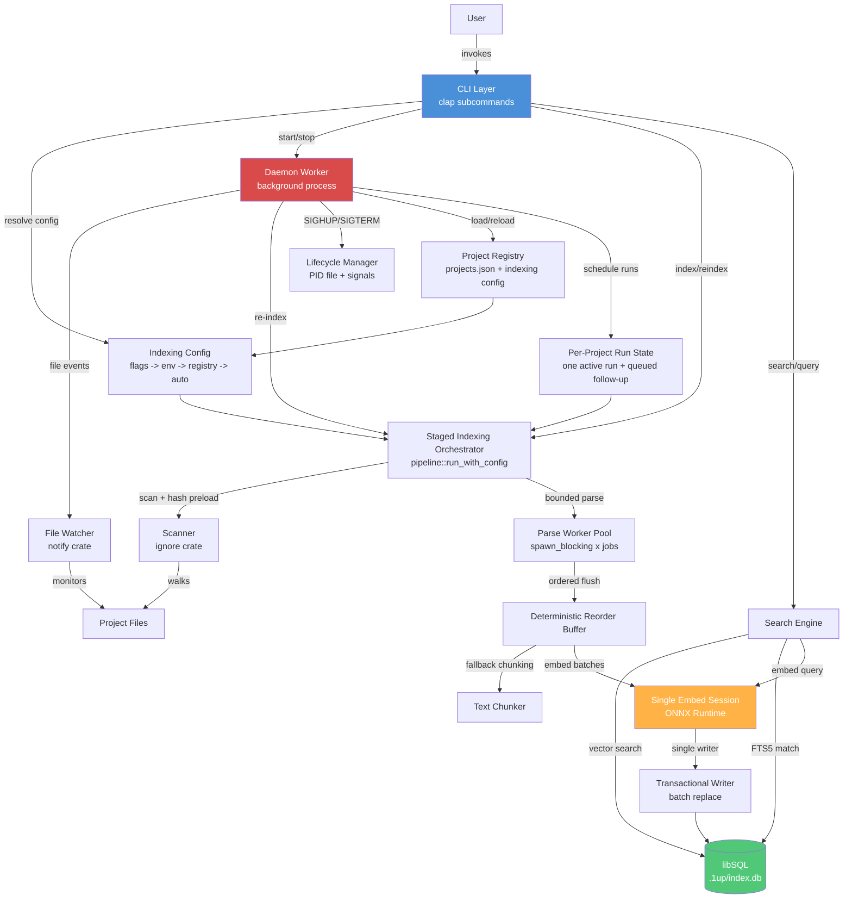

# System Architecture

**Project**: 1up
**Architecture Pattern**: Layered + Two-Process Model
**Last Updated**: 2026-04-04

## High-Level Architecture



CLI and daemon runs converge on the same `IndexingConfig` resolution path before entering `pipeline::run_with_config`. Only file-local parse work fans out; embeddings stay in one ONNX session and all database mutation flows through a single transactional writer so replacement semantics remain deterministic.

## Architectural Patterns

### Two-Process Model
CLI process (per-invocation) and detached daemon worker (background) share no runtime state. Communication is exclusively through the libSQL database, PID file, project registry (JSON), and Unix signals (SIGHUP/SIGTERM).

### Layered Architecture
Clear separation: CLI (presentation) -> Indexer/Search (processing) -> Storage (persistence), with daemon as a parallel entry point into the same pipeline.

### Staged Single-Writer Pipeline
Indexing is split into scan, delete cleanup, bounded parse, embed, and write phases. Parse workers run concurrently, but completed files are reordered by sequence ID before any storage mutation so one writer owns all segment replacement work. Write batch size is configurable via `write_batch_files` to tune transaction granularity.

### Incremental Processing
SHA-256 file hashing in pipeline; skip if hash unchanged; deleted file detection via set difference.

### Graceful Degradation
Embedder is `Optional<&mut Embedder>`; missing model degrades to FTS-only; `SqlVectorV2` falls back to `FtsOnly` on failure.

### Schema-Gated Access
`schema::ensure_current()` validates version + required objects before any read/write; stale schemas require explicit `1up reindex`.

### Shared Config Resolution
Indexing settings (jobs, embed_threads, write_batch_files) resolve in one chain: CLI flags -> environment variables (`ONEUP_INDEX_JOBS`, `ONEUP_EMBED_THREADS`, `ONEUP_INDEX_WRITE_BATCH_FILES`) -> persisted registry config -> automatic defaults. Manual and daemon-triggered runs share the same concurrency model.

### Transient Failure Retry
Database lock contention is handled with bounded retries (10 attempts, 50ms delay) rather than failing immediately, supporting concurrent CLI and daemon access to the same database.

## Layer Details

| Layer | Purpose | Key Files |
|-------|---------|-----------|
| CLI | User-facing command parsing and output formatting | `src/main.rs`, `src/cli/` |
| Daemon | Background file watching, registry management, auto re-indexing | `src/daemon/` |
| Indexer | File scanning, parsing, chunking, embedding, pipeline orchestration | `src/indexer/` |
| Search | Query execution, intent detection, RRF fusion, result ranking | `src/search/` |
| Storage | Database lifecycle, schema management, segment CRUD, queries | `src/storage/` |
| Shared | Cross-cutting: config paths, constants, error types, data types | `src/shared/` |

## Data Flows

### Indexing Pipeline
```
Resolve indexing config (CLI flags -> env vars -> registry -> auto defaults)
  -> Initialize progress snapshot
  -> Scan directory (ignore crate, .gitignore-aware) and preload stored file hashes
  -> Delete segments for removed files before new work begins
  -> Dispatch changed files to bounded spawn_blocking parse pool with sequence IDs
  -> Reorder completed parse results to preserve deterministic file ordering
  -> Generate embeddings in batches through one ONNX session when available
  -> Replace file segments through single-writer transactional batch helpers (write_batch_files controls batch size)
  -> Persist final progress with work counters, parallelism, and stage timings to .1up/index_status.json
```

### Search Query
```
Parse query text -> detect intent (DEFINITION, FLOW, USAGE, DOCS, GENERAL)
  -> Lookup symbol candidates (definitions/usages)
  -> Generate query embedding if ONNX model available
  -> Select retrieval backend: SqlVectorV2 (vector) or FtsOnly (full-text)
  -> RRF fusion with intent-based boosting, dedup, per-file caps, penalties
```

### Daemon File Watch Loop
```
Worker loads project registry and persisted indexing settings, then watches directories
  -> tokio::select! multiplexes: SIGHUP (reload), SIGTERM (shutdown), timer (drain events)
  -> Drain + filter changed paths and mark each owning project dirty
  -> If project idle: start one indexing run with resolved config
  -> If changes arrive during a run: accumulate them and queue one follow-up pass
  -> After each run: rerun once if still dirty, otherwise return to idle
  -> On SIGHUP: reload registry, add/remove watchers, refresh indexing settings
  -> On SIGTERM: unwatch all, clean up PID file, exit
```

### Daemon Lifecycle
```
CLI `start` or auto-start registers project in projects.json with optional indexing settings
  -> If worker already runs: send SIGHUP so it reloads project list and settings
  -> Else spawn detached `1up __worker` child process (setsid for session leader)
  -> Worker writes PID file, enters event loop
  -> CLI `stop` deregisters project; sends SIGTERM if no projects remain, SIGHUP otherwise
  -> Stale PID files detected and cleaned on next startup
```

## Integration Points

| Integration | Purpose | Type |
|-------------|---------|------|
| libSQL (Turso) | Segment storage, FTS5 search, native vector search with 384-dim embeddings | Embedded database |
| ONNX Runtime (ort) | Local ML inference for 384-dim sentence embeddings (all-MiniLM-L6-v2) | Embedded inference |
| Tree-sitter | Multi-language AST parsing (16 language grammars compiled in) | Compiled-in library |
| hyperfine | Parallel indexing performance benchmarking (serial vs auto vs constrained) | Dev tooling |

## State Management

- **PID file**: `~/.local/share/1up/daemon.pid`
- **Project registry**: `~/.local/share/1up/projects.json` (includes per-project IndexingConfig)
- **Per-project DB**: `<project>/.1up/index.db`
- **Index progress**: `<project>/.1up/index_status.json` (IndexProgress with parallelism + stage timings)
- **Model cache**: `~/.local/share/1up/models/`

## Deployment

- **Type**: Single binary CLI with background daemon
- **Environment**: Local developer machine (macOS/Linux)
- **Distribution**: `cargo build --release`, installed to `~/.local/bin/1up` with codesign on macOS
- **Installation**: `just install` (builds release, copies to `~/.local/bin`, codesigns)
- **Dev tooling**: `just bench-parallel` for performance benchmarking via hyperfine
