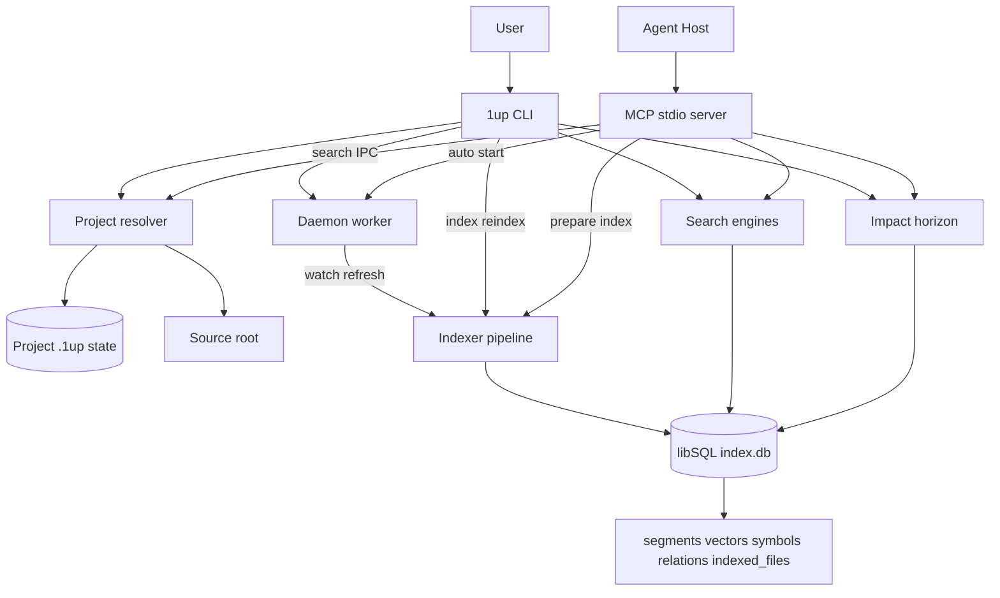

# 1up - Architecture

## Summary

1up is a local-first code discovery substrate distributed as a single Rust binary. The runtime is now a layered CLI + MCP + daemon system over project-local libSQL state: short-lived CLI commands handle direct user workflows, `1up mcp` exposes agent-facing stdio tools, and an optional background daemon keeps project indexes fresh and serves warm CLI search over a guarded Unix socket. Project identity and index state live under the resolved `.1up/` state root, while linked git worktrees can use a separate source root for scanning.

The search index remains schema-gated at v12: `segments`, `segment_vectors`, `segment_symbols`, `segment_relations`, `indexed_files`, FTS, and vector indexes must all match the current layout before reads proceed. Indexing fans out parse work but converges storage through transactional, batched writes. `segment_vectors.embedding_vec` uses `FLOAT8(384)` with `vector8(?)` writes and a compressed libSQL vector index; `indexed_files` enables metadata-based unchanged-file skipping before content reads. Impact remains a local read path over descriptor-backed relations rather than an extension of daemon IPC.

## Reconciliation Notes

| Prior claim | Status | Update |
|---|---|---|
| Layered two-process CLI + daemon model | refined | Still true for CLI search and refresh, but the architecture now has a first-class MCP stdio adapter for agent hosts. |
| Project-local libSQL state with schema v12 | confirmed | v12 validation still requires relation evidence columns, `indexed_files`, and `FLOAT8(384)` vector storage. |
| Faster indexing via tuned DB connections, manifest prefilter, and batched writes | confirmed | Current pipeline also records deleted-file cleanup and scoped fallback reasons in progress metadata. |
| Shrunk vector index | refined | Current baseline records `index.db` at 74,584,064 bytes (~71.1 MiB) for schema v12 with `max_neighbors=32`. |
| Release/distribution via GitHub releases and package channels | refined | Release evidence now treats MCP protocol smoke, package publication records, update manifests, and install-script behavior as release surfaces. |

## Key Architecture Patterns

| Pattern | Meaning | Evidence |
|---|---|---|
| Layered CLI + MCP + daemon | CLI commands, MCP tools, and daemon refresh/search are separate entry surfaces over shared project state and storage. | `src/cli/mod.rs`, `src/cli/mcp.rs`, `src/mcp/server.rs`, `src/daemon/worker.rs` |
| Agent-facing MCP adapter | `1up mcp --path` serves rmcp stdio tools with structured envelopes, summaries, payloads, and suggested next actions. | `src/mcp/tools.rs`, `src/mcp/ops.rs`, `src/mcp/types.rs` |
| Idempotent guarded startup | Daemon startup and MCP instances use owner-only state, lock files, registry reloads, and non-destructive contention handling. | `src/daemon/lifecycle.rs`, `src/cli/mcp.rs`, `src/daemon/registry.rs`, `src/shared/fs.rs` |
| Split state/source roots | Linked worktrees store `.1up/` state at the main worktree while scanning source from the active worktree. | `src/shared/project.rs`, `src/indexer/pipeline.rs` |
| Staged single-writer indexing | Parse work can run in parallel, but segment, symbol, relation, vector, and manifest writes flush through ordered transactional batches. | `src/indexer/pipeline.rs`, `src/storage/segments.rs` |
| Metadata-first incremental indexing | Full and scoped runs compare file size and mtime from `indexed_files` before content reads, with content hashes as the correctness backstop. | `src/indexer/pipeline.rs`, `src/storage/segments.rs`, `src/storage/queries.rs` |
| Candidate-first retrieval with degradation | Vector, FTS, and symbol paths rank candidates before hydration; daemon and MCP search fall back to FTS-only when embeddings are unavailable. | `src/daemon/worker.rs`, `src/mcp/ops.rs`, `src/search/hybrid.rs`, `src/storage/queries.rs` |
| Local-only advisory impact | CLI and MCP impact open the current index locally and traverse descriptor-backed relation evidence with trust-bucketed outputs. | `src/mcp/ops.rs`, `src/search/impact.rs`, `src/storage/relations.rs` |
| Schema-gated local state | Existing DBs fail closed unless schema objects, required columns, vector element type, and schema version match the current binary. | `src/storage/schema.rs`, `src/shared/constants.rs` |
| Evidence-driven release surface | CI, archive verification, MCP smoke, setup-script tests, package publication records, and update manifests form the release contract. | `.github/workflows/*.yml`, `scripts/release/*.sh`, `scripts/install/setup.sh` |

## Layers

| Layer | Purpose | Key Components | Depends On |
|---|---|---|---|
| CLI | Parse user commands, choose output contracts, dispatch index/search/status/update/MCP workflows. | `src/cli/mod.rs`, `src/main.rs` | Shared, Daemon, Indexer, Search, Storage, MCP |
| MCP | Expose code discovery tools to agent hosts over stdio with structured responses and next-action guidance. | `src/cli/mcp.rs`, `src/cli/add_mcp.rs`, `src/mcp/server.rs`, `src/mcp/tools.rs`, `src/mcp/ops.rs` | Shared, Indexer, Search, Storage, Daemon lifecycle |
| Daemon | Maintain watched project indexes and serve warm CLI search through bounded local IPC. | `src/daemon/worker.rs`, `src/daemon/lifecycle.rs`, `src/daemon/search_service.rs`, `src/daemon/watcher.rs`, `src/daemon/registry.rs` | Indexer, Search, Storage, Shared |
| Indexer | Scan, parse, chunk, embed, prefilter, and persist repository files. | `src/indexer/pipeline.rs`, `src/indexer/scanner.rs` | Storage, Shared, tree-sitter, ONNX embedder |
| Search | Execute hybrid search, symbol lookup, context reads, and impact expansion. | `src/search/*`, `src/mcp/ops.rs` | Storage, Shared, Embedder |
| Storage | Own libSQL connections, schema validation, SQL, segment writes, relation writes, and manifest state. | `src/storage/db.rs`, `src/storage/schema.rs`, `src/storage/queries.rs`, `src/storage/segments.rs`, `src/storage/relations.rs` | Shared |
| Shared | Define config paths, root resolution, secure filesystem helpers, constants, progress types, and update metadata. | `src/shared/config.rs`, `src/shared/project.rs`, `src/shared/fs.rs`, `src/shared/types.rs`, `src/shared/update.rs` | None |
| Release/Evidence | Build, package, verify, publish, and retain release proof. | `.github/workflows/*.yml`, `scripts/release/*.sh`, `scripts/security_check.sh`, `scripts/install/setup.sh`, `packaging/*` | GitHub Actions, package repos, release assets |

## Main Flows

### MCP Code Discovery

1. An agent host starts `1up mcp --path <repo>` directly or via `1up add-mcp` generated host configuration.
2. The CLI resolves `state_root` and `source_root`, takes a per-project MCP instance lock, auto-initializes only at an existing 1up project or git root, and best-effort starts the daemon for freshness.
3. `rmcp` serves canonical tools: `oneup_prepare`, `oneup_search`, `oneup_read`, `oneup_symbol`, and `oneup_impact`.
4. `oneup_prepare` classifies readiness and can explicitly index, reindex, or repair missing/degraded state through the same full-scope pipeline used by CLI indexing.
5. Search, symbol, read, and impact tools open the current index locally, enforce schema compatibility, and return a `ToolEnvelope` with `status`, `summary`, structured `data`, and `next_actions`.
6. `oneup_read` hydrates segment handles from the DB or reads precise file locations through project-root clamping, rejecting path traversal.

### CLI Daemon-Backed Search

1. CLI search resolves the project root and attempts a framed JSON request over the daemon Unix socket.
2. The daemon accepts only same-UID peers, clamps limits, rejects oversized payloads, and sheds excess concurrency with a safe busy response.
3. Registered projects reuse a warm `EmbeddingRuntime` when available; otherwise the daemon runs FTS-only search.
4. Results include ranked `SearchResult` values and optional `daemon_version`.
5. CLI falls back to local search when the daemon is unavailable, stale, or rejects the request.

### Index Build And Refresh

1. CLI, MCP prepare, or daemon refresh opens a tuned libSQL connection with WAL, synchronous=NORMAL, cache, mmap, and temp-store PRAGMAs.
2. The scanner applies gitignore/global-ignore/exclude rules, default build-artifact ignores, binary extension skips, and special extensionless file recognition.
3. Full runs load `indexed_files` and segment hashes, skip metadata-unchanged files, and detect deleted indexed paths.
4. Scoped runs scan only changed paths, but fall back to full when ignore semantics, directories, excluded files, or ambiguous/unscoped watcher events would make a scoped update unsafe.
5. Parse workers run concurrently, then ordered flushes build embeddings and persist file batches transactionally.
6. Storage replaces file segments, vectors, symbols, relation descriptors, and manifest entries together; empty file batches delete removed files and manifest rows.
7. Progress persists scope, prefilter, parallelism, timings, deleted-file counts, and embedding availability to `.1up/index_status.json`.

### Daemon Refresh

1. The daemon loads a locked global registry from the secure XDG data root, preserving project root, optional source root, and indexing config.
2. `notify` watches source roots recursively and filters generated, binary, dependency, `.1up`, and `.rp1` paths.
3. File changes queue scoped runs; ambiguous paths and unscoped watcher errors promote to full refresh with a fallback reason.
4. Dirty runs are serialized per daemon process, and change bursts during an active run collapse into one follow-up run.
5. Daemon heartbeat status is written to `.1up/daemon_status.json` for readiness and benchmark visibility.

### Impact Horizon

1. CLI or MCP impact accepts exactly one anchor: segment, symbol, or file/line.
2. The engine reads the current index directly and requires schema v12 compatibility.
3. Expansion traverses `segment_relations` using canonical target, lookup target, qualifier fingerprint, and edge identity evidence.
4. Confident structural matches become primary `results`; ambiguous, same-file, test-only, import/docs, or low-signal evidence remains contextual or yields explicit empty/refused envelopes.

### Release And Update

1. Release Please owns version/changelog PRs and tag creation.
2. `release-assets` validates release metadata, builds the target matrix, stages the Windows ONNX Runtime DLL, packages archives with LICENSE/README, uploads checksums, release manifest, notes, and `setup.sh`.
3. `release-evidence` verifies archives on the target matrix, runs MCP protocol smoke for each archive, retrieves merge/security evidence, optionally includes eval/benchmark/host-smoke assets, and uploads a consolidated evidence bundle.
4. `publish-packages` renders Homebrew and Scoop definitions, commits them to package repos, uploads a package publication record, and publishes `update-manifest.json` to `main`.
5. `scripts/install/setup.sh` installs from GitHub Releases with platform detection, optional SHA256 verification, atomic binary replacement, and managed PATH blocks.

## Data And State

| Area | Location | Notes |
|---|---|---|
| Global runtime state | `dirs::data_dir()/1up` | Daemon pid/socket, registry, model cache, update cache, startup/MCP locks. |
| Project registry | `dirs::data_dir()/1up/projects.json` | Locked, atomically replaced, owner-only; stores project id/root, optional source root, and persisted indexing config. |
| Project-local state | `<state_root>/.1up/` | `project_id`, `index.db`, `index_status.json`, `daemon_status.json`. |
| Source root | `<source_root>` | Files scanned/read; may differ from state root for git worktrees. |
| Search persistence | `segments`, `segment_vectors`, `segment_symbols`, `segments_fts` | `segment_vectors.embedding_vec` is `FLOAT8(384)`; vector SQL uses `vector8(?)`; FTS triggers mirror segment content. |
| Impact persistence | `segment_relations` | Stores raw/canonical/lookup targets, qualifier fingerprints, and edge identity kind for bounded expansion. |
| File manifest | `indexed_files` | Stores path, extension, content hash, file size, and mtime ns for prefiltering and deleted-file cleanup. |
| Model cache | `dirs::data_dir()/1up/models/all-MiniLM-L6-v2` | Verified/staging/current manifests plus failure marker for pinned ONNX/tokenizer artifacts. |
| Release manifests | GitHub release assets and repo `update-manifest.json` | Drive self-update, installer, package publication, and release evidence. |

## Integrations

| Integration | Purpose | Notes |
|---|---|---|
| libSQL | Embedded local index storage | Shared by CLI, MCP, daemon, search, impact, and indexing. |
| ONNX Runtime / Hugging Face artifacts | Local embedding inference | Non-Windows uses downloaded static runtime; Windows loads the DLL dynamically and release assets stage the DLL. |
| tree-sitter | Structured parsing | Produces segments, symbols, roles, and relation metadata. |
| rmcp | MCP stdio server | Exposes `oneup_*` tools and JSON schemas to agent hosts. |
| notify | File watching | Powers daemon scoped refresh and full fallback triggers. |
| GitHub Actions / Release Please / GitHub Releases | CI, versioning, artifact publishing, release evidence | Multi-workflow release pipeline with retained evidence. |
| Homebrew / Scoop / setup.sh / self-update | Distribution and upgrade channels | Package definitions and stable update manifest are rendered from the release manifest. |
| Promptfoo / Claude Agent SDK / Bun | Evals | Search and impact evals compare 1up MCP-assisted agents with baseline raw-search agents. |
| cargo-audit / shellcheck / hyperfine | Gates and evidence | Security, install-script, and performance evidence feed CI/release decisions. |

## Deployment Model

- Deployment type: single Rust binary named `1up`, with optional background daemon and optional MCP stdio server mode.
- Runtime environment: local developer machines on macOS, Linux, and Windows; daemon/Unix-socket paths are Unix-focused with platform stubs where daemon support is unavailable.
- Installation channels: GitHub release archives, `setup.sh`, Homebrew formula, Scoop manifest, and built-in self-update via `update-manifest.json`.
- Release matrix: `aarch64-apple-darwin`, `x86_64-unknown-linux-gnu`, `aarch64-unknown-linux-gnu`, and `x86_64-pc-windows-msvc`.
- Release gates: CI security check, release build smoke, release metadata validation, setup-script lint/integration, archive verification, MCP smoke, and optional eval/benchmark/host evidence.

## Diagram

## What Changed With MCP And Release Surface

- Added first-class MCP commands and modules: `add-mcp`, `mcp`, `src/mcp/server.rs`, `src/mcp/tools.rs`, `src/mcp/ops.rs`, and typed MCP schemas.
- MCP search/read/symbol/impact reuse local index/search/storage engines instead of adding a separate network service.
- MCP prepare can explicitly create or rebuild the local index, while readiness distinguishes missing, indexing, stale, degraded, and ready states.
- Release archive verification now performs JSON-RPC MCP smoke against every built archive and asserts canonical tools, structured content, readiness statuses, and clean stdout protocol.
- Release evidence now models live MCP host smoke as `mcp_host_smoke.v1`, with recorded or skipped evidence per host.
- The install and package surface is now part of the architecture: `setup.sh`, Homebrew, Scoop, release manifest, package publication record, and update manifest are all generated/validated flows.

## What Changed With Faster Indexing

- Tuned libSQL connections through `connect_tuned` and current schema preparation.
- Added metadata prefilter and deleted-file cleanup through `indexed_files`.
- Preserved correctness with content-hash checks after metadata prefiltering.
- Batches segment, vector, symbol, relation, and manifest writes inside transactional file-batch replacement.
- Progress now reports setup timings, input preparation, scope, prefilter, parallelism, and deleted-file counts.

## What Changed With Shrunk Vector Index

- `segment_vectors.embedding_vec` stores `FLOAT8(384)` vectors and uses `vector8(?)` at write/query sites.
- `idx_segment_vectors_embedding` uses compressed neighbors with `max_neighbors=32`.
- `SCHEMA_VERSION = 12` makes stale vector formats fail closed with `1up reindex` guidance.
- `VECTOR_PREFILTER_K = 400` widens the candidate pool to absorb quantization noise before reranking.
- The pinned size baseline records 74,584,064 byte `index.db` and schema v12 for the 1up repository.
