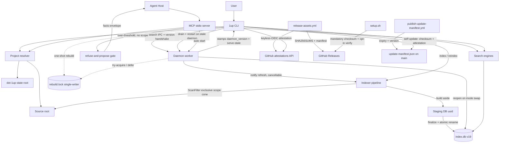

# System Architecture

1up is a local-first single Rust binary (`oneup` package, `1up` binary) with an optional background daemon and an MCP stdio mode, over a project-local libSQL index (`.1up/index.db`, schema v19). Since v0.1.13, large monorepos are indexed as **scoped directory cones** behind a refuse-and-propose gate.

## Architectural Patterns

- **Layered CLI + MCP + daemon over one local libSQL index** — three entry surfaces (short-lived CLI, `1up mcp` stdio tools, optional daemon) share the same storage/search/indexer engines and `.1up/` state.
- **Non-destructive build-aside rebuild + atomic swap** — `StagingRebuild` (`src/storage/swap.rs`) builds into a uuid-suffixed staging DB, finalizes (`wal_checkpoint(TRUNCATE)` → one file), then atomically renames over `index.db`. Readers see either the full prior or full new generation; an aborted rebuild leaves `index.db` intact.
- **Single-writer rebuild lock** — `RebuildLock` flocks `<state_root>/.1up/rebuild.lock`; one-shot rebuilds bounded-wait then fail closed (`RebuildLockContended`), the daemon try-acquires and defers; released on guard drop (incl. cancellation unwind).
- **Daemon version-handshake drain/restart** — `search_service` stamps `daemon_version`; `src/cli/search.rs` gates on `VERSION`, drains+restarts a stale daemon (SIGTERM+poll, `DAEMON_DRAIN_TIMEOUT_MS=3000`), falls back to local search.
- **Cooperative cancellation seam (daemon → indexer)** — one `CancellationToken` across passes; SIGTERM cancels and the in-flight sweep is resumed to a committed boundary, re-queued (stays dirty) rather than torn.
- **Long-lived handle adopts swapped index by inode** — the daemon records `(dev, ino)` and reopens before any pass/search when a swap installed a fresh inode.
- **Serve-stale during rebuild** — daemon results carry `STALE_REBUILD_REASON` when a refresh is in flight, combined via `combine_degraded_reasons`.
- **Daemon idle self-exit** — an empty daemon self-exits past `DAEMON_IDLE_SHUTDOWN_SECS=60`.
- **Independent-channel supply-chain trust** — `verify_archive_checksum` (SHA-256 floor) then `verify_artifact_attestation` (sigstore-verify against the embedded production trusted root, issuer + workflow identity pinned); three-state: verified → proceed, cannot-run → degrade to checksum, disproved → fail closed.
- **Mandatory-when-published checksum (tri-state fetch)** — `setup.sh` classifies the `SHA256SUMS` fetch published/unpublished/transient (retry then fail closed); attestation is opt-in via gh/cosign.
- **Anti-rollback / anti-freeze manifest gate** — `ensure_manifest_acceptable` rejects older-than-installed or past-expiry manifests before download (distinct from advisory `build_update_status`).
- **Schema-gated local state, fail-closed** — `ensure_current` validates `SCHEMA_VERSION=19`, objects, vector column, context columns; no in-place migration (older schema fails closed with reindex guidance on both CLI stderr and MCP `next_actions`).
- **Refuse-and-propose gate (monorepo)** — a first index (segments == 0, robust to the empty schema DB created at startup) of an over-threshold repo without a recorded scope never starts: the daemon consumes the pending run and idles (no re-walk loop); `oneup_start` returns a `FactsEnvelope` (gitignore-aware per-directory stats, workspace manifests, `launch_subdir` first-suggestion, measured-density vector estimates with bounds). Gate decision is the pure `gate_allows_first_index`.
- **Exclusive scope cones** — `ScanFilter` precedence: secrets > `scope_globs` (exclusive cone) > `include_globs`/override dirs > excludes > dotfile hiding; configured includes cannot punch through the cone. Scope roots persist in DB meta (`scope_roots_v1`); every rebuild path (MCP staged, daemon refresh with progress-file fallback) re-persists scope so `finalize_and_swap` preserves it; widening (`scope_add` on a scoped index) is incremental, narrowing is an atomic staging rebuild.
- **Non-blocking bounded-wait start** — `oneup_start` spawns the rebuild and waits up to `ONEUP_START_RESPONSE_BUDGET_MS` (2s default): fast ops return final readiness (drift cleared, blocked surfaced with reason); long rebuilds detach and callers poll `oneup_status`. Searches during rebuild are bounded (10s) and degrade honestly.
- **Content-addressed embedding pool + deferred vector index** — `embedding_pool` (v17+) dedups vectors by `content_key` with `ref_count` lifecycle; staging rebuilds create schema with `VectorIndexBuild::Deferred` and build DiskANN once after pool load, before the swap.
- **Liveness-reconciled state** — stale rebuild locks (>5 min, dead holder) auto-clear before acquisition; `Running` progress with a dead `indexer_pid` reads as missing; the gate walk runs on `spawn_blocking` so SIGTERM cancellation actually fires mid-walk.
- **Version-checked release contract** — `release-assets.yml` (validate → build matrix → attest → publish-draft) + `publish-update-manifest.yml` (publish → verify re-fetch+diff); manifest version transitively tracks `CARGO_PKG_VERSION`.

## Layers

| Layer | Purpose | Key files |
|---|---|---|
| CLI | Parse commands, output contracts, dispatch lifecycle/index/search/update/doctor/mcp; run the search version-handshake | `main.rs`, `cli/mod.rs`, `cli/search.rs`, `cli/mcp.rs` |
| MCP | Nine `oneup_*` tools over stdio with `ToolEnvelope`; auto-init + auto-start daemon; facts-envelope gate, scope ops, non-blocking start, IndexScope disclosure | `mcp/{server,tools,ops,types}.rs` |
| Daemon | Watched-index refresh (cancellable, lock-guarded, scope-aware + gated), warm search with handshake + serve-stale, idle self-exit, liveness reconciliation | `daemon/{worker,lifecycle,search_service,watcher,registry,ipc}.rs` |
| Indexer | Scan (exclusive scope cones via `ScanFilter`), parse, chunk, embed (pool dedup), prefilter, persist; honors a `CancellationToken` | `indexer/{pipeline,scanner,scan_filter,parser,embedder,markdown}.rs` |
| Search | Hybrid retrieval, ranking, symbol/context/structural/impact, overview; path-prefix scoping | `search/{hybrid,retrieval,ranking,overview,impact,scope}.rs` |
| Storage | libSQL connections, schema v19 (scope meta, embedding pool), SQL, segment/relation/manifest writes, build-aside swap | `storage/{db,schema,swap,queries,segments,relations}.rs` |
| Shared | Config/path/worktree resolution, secure fs, constants, self-update trust gates, errors | `shared/{config,project,fs,constants,update,errors}.rs` |

## Key Interactions

1. **Non-destructive rebuild** — acquire `RebuildLock` (stale locks auto-cleared) → `StagingRebuild::open` (uuid staging DB, schema v19, deferred vector index) → pipeline writes staging (scope re-persisted to staging meta) → `finalize_and_swap` (WAL fold, retire prior sidecars, atomic rename over `index.db`) → lock releases on drop.
1a. **Monorepo first contact** — `1up mcp` on an over-threshold repo: daemon starts but the gate keeps it idle; `oneup_start` (no scope) returns the facts envelope; a scoped start records the decision, spawns the cone rebuild (non-blocking), and subsequent daemon refreshes read + honor the recorded scope.
2. **CLI daemon-backed search w/ handshake** — framed JSON `SearchRequest` over the Unix socket → daemon validates same-UID peer + context, reopens on inode swap, serves results stamped with `daemon_version` (+ stale flag) → CLI checks authority, drains+restarts on mismatch, else local fallback.
3. **Daemon cancellable refresh under SIGTERM** — notify/SIGHUP/debounce mark dirty → `run_dirty_projects_until_clean_or_cancelled` races the sweep against SIGTERM → token cancelled, sweep resumed to a committed boundary, scope re-queued.
4. **Self-update with independent-channel trust** — `ensure_manifest_acceptable` → download → `verify_archive_checksum` → `verify_artifact_attestation` (three-state) → atomic temp-then-rename `replace_binary`.
5. **Release publish + manifest verify** — validate (version==tag) → build matrix → attest-build-provenance → publish-draft (archives + `SHA256SUMS` + `release-manifest.json` + `setup.sh`) → `publish-update-manifest` regenerates `update-manifest.json` (incl. `expiry`) to main → verify re-fetch+diff.

## Integrations

- **libSQL** (0.9, WAL) — embedded FTS/vector storage + WAL-checkpoint primitives for the swap.
- **Sigstore / GitHub attestations API** — keyless-OIDC build provenance (`actions/attest-build-provenance`), verified natively via `sigstore-verify` + `sigstore-trust-root` (embedded production root; issuer `token.actions.githubusercontent.com`; `ATTESTATION_WORKFLOW_IDENTITY_PREFIX`).
- **ONNX Runtime / Hugging Face** — `ort` 2.0.0-rc.12, all-MiniLM-L6-v2 (384-dim); `ONEUP_DISABLE_MODEL_DOWNLOADS`.
- **tree-sitter** (~17 grammars) — structured parsing for segments/symbols/relations/structural.
- **rmcp** (1.5) — MCP stdio server (nine tools; ≤2KB instructions budget).
- **notify** (7) — file watching (`WATCHER_DEBOUNCE_MS=500`).
- **reqwest** — bounded-timeout fetch of manifest, archives, attestation bundles.
- **GitHub Actions / Release Please / Releases** — versioning, archive publish, attestation, manifest publish+verify, `setup.sh` hosting.

## Data Flow & State

- **State** lives under the resolved `.1up/` state root: `index.db` (+ uuid staging DB during a rebuild), `rebuild.lock`, `index_status.json`, `daemon_status.json`, `daemon_context_status.json`; plus XDG state (daemon pid, update-check cache) and `dirs::data_dir()/1up/projects.json` (registry).
- **Index build/refresh** — source files → segments/vectors/symbols/relations rows (built aside + atomically swapped on a required rebuild); progress → `index_status.json`.
- **Update check** — remote `update-manifest.json` → version-keyed cache → passive notification or anti-rollback/expiry refusal.
- **Self-update activation** — archive + SHA-256 + attestation bundles → atomically replaced binary (checksum + attestation verified; daemon stopped first).

## Deployment

- Local-first single binary + optional daemon/MCP. Daemon/Unix-socket/flock paths are Unix-focused with platform stubs (`worker_stub.rs`, `lifecycle_stub.rs`); Windows focuses on local indexing.
- Distributed via GitHub Releases (Release Please); build matrix `[aarch64-apple-darwin, x86_64/aarch64-unknown-linux-gnu, x86_64-pc-windows-msvc]` with keyless-OIDC attestation, `SHA256SUMS`, version-checked manifest, and `setup.sh`.
- Install: `curl -fsSL https://1up.rp1.run/setup.sh | bash` (mandatory-when-published checksum + opt-in gh/cosign attestation) or `1up update` (checksum floor + native attestation, anti-rollback/expiry gated).

```mermaid
graph TB
    User[User] --> CLI[1up CLI]
    Host[Agent Host] --> MCP[MCP stdio server]
    CLI --> Project[Project resolver]
    MCP --> Project
    Project --> State[dot-1up state root]
    Project --> Source[Source root]
    CLI -->|search IPC + version handshake| Daemon[Daemon worker]
    Daemon -->|stamps daemon_version + serve-stale| CLI
    CLI -->|drain + restart on stale daemon| Daemon
    MCP -->|auto start| Daemon
    Daemon -->|notify refresh, cancellable| Indexer[Indexer pipeline]
    CLI -->|index / reindex| Indexer
    MCP -->|over-threshold, no scope| Gate[refuse-and-propose gate]
    Gate -->|facts envelope| Host
    Indexer -->|ScanFilter exclusive scope cone| Source
    Indexer -->|build aside| Staging[Staging DB uuid]
    Staging -->|finalize + atomic rename| Storage[(index.db v19)]
    Daemon -->|reopen on inode swap| Storage
    CLI -. one-shot rebuild .-> Lock[(rebuild.lock single-writer)]
    Daemon -. try-acquire / defer .-> Lock
    Search[Search engines] --> Storage
    CLI --> Search
    MCP --> Search
    Release[release-assets.yml] -->|keyless-OIDC attestation| Attest[GitHub attestations API]
    Release -->|SHA256SUMS + manifest| GHR[GitHub Releases]
    Publish[publish-update-manifest.yml] -->|expiry + version| Manifest[update-manifest.json on main]
    CLI -->|self-update: checksum + attestation| Manifest
    CLI --> Attest
    Setup[setup.sh] -->|mandatory checksum + opt-in verify| GHR
```
