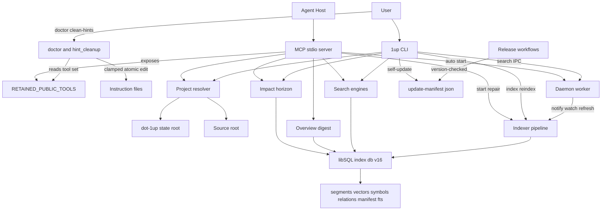
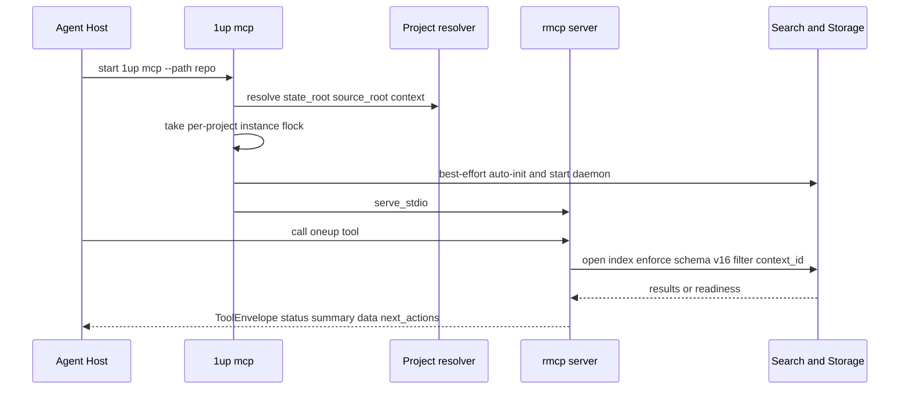

# System Architecture

**Project**: 1up (Cargo package `oneup`, binary `1up`)
**Architecture Pattern**: Layered CLI + MCP + daemon over project-local libSQL state
**Last Updated**: 2026-06-15

1up is a local-first code discovery substrate distributed as a single Rust binary. The runtime is a layered system over project-local libSQL state: short-lived CLI commands handle direct user workflows, `1up mcp` exposes agent-facing stdio tools, and an optional background daemon keeps project indexes fresh and serves warm CLI search over a guarded Unix socket. Project identity and index state live under the resolved `.1up/` state root, while linked git worktrees use a separate source root for scanning. The CLI also exposes a visible, opt-in `doctor` maintenance command for cleaning legacy 1up hints out of user instruction files, gated by a project-root-clamped atomic writer. The search index is schema-gated at v16: worktree, segment, vector, symbol, relation, and manifest objects, plus FTS and vector indexes, must all match the current layout before reads proceed.

## Reconciliation Notes

| Prior claim | Status | Update |
|---|---|---|
| Layered two-process CLI + daemon model with first-class MCP adapter | confirmed | CLI commands, `1up mcp` stdio tools, and daemon refresh/search remain three distinct entry surfaces over shared project state. |
| Project-local libSQL state at schema v13 | refined | `SCHEMA_VERSION` is now 16. v16 changes markdown heading breadcrumbs to store cleaned heading text, changing breadcrumb shape and composed embedding text, so pre-v16 indexes fail closed with `1up reindex`. `ensure_current` rejects v15 and below. |
| Canonical MCP tool set of 8 `oneup_*` tools | refined | Now 9 retained tools: `oneup_overview` was added (deterministic repository orientation digest). `RETAINED_PUBLIC_TOOLS` is the shared source of truth; `oneup_prepare`/`oneup_read` are now legacy/stale tokens. |
| Shrunk vector index pinned at 74,584,064 bytes (~71.1 MiB) | refined | The active CI/release guard (`justfile` `bench-vector-index-size`) gates `index.db` <= 80 MiB and `indexing_ms` <= 90000 with current schema; the older exact byte baseline is stale. `FLOAT8(384)`/`vector8(?)` storage and `VECTOR_PREFILTER_K=400` are unchanged. |
| Evidence-driven release surface (CI, archive verify, MCP smoke, setup.sh, update manifests) | refined | `publish-update-manifest` now has a paired `verify-update-manifest` job that re-fetches the published manifest and diffs it against the release manifest. Manifest version transitively tracks `CARGO_PKG_VERSION` because `validate_release_metadata.sh` and `generate_release_manifest.sh` fail unless `Cargo.toml` version == release tag. |
| Schema-gated local state fails closed on mismatch | confirmed | `ensure_current` still validates schema version, required tables/indexes/triggers, `segment_vectors.embedding_vec`, `context_id` columns, and relation evidence columns. |
| Secure filesystem helpers clamp writes to `.1up` state root | refined | `fs.rs` adds `atomic_replace_within_project_root`: a second atomic writer clamped to the user's project root (not `.1up`) that preserves the target file's existing permission mode, rejects symlink leaves and out-of-root parents, and is used only by the new `doctor` command. |

## High-Level Architecture


```mermaid
graph TB
    User[User] --> CLI[1up CLI]
    Host[Agent Host] --> MCP[MCP stdio server]
    User -->|doctor clean-hints| Doctor[doctor and hint_cleanup]
    Doctor -->|reads tool set| Retained[RETAINED_PUBLIC_TOOLS]
    MCP -->|exposes| Retained
    Doctor -->|clamped atomic edit| Instr[Instruction files]
    CLI --> Project[Project resolver]
    MCP --> Project
    Project --> State[dot-1up state root]
    Project --> Source[Source root]
    CLI -->|search IPC| Daemon[Daemon worker]
    MCP -->|auto start| Daemon
    Daemon -->|notify watch refresh| Indexer[Indexer pipeline]
    CLI -->|index reindex| Indexer
    MCP -->|start repair| Indexer
    Indexer --> Storage[libSQL index db v16]
    CLI --> Search[Search engines]
    MCP --> Search
    MCP --> Overview[Overview digest]
    Search --> Storage
    Overview --> Storage
    CLI --> Impact[Impact horizon]
    MCP --> Impact
    Impact --> Storage
    Storage --> Tables[segments vectors symbols relations manifest fts]
    Release[Release workflows] -->|version-checked| Manifest[update-manifest json]
    CLI -->|self-update| Manifest
```

## Key Architecture Patterns

| Pattern | Meaning | Evidence |
|---|---|---|
| Layered CLI + MCP + daemon | CLI commands, MCP stdio tools, and daemon refresh/search are separate entry surfaces over shared project state, storage, search, and indexer engines. | `src/main.rs`, `src/cli/mod.rs`, `src/cli/mcp.rs`, `src/mcp/server.rs`, `src/daemon/worker.rs` |
| Agent-facing MCP adapter with structured envelopes | `1up mcp --path` serves rmcp stdio tools returning a `ToolEnvelope` (status, summary, structured data, next_actions); server instructions are budgeted to survive a 2KB truncation. | `src/mcp/tools.rs`, `src/mcp/ops.rs`, `src/mcp/types.rs`, `src/mcp/server.rs` |
| Retained-tool source of truth shared across surfaces | The live MCP tool set (`RETAINED_PUBLIC_TOOLS`, 9 `oneup_*` tools) is the single authority for both MCP exposure and for classifying which `oneup_*` tokens in user instruction files are stale. | `src/mcp/types.rs`, `src/cli/hint_cleanup.rs`, `src/mcp/tools.rs` |
| Opt-in, default-OFF instruction-file hygiene | `1up doctor --clean-hints` is a read-only preview by default; mutation requires `--apply` and is restricted to a 1up-owned HTML-comment fenced span. Unfenced stale tokens are detect-and-advise only. | `src/cli/doctor.rs`, `src/cli/hint_cleanup.rs`, `src/cli/mod.rs` |
| Project-root-clamped atomic write | Edits to user files outside `.1up` go through a clamp to the project root, symlink-leaf rejection, out-of-root parent rejection, mode preservation, temp-write, fsync, and atomic rename. | `src/shared/fs.rs` (`atomic_replace_within_project_root`) |
| Idempotent guarded startup | Daemon startup and MCP instances use owner-only state, exclusive flocks, registry reloads, and non-destructive contention handling. | `src/daemon/lifecycle.rs`, `src/cli/mcp.rs`, `src/daemon/registry.rs`, `src/shared/fs.rs` |
| Split state/source roots | Linked git worktrees store `.1up/` state at the main worktree while scanning source from the active worktree; a `context_id` binds the pair. | `src/shared/project.rs`, `src/indexer/pipeline.rs` |
| Staged single-writer indexing | Parse work runs in parallel, but segment, symbol, relation, vector, and manifest writes flush through ordered transactional batches. | `src/indexer/pipeline.rs`, `src/storage/segments.rs` |
| Metadata-first incremental indexing | Full and scoped runs compare file size and mtime from `indexed_files` before content reads, with content hashes as the correctness backstop. | `src/indexer/pipeline.rs`, `src/storage/queries.rs` |
| Candidate-first retrieval with degradation | Vector, FTS, and symbol paths produce candidates that are RRF-fused and reranked before hydration; daemon and MCP search fall back to FTS-only when embeddings are unavailable. | `src/search/hybrid.rs`, `src/search/retrieval.rs`, `src/search/ranking.rs`, `src/daemon/worker.rs`, `src/mcp/ops.rs` |
| Deterministic repository orientation digest | `oneup_overview` computes a size-bounded, deterministically-ordered digest (stats, most-referenced types, module map, cross-module deps, entry points) over the active context. | `src/search/overview.rs`, `src/mcp/tools.rs` |
| Local-only advisory impact | CLI and MCP impact open the current index locally and traverse descriptor-backed `segment_relations` evidence with trust-bucketed primary vs contextual outputs. | `src/search/impact.rs`, `src/storage/relations.rs`, `src/mcp/ops.rs` |
| Schema-gated local state | Existing DBs fail closed unless schema version, required objects, vector column, `context_id` columns, and relation evidence columns match the current binary. | `src/storage/schema.rs`, `src/shared/constants.rs` |
| Evidence-driven release surface | Security gate, release-build smoke, release-metadata validation, archive verification with MCP smoke, update-manifest publish+verify, and the install script form the release contract. | `.github/workflows/*.yml`, `scripts/release/*.sh`, `scripts/security_check.sh`, `scripts/install/setup.sh`, `justfile` |

## Component Architecture

### CLI Layer
**Purpose**: Parse user commands, resolve output contracts, and dispatch lifecycle, index, search, status, update, doctor, and MCP workflows.
**Location**: `src/main.rs`, `src/cli/mod.rs`
**Responsibilities**:
- Route subcommands and resolve `--format`/`--plain` output contracts (visible commands: `start`, `status`, `list`, `stop`, `get`, `symbol`, `context`, `impact`, `doctor`).
- Suppress passive update notifications for `mcp`, `__worker`, `update`, and JSON-output maintenance commands.

**Dependencies**:
- Internal: Shared, Daemon, Indexer, Search, Storage, MCP.
- External: `clap`, `tokio`, `tracing-subscriber`.

### Instruction-File Hygiene (doctor)
**Purpose**: Opt-in, default-OFF detection and cleanup of legacy 1up hints in user instruction files.
**Location**: `src/cli/doctor.rs`, `src/cli/hint_cleanup.rs`
**Key Patterns**: Pure filesystem-free classifier; fence-only auto-remove under `--apply`; detect-and-advise for unfenced stale tokens.
**Responsibilities**:
- Scan `AGENTS.md`, `CLAUDE.md`, `.github/copilot-instructions.md` for a 1up-owned `<!-- 1up:hint:begin -->`/`<!-- 1up:hint:end -->` fence and for `oneup_*` tokens absent from `RETAINED_PUBLIC_TOOLS`.
- With `--apply`, remove only the owned fenced span byte-exactly via `atomic_replace_within_project_root`; never edit unfenced content.

**Dependencies**:
- Internal: Shared (`atomic_replace_within_project_root`), MCP types (`RETAINED_PUBLIC_TOOLS`).

### MCP Layer
**Purpose**: Expose code discovery tools to agent hosts over stdio with structured envelopes and next-action guidance.
**Location**: `src/cli/mcp.rs`, `src/mcp/server.rs`, `src/mcp/tools.rs`, `src/mcp/ops.rs`, `src/mcp/types.rs`
**Key Patterns**: Per-project instance flock; local engine reuse (no separate network service); 2KB-budgeted server instructions.
**Interface** (9 retained tools):
```rust
pub const RETAINED_PUBLIC_TOOLS: [&str; 9] = [
    TOOL_STATUS,    // oneup_status
    TOOL_START,     // oneup_start
    TOOL_SEARCH,    // oneup_search
    TOOL_GET,       // oneup_get
    TOOL_SYMBOL,    // oneup_symbol
    TOOL_CONTEXT,   // oneup_context
    TOOL_IMPACT,    // oneup_impact
    TOOL_STRUCTURAL,// oneup_structural
    TOOL_OVERVIEW,  // oneup_overview
];
```

### Daemon Layer
**Purpose**: Maintain watched project indexes and serve warm CLI search through bounded local IPC.
**Location**: `src/daemon/worker.rs`, `src/daemon/lifecycle.rs`, `src/daemon/search_service.rs`, `src/daemon/watcher.rs`, `src/daemon/registry.rs`, `src/daemon/ipc.rs`
**Key Patterns**: Single daemon lock; `notify`-driven scoped refresh with full fallback; per-process serialized dirty runs; same-UID-only IPC peers.
**Configuration**: Owner-only XDG state root; framed JSON requests bounded by `MAX_DAEMON_REQUEST_BYTES` and `MAX_DAEMON_IN_FLIGHT_REQUESTS`; platform stubs (`lifecycle_stub.rs`, `search_service_stub.rs`, `worker_stub.rs`) where daemon support is unavailable.

### Indexer Layer
**Purpose**: Scan, parse, chunk, embed, prefilter, and persist repository files.
**Location**: `src/indexer/pipeline.rs`, `src/indexer/scanner.rs`, `src/indexer/parser.rs`, `src/indexer/markdown.rs`, `src/indexer/chunker.rs`, `src/indexer/embedder.rs`
**Dependencies**: Storage, Shared, tree-sitter (~17 grammars), ONNX embedder (all-MiniLM-L6-v2, 384-dim).

### Search Layer
**Purpose**: Execute hybrid search, ranking, symbol lookup, context reads, structural queries, impact expansion, and the overview digest.
**Location**: `src/search/hybrid.rs`, `src/search/retrieval.rs`, `src/search/ranking.rs`, `src/search/symbol.rs`, `src/search/context.rs`, `src/search/structural.rs`, `src/search/impact.rs`, `src/search/overview.rs`, `src/search/scope.rs`
**Key Patterns**: RRF fusion (`RRF_K=60`, `VECTOR_WEIGHT=1.5`, `SYMBOL_WEIGHT=4.0`); vector exhaustive-scan path below `VECTOR_EXHAUSTIVE_SCAN_MAX_VECTORS=16384`, approximate index path above.

### Storage Layer
**Purpose**: Own libSQL connections, schema validation, SQL, segment writes, relation writes, and manifest state.
**Location**: `src/storage/db.rs`, `src/storage/schema.rs`, `src/storage/queries.rs`, `src/storage/segments.rs`, `src/storage/relations.rs`
**Key Patterns**: Tuned connections (WAL, `synchronous=NORMAL`, cache, mmap, temp-store); fail-closed schema gating at `SCHEMA_VERSION=16`.

### Shared Layer
**Purpose**: Define config paths, root/worktree resolution, secure filesystem helpers, constants, progress types, symbols, and update metadata.
**Location**: `src/shared/config.rs`, `src/shared/project.rs`, `src/shared/fs.rs`, `src/shared/types.rs`, `src/shared/constants.rs`, `src/shared/symbols.rs`, `src/shared/progress.rs`, `src/shared/update.rs`, `src/shared/errors.rs`
**Dependencies**: None internal (foundation layer).

## Data Flow

### MCP Code Discovery (primary agent flow)

```mermaid
sequenceDiagram
    participant Host as Agent Host
    participant CLI as 1up mcp
    participant Resolver as Project resolver
    participant Server as rmcp server
    participant Engines as Search and Storage

    Host->>CLI: start 1up mcp --path repo
    CLI->>Resolver: resolve state_root source_root context
    CLI->>CLI: take per-project instance flock
    CLI->>Engines: best-effort auto-init and start daemon
    CLI->>Server: serve_stdio
    Host->>Server: call oneup tool
    Server->>Engines: open index enforce schema v16 filter context_id
    Engines-->>Server: results or readiness
    Server-->>Host: ToolEnvelope status summary data next_actions
```

### Index Build and Refresh
1. CLI, MCP start, or daemon refresh resolves a `WorktreeContext` and opens a tuned libSQL connection.
2. The scanner applies gitignore/global-ignore/exclude rules, build-artifact and binary skips, and special extensionless recognition.
3. Full runs load `indexed_files` and segment hashes, skip metadata-unchanged files, and detect deleted paths; scoped runs scan only changed paths and fall back to full when scoped semantics are unsafe.
4. Parse workers run concurrently; ordered flushes build embeddings and persist file batches transactionally.
5. Storage replaces segments, vectors, symbols, relation descriptors, and manifest rows per context together; empty batches delete removed rows.
6. Progress persists `context_id`, source root, branch status, scope, prefilter, parallelism, timings, deleted-file counts, and embedding availability to `.1up/index_status.json`.

### CLI Daemon-Backed Search
CLI search sends a framed JSON request (`context_id` + source root) over the daemon Unix socket. The daemon accepts only same-UID peers, clamps limits, rejects oversized payloads, validates the context/source pair against the registry, reuses a warm `EmbeddingRuntime` (or FTS-only), and returns ranked `SearchResult` values. The CLI falls back to context-scoped local search when the daemon is unavailable, stale, or rejects the request.

### Doctor Hint Cleanup
`hint_cleanup::classify` locates a 1up-owned fence and scans for stale `oneup_*` tokens. Without `--apply` it is a read-only preview. With `--apply` and an owned fence, `atomic_replace_within_project_root` removes only the fenced span (byte-exact elsewhere, mode preserved). Unfenced stale tokens are reported as advisories and never edited.

### Release and Update
Release Please owns version/changelog PRs and tags. `validate_release_metadata.sh` and `generate_release_manifest.sh` fail unless `Cargo.toml` version == release tag. `release-assets` builds the target matrix, stages the Windows ONNX DLL, and uploads archives, checksums, release manifest, notes, and `setup.sh`. `verify_release_archives.sh` runs JSON-RPC MCP smoke against every archive (asserting canonical tools, structured content, readiness, and that the reported version matches the manifest). `publish-update-manifest` regenerates `update-manifest.json` from the release manifest and pushes to `main`; a paired `verify-update-manifest` job re-fetches and diffs published vs expected.

## Integration Points

### External Services
- **libSQL** (`libsql` 0.9 core): embedded local index storage shared by CLI, MCP, daemon, search, impact, and indexing.
- **ONNX Runtime / Hugging Face** (`ort` 2.0.0-rc.12): local embedding inference; non-Windows links the downloaded static runtime, Windows loads the DLL dynamically. Model `model.onnx` and `tokenizer.json` are pinned by SHA-256; `ONEUP_DISABLE_MODEL_DOWNLOADS` forces hermetic FTS-only in CI.
- **tree-sitter** (0.26 + ~17 grammars): structured parsing for segments, symbols, roles, relations, and structural queries.
- **rmcp** (1.5): MCP stdio server exposing 9 `oneup_*` tools and JSON schemas; instructions budgeted under 2KB.
- **notify** (7): file watching for daemon scoped refresh and full-fallback triggers.
- **GitHub Actions / Release Please / GitHub Releases**: CI, versioning, artifact publishing, manifest publish/verify, and release evidence.
- **setup.sh / self-update**: distribution and upgrade channels; self-update reads `update-manifest.json` gated by `ONEUP_UPDATE_MANIFEST_URL`.
- **Promptfoo / Claude Agent SDK / Bun**: search/impact evals and the recall@k harness comparing 1up MCP-assisted agents against baseline raw-search agents.

### Internal Communication
- **Service-to-service**: CLI to daemon over a framed JSON Unix socket protocol (`src/daemon/ipc.rs`, `src/daemon/search_service.rs`); MCP and CLI otherwise reuse local search/storage engines in-process rather than over a network.
- **Event handling**: `notify` filesystem events drive debounced (`WATCHER_DEBOUNCE_MS=500`) scoped refresh, with branch-context changes and ambiguous paths promoting to full refresh.

## Security Architecture

### Authentication
- **Method**: No network auth surface; the daemon socket authenticates by OS peer credentials.
- **Flow**: The daemon accepts only same-UID peer connections and rejects others.

### Authorization
- **Model**: Filesystem ownership and exclusive locks. Owner-only modes (`0o700` dirs, `0o600` files/sockets) on XDG state, project `.1up`, and the daemon socket.
- **Implementation**: Exclusive flocks for the daemon and per-project MCP instances; context/source pairs validated against the locked registry before serving.

### Data Protection
- **Encryption**: None at rest (local developer-machine index); integrity for distributed artifacts via pinned SHA-256 on the embedding model/tokenizer and optional SHA-256 verification on install/self-update.
- **Sensitive data / path safety**: `src/shared/fs.rs` clamps all sensitive writes to an approved root, rejects symlink components and leaves, normalizes paths, and writes via temp + fsync + atomic rename. `atomic_replace` clamps to `.1up`; `atomic_replace_within_project_root` clamps to the user's project root and preserves the existing file mode.

## Performance Considerations

### Bottlenecks
- Vector graph traversal is read-heavy and slow at small corpus sizes, so an exhaustive `vector_distance_cos` scan is used below `VECTOR_EXHAUSTIVE_SCAN_MAX_VECTORS=16384`.
- Linked worktrees dilute the shared vector index, mitigated by scaling prefilter candidates by context count (`VECTOR_PREFILTER_CONTEXT_SCALE_LIMIT=8`).

### Scalability
- **Indexing**: parallel parse workers (`ONEUP_INDEX_JOBS`), bounded embed threads (`MAX_AUTO_EMBED_THREADS=4`, `ONEUP_EMBED_THREADS`), and auto-sized transactional write batches (`ONEUP_INDEX_WRITE_BATCH_FILES`).
- **Retrieval**: candidate prefilter (`VECTOR_PREFILTER_K=400`) feeding RRF fusion and reranking; warm `EmbeddingRuntime` reuse in the daemon.
- **Storage**: `FLOAT8(384)` quantized vectors with a compressed neighbor index (`max_neighbors=32`).

### Monitoring
- Index progress and timings in `.1up/index_status.json`; daemon heartbeat in `.1up/daemon_status.json` and context-aware state in `.1up/daemon_context_status.json`.
- Release evidence: security gate JSON, archive/MCP smoke, and benches gating `index.db` <= 80 MiB and `indexing_ms` <= 90000 (`justfile` `bench-vector-index-size`), plus search-latency Criterion benches.

## Deployment Architecture

### Environments
- **Development**: `just install` builds the release binary and copies it to `~/.local/bin`; `just verify` runs fmt, clippy, the full test surface, and `setup.sh` lint/smoke.
- **Staging**: not applicable (no hosted service); evals and benches run locally and in CI as release evidence.
- **Production**: end-user developer machines on macOS, Linux, and Windows running the single `1up` binary, with an optional background daemon and optional MCP stdio server mode.

### Infrastructure
- **Hosting**: none; local-first single binary. Daemon/Unix-socket paths are Unix-focused with platform stubs where unavailable.
- **Database**: embedded libSQL `index.db` under `<state_root>/.1up/`; a locked, owner-only global registry (`projects.json`) under `dirs::data_dir()/1up/`.
- **Networking / distribution**: GitHub Releases (semantic versioning via Release Please); `setup.sh` installer with platform detection, optional SHA-256 verification, atomic binary replacement, and managed PATH blocks; built-in self-update through the version-checked `update-manifest.json`. Release matrix: `aarch64-apple-darwin`, `x86_64-unknown-linux-gnu`, `aarch64-unknown-linux-gnu`, `x86_64-pc-windows-msvc`.
