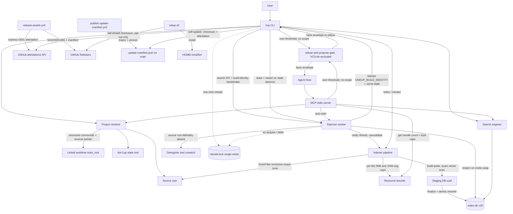

# System Architecture

1up is a local-first single Rust binary (`oneup` package, `1up` binary) with an optional background daemon and an MCP stdio mode, over a project-local libSQL index (`.1up/index.db`, schema v20). Since v0.1.13 large monorepos are indexed as **scoped directory cones** behind a refuse-and-propose gate; the v0.1.15–v0.1.17 range drops the DiskANN vector index in favor of exact vector scan (schema v20), git-stamps build identity for daemon trust, and hardens the install/state-root/MCP-batch attack surfaces.

## Architectural Patterns

- **Layered CLI + MCP + daemon over one local libSQL index** — three entry surfaces (short-lived CLI, `1up mcp` stdio tools, optional daemon) share the same storage/search/indexer engines and `.1up/` state.
- **Non-destructive build-aside rebuild + atomic swap** — `StagingRebuild` (`src/storage/swap.rs`) builds into a uuid-suffixed staging DB, finalizes (`wal_checkpoint(TRUNCATE)` → one file), then atomically renames over `index.db`. Readers see either the full prior or full new generation; an aborted rebuild leaves `index.db` intact.
- **Single-writer rebuild lock** — `RebuildLock` flocks `<state_root>/.1up/rebuild.lock`; one-shot rebuilds bounded-wait then fail closed (`RebuildLockContended`), the daemon try-acquires and defers; released on guard drop (incl. cancellation unwind).
- **Git-stamped build identity for daemon trust** *(new)* — `build.rs` (new, ~273 lines) composes `ONEUP_BUILD_IDENTITY = {CARGO_PKG_VERSION}+{git-short-hash}[.dirty[.digest]]` at compile time (degrading to `+unknown` without git; two differently-dirty trees at the same HEAD are discriminated via an 8-hex digest of `git diff HEAD`). The daemon version-handshake keys off this instead of bare semver, so two same-version daemons built from different source are no longer conflated as mutually authoritative.
- **Daemon version-handshake drain/restart** *(refined)* — `search_service` stamps `daemon_version` (now build-identity-keyed); `src/cli/search.rs` gates on it (`daemon_response_is_authoritative`), drains+restarts a stale daemon (SIGTERM+poll, `DAEMON_DRAIN_TIMEOUT_MS=3000`), falls back to local search. An absent stamp is refused, not trusted.
- **Worktree commondir anchoring** *(new, e8ea203)* — a linked worktree's `.git`-file `gitdir`/`commondir` pointer is no longer trusted unconditionally: both anchoring (git_dir's parent must be `<commondir>/worktrees/`) and a reverse pointer (that worktrees-metadata file must point back at this exact `.git` file) must pass before `main_root`/`state_root` is adopted — closing a path where a crafted `.git` file could redirect a project's `.1up/` state, index DB, and daemon registry into an unrelated victim repository tree.
- **Cooperative cancellation seam (daemon → indexer)** — one `CancellationToken` across passes; SIGTERM cancels and the in-flight sweep is resumed to a committed boundary, re-queued (stays dirty) rather than torn.
- **Long-lived handle adopts swapped index by inode** — the daemon records `(dev, ino)` and reopens before any pass/search when a swap installed a fresh inode.
- **Serve-stale during rebuild** — daemon results carry `STALE_REBUILD_REASON` when a refresh is in flight, combined via `combine_degraded_reasons`.
- **Daemon idle self-exit** — an empty daemon self-exits past `DAEMON_IDLE_SHUTDOWN_SECS=60`.
- **Deleted watched-directory deregistration, gate-agreement corrected** *(refined, bfc181b)* — `run_project` stats `source_root` before the rebuild lock; on a missing root, `deregister_deleted_project` removes it from `ProjectStates`+`Registry`+unwatches. The daemon's first-index gate walk (`count_files_gitignore_aware`) now excludes `.git`/`.hg`/`.svn` the same way the MCP facts-envelope gate (`is_under_vcs_dir`) already did, so the two gates agree on over/under-threshold; the gated file count is cached (`cached_gate_file_count`) rather than rewalked per dirty signal. Destructive deregistration now requires a definite `SourcePresence::Absent` — an `Indeterminate` probe defers.
- **Independent-channel supply-chain trust** — `verify_archive_checksum` (SHA-256 floor) then `verify_artifact_attestation` (sigstore-verify against the embedded production trusted root, issuer + workflow identity pinned); three-state: verified → proceed, cannot-run → degrade to checksum, disproved → fail closed.
- **Fail-closed installer checksum (opt-out only)** *(refined)* — `setup.sh` previously warned-and-continued on a genuinely unpublished `SHA256SUMS` (installing an unverified binary); it now fails closed there too, with `ONEUP_SKIP_CHECKSUM=1` as an explicit, loudly-warned opt-out. Transient-fetch fail-closed and mandatory-verify-when-published paths unchanged. Default install dir moved `$HOME/.1up/bin` → `$HOME/.local/bin`.
- **Anti-rollback / anti-freeze manifest gate** — `ensure_manifest_acceptable` rejects older-than-installed or past-expiry manifests before download (distinct from advisory `build_update_status`).
- **Schema-gated local state, fail-closed** *(refined)* — `ensure_current` validates `SCHEMA_VERSION=20`, objects, and context columns; no in-place migration (older schema fails closed with reindex guidance). Read paths call `ensure_current_tolerating_init` to ride out the transient post-init version-row window — now its own multi-second budget (`SCHEMA_INIT_WAIT_ATTEMPTS`=50 × `SCHEMA_INIT_WAIT_DELAY_MS`=100ms ≈ 5s), distinct from the DB-lock retry budget.
- **Refuse-and-propose gate (monorepo)** — a first index of an over-threshold repo without a recorded scope never starts; `oneup_start`/`1up start` return a `FactsEnvelope` (gitignore-aware, VCS-dir-excluded per-directory stats, `launch_subdir` first-suggestion, measured-density vector estimates). Pure decision in `gate_allows_first_index`; enforced identically on both surfaces after the gate-agreement fix.
- **Exclusive scope cones** — `ScanFilter` precedence: secrets > `scope_globs` (exclusive cone) > `include_globs`/override dirs > excludes > dotfile hiding; every rebuild path re-persists scope; widening is incremental, narrowing is an atomic staging rebuild.
- **Resource protection (per-file and per-request bounds)** *(refined, 04e6663)* — `MAX_FILE_SIZE_BYTES=2MB` + `MAX_SEGMENTS_PER_FILE=1000` bound indexing memory. Extended to the MCP surface: `oneup_get` rejects a request exceeding `MAX_GET_HANDLES_PER_CALL` (50) handles or `MAX_GET_REQUEST_HANDLE_BYTES` (16KiB) aggregate handle bytes before any index open (previously unbounded; a 50k-handle batch produced a ~12.9MB envelope).
- **Non-blocking bounded-wait start** — `oneup_start` spawns the rebuild and waits up to `ONEUP_START_RESPONSE_BUDGET_MS` (2s); long rebuilds detach and callers poll `oneup_status`.
- **Content-addressed embedding pool, exact vector scan (schema v20, DiskANN removed)** *(supersedes prior)* — `embedding_pool` still dedups vectors by `content_key` with `ref_count` lifecycle, but the DiskANN index and its `Immediate`/`Deferred`-build-before-swap machinery are removed entirely: all corpus sizes use exact `vector_distance_cos` scan (`VECTOR_EXACT_SCAN_WARN_THRESHOLD`=262144 gates only a one-time advisory warning). This directly supersedes the prior "deferred vector index built once after pool load, before the swap" claim; rationale and measurements in `docs/diskann-removal.md`.
- **Liveness-reconciled state** — stale rebuild locks (>5 min, dead holder) auto-clear; `Running` progress with a dead `indexer_pid` reads as missing; the gate walk runs on `spawn_blocking` so SIGTERM cancellation fires mid-walk. New: opportunistic per-project lock-file reaping (`shared::lock_reap`) sweeps provably-stale `mcp-*/startup-*.lock` files (age + flock probe + inode identity re-check, 250ms budget) at lock-mint points.
- **Version-checked release contract, CI-verified** *(refined)* — `release-assets.yml` (validate → build matrix → attest → publish-draft) + `publish-update-manifest.yml` (publish → verify re-fetch+diff); manifest version tracks `CARGO_PKG_VERSION` (now 0.1.17). CI now *executes* the Windows ancestor-guard regression via `verify_mcp_smoke.sh --self-test-only`; `embedding-quality.yml` gains an opt-in `capture_baseline` dispatch mode that captures the pinned recall baseline on the gate's own runner platform (int8 inference differs ~2.2pp between macOS-arm64 and the Linux gate runner, exceeding the 0.02 tolerance).

## Layers

| Layer | Purpose | Key files |
|---|---|---|
| CLI | Parse commands, output contracts, dispatch lifecycle/index/search/update/doctor/mcp; run the build-identity search handshake; enforce the monorepo gate at `1up start` (`--scope`) | `main.rs`, `cli/mod.rs`, `cli/start.rs`, `cli/search.rs`, `cli/mcp.rs` |
| MCP | Nine `oneup_*` tools over stdio with `ToolEnvelope`; auto-init + auto-start daemon; facts-envelope gate (agreeing with the daemon gate), scope ops, non-blocking start, bounded `oneup_get` batches, multi-query search | `mcp/{server,tools,ops,types}.rs` |
| Daemon | Watched-index refresh (cancellable, lock-guarded, scope-aware, gated with the aligned VCS-aware file count), warm search with build-identity handshake + serve-stale, registry dedup, stale-branch auto-prune, idle self-exit, liveness reconciliation | `daemon/{worker,lifecycle,search_service,watcher,registry,ipc}.rs` |
| Indexer | Scan (exclusive scope cones via `ScanFilter`), parse, chunk, embed (pool dedup), prefilter, persist; honors a `CancellationToken` | `indexer/{pipeline,scanner,scan_filter,parser,embedder,markdown}.rs` |
| Search | Hybrid retrieval, ranking (token-level query classification), symbol/context/structural/impact, overview; exact vector scan (DiskANN removed) | `search/{hybrid,retrieval,ranking,overview,impact,scope}.rs` |
| Storage | libSQL connections, schema v20 (scope meta, embedding pool, no DiskANN index), SQL, segment/relation/manifest writes, build-aside swap | `storage/{db,schema,swap,queries,segments,relations}.rs` |
| Shared | Config/path/worktree resolution (anchored commondir trust), secure fs (three-state source presence), constants (build identity), lock reaping, self-update trust gates, errors | `shared/{config,project,fs,constants,lock_reap,update,errors}.rs`, `build.rs` |

## Key Interactions

1. **Non-destructive rebuild** — acquire `RebuildLock` (stale locks auto-cleared) → `StagingRebuild::open` (uuid staging DB, schema v20) → pipeline writes staging (scope re-persisted; vectors go to `embedding_pool`, no vector-index build step) → `finalize_and_swap` (WAL fold, retire prior sidecars, atomic rename) → lock releases on drop.
1a. **Monorepo first contact** — `1up mcp`/`1up start` on an over-threshold repo: daemon-side and MCP-side gates agree (both VCS-dir-excluded counts); `oneup_start` (no scope) returns the facts envelope; a scoped start records the decision, spawns the cone rebuild (non-blocking); subsequent daemon refreshes honor the recorded scope.
2. **CLI daemon-backed search w/ build-identity handshake** — framed JSON `SearchRequest` over the Unix socket → daemon validates same-UID peer + context, reopens on inode swap, serves results stamped with `daemon_version` (git-stamped build identity, + stale flag) → CLI checks authority, drains+restarts on mismatch, else local fallback.
3. **Worktree state-root resolution** — `resolve_project_root` walks up to a `.git` file/dir; on a `.git` file, `resolve_linked_worktree_info` reads gitdir then commondir; anchoring check + reverse-pointer check must both pass before `main_root`/`state_root` is adopted; otherwise fall back through existing resolution.
4. **Daemon cancellable refresh under SIGTERM** — notify/SIGHUP/debounce mark dirty → `run_dirty_projects_until_clean_or_cancelled` races the sweep against SIGTERM → token cancelled, sweep resumed to a committed boundary, scope re-queued.
5. **Self-update with independent-channel trust** — `ensure_manifest_acceptable` → download → `verify_archive_checksum` → `verify_artifact_attestation` (three-state) → atomic temp-then-rename `replace_binary`.
6. **Fail-closed local install** — `setup.sh` classifies the `SHA256SUMS` fetch published/unpublished/transient: published → mandatory verify; transient → fail closed with retry; unpublished → fail closed by default *(new)* unless `ONEUP_SKIP_CHECKSUM=1`; binary installed to `$HOME/.local/bin`.
7. **Release publish + manifest verify** — validate (version==tag) → build matrix → attest-build-provenance → publish-draft (archives + `SHA256SUMS` + `release-manifest.json` + `setup.sh`) → `publish-update-manifest` regenerates `update-manifest.json` (incl. `expiry`) to main → verify re-fetch+diff.

## Integrations

- **libSQL** (0.9, WAL) — embedded FTS/vector storage + WAL-checkpoint primitives for the swap; schema v20 drops the DiskANN vector index in favor of exact scan.
- **Sigstore / GitHub attestations API** — keyless-OIDC build provenance (`actions/attest-build-provenance`), verified natively via `sigstore-verify` + embedded production trusted root.
- **ONNX Runtime / Hugging Face** — `ort` 2.0.0-rc.12, all-MiniLM-L6-v2 (384-dim); `ONEUP_DISABLE_MODEL_DOWNLOADS`.
- **tree-sitter** (~17 grammars) — structured parsing for segments/symbols/relations/structural.
- **rmcp** (1.5) — MCP stdio server (nine tools; ≤2KB instructions budget; `oneup_get` now batch-capped).
- **notify** (7) — file watching (`WATCHER_DEBOUNCE_MS=500`).
- **reqwest** — bounded-timeout fetch of manifest, archives, attestation bundles; also backs setup.sh's tri-state SHA256SUMS classification.
- **git (via build.rs and shared/project.rs)** *(new)* — build-identity stamping (short-hash/dirty-digest) and worktree/state-root resolution (gitdir/commondir with anchoring + reverse-pointer verification).
- **GitHub Actions / Release Please / Releases** — versioning, archive publish, attestation, manifest publish+verify, `setup.sh` hosting; ci.yml runs a Windows ancestor-guard self-test; embedding-quality.yml has a `capture_baseline` dispatch mode.

## Data Flow & State

- **State** lives under the resolved `.1up/` state root: `index.db` (+ uuid staging DB during a rebuild), `rebuild.lock`, `index_status.json`, `daemon_status.json`, `daemon_context_status.json`; plus XDG state (daemon pid, update-check cache, per-project `mcp-*/startup-*.lock` files — now reaped) and `dirs::data_dir()/1up/projects.json` (registry, EntryIdentity-deduped on load). `main_root`/`state_root` for linked worktrees is adopted only after anchoring + reverse-pointer verification.
- **Index build/refresh** — source files (via ScanFilter exclusive scope cone) → segments/vectors (embedding_pool, exact-scan)/symbols/relations rows, built aside and atomically swapped; progress → `index_status.json` (read via the three-state torn-read-tolerant path).
- **Update check** — remote `update-manifest.json` → version-keyed cache → passive notification or anti-rollback/expiry refusal.
- **Self-update activation** — archive + SHA-256 + attestation bundles → atomically replaced binary (checksum + attestation verified; daemon stopped first).
- **Local install** — GitHub release archive + SHA256SUMS (published/unpublished/transient) → binary in `$HOME/.local/bin`, fail-closed by default on unpublished checksums.
- **GC reclamation** — `1up gc --apply` prunes source-missing registrations (only on definite `Absent`; `Indeterminate` retained with a warning) and stale-branch snapshots, and sweeps orphaned staging DBs; daemon startup auto-prunes a conservative stale-branch subset; `status`/`list` disclose reclaimable accumulation above floors.

## Deployment

- Local-first single binary + optional daemon/MCP. Daemon/Unix-socket/flock paths are Unix-focused with platform stubs (`worker_stub.rs`, `lifecycle_stub.rs`); Windows focuses on local indexing and now has an executed CI ancestor-guard self-test.
- Distributed via GitHub Releases (Release Please); build matrix `[aarch64-apple-darwin, x86_64/aarch64-unknown-linux-gnu, x86_64-pc-windows-msvc]` with keyless-OIDC attestation, `SHA256SUMS`, version-checked manifest, and `setup.sh`; current pinned version 0.1.17.
- Install: `curl -fsSL https://1up.rp1.run/setup.sh | bash` (installs to `$HOME/.local/bin`; fails closed on missing checksum unless `ONEUP_SKIP_CHECKSUM=1`) or `1up update` (checksum floor + native attestation, anti-rollback/expiry gated).

```mermaid
graph TB
    User[User] --> CLI[1up CLI]
    Host[Agent Host] --> MCP[MCP stdio server]
    CLI --> Project[Project resolver]
    MCP --> Project
    Project -->|anchored commondir + reverse pointer| Worktree[Linked worktree main_root]
    Project --> State[dot-1up state root]
    Project --> Source[Source root]
    CLI -->|search IPC + build-identity handshake| Daemon[Daemon worker]
    Daemon -->|stamps ONEUP_BUILD_IDENTITY + serve-stale| CLI
    CLI -->|drain + restart on stale daemon| Daemon
    MCP -->|auto start| Daemon
    Daemon -->|notify refresh, cancellable| Indexer[Indexer pipeline]
    Daemon -->|source root definitely absent| Deregister[Deregister and unwatch]
    CLI -->|index / reindex| Indexer
    MCP -->|over-threshold, no scope| Gate[refuse-and-propose gate, VCS-dir-excluded]
    CLI -->|over-threshold, no scope| Gate
    Gate -->|facts envelope| Host
    Gate -->|facts envelope to stdout| CLI
    Indexer -->|per-file 2MB and 1000-seg caps| Bounds[Resource bounds]
    MCP -->|get handle count + byte caps| Bounds
    Indexer -->|ScanFilter exclusive scope cone| Source
    Indexer -->|build aside, exact vector scan| Staging[Staging DB uuid]
    Staging -->|finalize + atomic rename| Storage[(index.db v20)]
    Daemon -->|reopen on inode swap| Storage
    CLI -. one-shot rebuild .-> Lock[(rebuild.lock single-writer)]
    Daemon -. try-acquire / defer .-> Lock
    Search[Search engines] --> Storage
    CLI --> Search
    MCP --> Search
    Release[release-assets.yml] -->|keyless-OIDC attestation| Attest[GitHub attestations API]
    Release -->|SHA256SUMS + manifest| GHR[GitHub Releases]
    Publish[publish-update-manifest.yml] -->|expiry + version| Manifest[update-manifest.json on main]
    CLI -->|self-update: checksum + attestation| Manifest
    CLI --> Attest
    Setup[setup.sh] -->|fail-closed checksum, opt-out only| GHR
    Setup -->|install| LocalBin[HOME/.local/bin]
```
