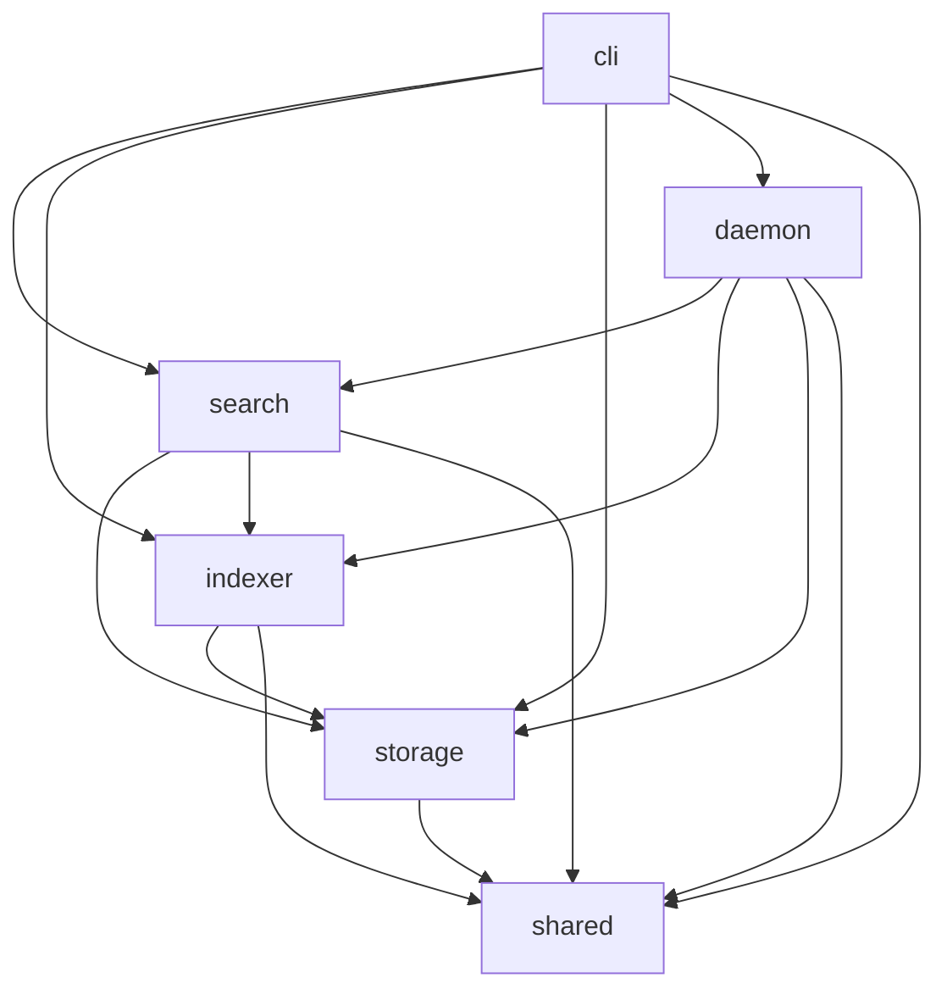

# Module & Component Breakdown

**Project**: 1up
**Analysis Date**: 2026-04-10
**Modules Analyzed**: 10

## Core Modules

### CLI (`src/cli/`)
**Purpose**: User-facing command parsing and output formatting via clap derive
**Files**: 14 | **Lines**: ~1,776

**Components**:
- **Cli** (`mod.rs`): Top-level CLI struct with `Command` enum dispatch, global `--format` (default plain) and `--verbose` flags, `parse_positive_usize` validator for concurrency flags
- **SearchArgs** (`search.rs`): Hybrid search with `--limit` and auto-daemon-start; tries daemon socket first with 250ms timeout, falls back to local
- **SymbolArgs** (`symbol.rs`): Symbol lookup with optional `--references` flag
- **ContextArgs** (`context.rs`): Context retrieval for `file:line` locations with `--allow-outside-root` flag and ContextAccessScope tracking
- **StructuralArgs** (`structural.rs`): AST pattern search using tree-sitter S-expression queries
- **IndexArgs** (`index.rs`): Explicit indexing with `--jobs`, `--embed-threads`, EmbeddingRuntime-based model management, progress spinners
- **ReindexArgs** (`reindex.rs`): Force clear + full re-index with schema rebuild and `--jobs`/`--embed-threads` flags
- **StartArgs** (`start.rs`): Auto-init project, install fenced agent reminders, index with config, register project in registry, spawn daemon or SIGHUP existing
- **HelloAgentArgs** (`hello_agent.rs`): Output condensed agent instruction (CONDENSED_REMINDER) in plain/json/human formats
- **Formatter** (`output.rs`): Output formatting trait with JSON, Human, and Plain implementations; progress-aware rendering with parallelism, timing breakdown, and relative "time ago" timestamps

**Dependencies**: search, indexer, storage, daemon, shared

### Search (`src/search/`)
**Purpose**: Search engines: hybrid semantic+FTS, symbol lookup, structural AST queries, and context retrieval
**Files**: 9 | **Lines**: ~3,228

**Components**:
- **HybridSearchEngine** (`hybrid.rs`): Shared execution path for local CLI and daemon-backed search; builds symbol variants, embeds queries when available, executes candidate-first fusion, and degrades per query to FTS-only when embedding/vector work fails
- **RetrievalBackend** (`retrieval.rs`): Backend selection (SqlVectorV2 or FtsOnly) based on index state; fetches vector and FTS `CandidateRow` sets first, then leaves segment hydration until after ranking
- **SymbolSearchEngine** (`symbol.rs`): Exact-first definition and reference lookup over canonicalized symbols stored in `segment_symbols`; prefix/contains fallback seeds fuzzy matching only when exact lookup misses
- **ContextEngine** (`context.rs`): Source context retrieval using tree-sitter scope detection with line-range fallback; supports ContextAccessScope for inside/outside project root tracking
- **StructuralSearchEngine** (`structural.rs`): Tree-sitter S-expression queries across indexed files; fallback to directory scan
- **IntentDetector** (`intent.rs`): Signal-based query classification into Definition, Flow, Usage, Docs, General
- **Ranking** (`ranking.rs`): RRF fusion plus intent/query/path/content boosts, short-segment penalties, overlap dedup, and per-file caps before final hydration
- **Formatter** (`formatter.rs`): Search result formatting utilities

**Dependencies**: storage, indexer (parser, scanner), shared

### Indexer (`src/indexer/`)
**Purpose**: Bounded staged indexing: scan, parse, embed, and single-writer persistence
**Files**: 6 | **Lines**: ~6,448

**Components**:
- **Pipeline** (`pipeline.rs`): Config-aware orchestrator accepting `IndexingConfig` for jobs/embed_threads/write_batch_files plus `RunScope`; prepares scoped or full run inputs, falls back safely when watcher paths affect ignore semantics, uses bounded `spawn_blocking` parse workers with sequence IDs, flushes through a `BTreeMap` reorder buffer, batches embeddings through one ONNX session, and persists `IndexProgress`/`IndexParallelism`/`IndexStageTimings` to `.1up/index_status.json`
- **Parser** (`parser.rs`): Multi-language AST parsing via tree-sitter; 16 language grammars; role classification and symbol collection
- **Embedder** (`embedder.rs`): ONNX engine (all-MiniLM-L6-v2) with configurable intra-op `embed_threads`, verified artifact download and activation (`verified/<artifact-id>/`, `current.json`, `.staging/`), legacy-cache import only after digest validation, batch inference, mean pooling, L2 normalization, and warm runtime reuse keyed by model fingerprints plus thread count via EmbeddingRuntime
- **Scanner** (`scanner.rs`): Directory walking via ignore crate with .gitignore respect and binary filtering
- **Chunker** (`chunker.rs`): Sliding-window text chunking (60-line window, 10-line overlap) for unsupported languages flushed through the same staged pipeline

**Dependencies**: storage, shared

### Storage (`src/storage/`)
**Purpose**: Database access layer using libSQL with FTS5, vector indexing, and transactional file replacement helpers
**Files**: 5 | **Lines**: ~2,124

**Components**:
- **Db** (`db.rs`): Database connection wrapper with `open_rw`/`open_ro`/`open_memory` constructors, lock retry
- **Schema** (`schema.rs`): Schema initialization, validation, vector-model compatibility checks, and rebuild with recovery guidance for schema v7
- **Segments** (`segments.rs`): Segment CRUD, bulk file-hash preload, deleted-file cleanup, transactional replacement helpers with configurable batch size, and maintenance of canonical symbol rows in `segment_symbols`
- **Queries** (`queries.rs`): SQL DDL and query constants for segments, FTS, `segment_symbols`, meta, bulk hash preload, and candidate-first vector/FTS retrieval

**Dependencies**: shared

### Daemon (`src/daemon/`)
**Purpose**: Background daemon for file watching, scoped incremental re-indexing, daemon-backed search, and persisted per-project indexing settings; platform-conditional with Unix-only implementations and cross-platform stubs
**Files**: 10 | **Lines**: ~2,617

**Components**:
- **Worker** (`worker.rs`): Main event loop with `tokio::select!`, per-project `ProjectRunState` (one active + one queued via dirty flag), scoped `RunScope::Paths` scheduling, burst-collapsing follow-up scheduling, shared config resolution, semaphore-bounded daemon search handling, and a warm `EmbeddingRuntime` cache per project
- **IPC** (`ipc.rs`): Length-prefixed JSON frame helpers with same-UID peer checks, bounded request/response sizes (16KB/2MB), and 250ms read/write deadlines
- **Lifecycle** (`lifecycle.rs`): Start/stop/ensure daemon with secure PID management, stale detection, and SIGHUP signaling; cross-platform stubs for non-Unix (`lifecycle_stub.rs`)
- **Watcher** (`watcher.rs`): Filesystem event monitoring via notify crate with debounce and non-blocking drain support
- **Registry** (`registry.rs`): Project registration with optional persisted `IndexingConfig` in a JSON-based project list written through atomic, approved-root filesystem helpers
- **Search Service** (`search_service.rs`): Secure Unix domain socket transport for `SearchRequest`/`SearchResponse`; owner-only socket bind, same-UID authorization, request sanitization, and graceful unavailable/busy responses so CLI search can fall back locally; stubs for non-Unix (`search_service_stub.rs`)

**Dependencies**: indexer, search, storage, shared

### Shared (`src/shared/`)
**Purpose**: Cross-cutting types, config resolution, constants, error types, secure filesystem helpers, symbol canonicalization, fenced agent reminder management, and project utilities
**Files**: 9 | **Lines**: ~2,237

**Components**:
- **Types** (`types.rs`): ParsedSegment, SearchResult, SymbolResult, ContextResult, StructuralResult, `IndexingConfig` (with `from_sources` resolution and validation), `IndexProgress`, `IndexParallelism`, `IndexStageTimings`, `IndexState`, `IndexPhase`, OutputFormat, SegmentRole, ReferenceKind, RunScope, ContextAccessScope
- **Config** (`config.rs`): XDG-compliant paths plus verified model artifact paths (`verified/`, `.staging/`, `current.json`) and `resolve_indexing_config` with priority: CLI > env > registry > defaults; `read_positive_env` for env var validation
- **Constants** (`constants.rs`): Tuning constants, watcher debounce, env var names, daemon IPC limits and deadlines, secure filesystem modes, verified artifact metadata, fence target files, and embedding/search limits
- **Errors** (`errors.rs`): OneupError hierarchy with thiserror derives covering StorageError, IndexingError, SearchError, EmbeddingError, ParserError, DaemonError, ConfigError, FilesystemError, ProjectError, FenceError
- **Fs** (`fs.rs`): Approved-root filesystem helpers for secure directory creation, atomic replace, root clamping, and typed file/socket cleanup with symlink rejection at every path component
- **Project** (`project.rs`): Project identity (UUID) and database path resolution backed by secure project-state helpers
- **Reminder** (`reminder.rs`): Versioned fenced agent reminder management for AGENTS.md/CLAUDE.md files; compile-time CONDENSED_REMINDER from `src/reminder.md`; idempotent fence create/update/replace lifecycle
- **Symbols** (`symbols.rs`): Symbol canonicalization helpers (normalize_symbolish) shared by indexing and search paths

**Dependencies**: None (foundation module)

## Support Modules

### Tests (`tests/`)
**Files**: 6 | **Lines**: ~3,612
- `integration_tests.rs`: End-to-end pipeline and search tests, including exact/canonical/reference symbol acceptance and incremental freshness checks
- `cli_tests.rs`: CLI subcommand tests via assert_cmd including concurrency flag validation, daemon lifecycle behaviors, and degraded search coverage
- `rewrite_sql_verification.rs`: Schema rebuild guidance plus add/edit/delete search freshness under degraded FTS-only indexing
- `release_assets_tests.rs`: Release archive, manifest, and evidence validation tests
- `security_check_tests.rs`: Security audit script verification tests
- `license_consistency_tests.rs`: License metadata consistency validation

### Benchmarks (`benches/`)
**Files**: 1 | **Lines**: ~489
- `search_bench.rs`: Criterion benchmarks for exact/partial symbol lookup, chunked-content retrieval, candidate-first backend selection, and hybrid fusion

### Scripts (`scripts/`)
**Files**: 15 | **Lines**: ~2,914
- `benchmark_parallel_indexing.sh`: Hyperfine benchmarks for full reindex, scoped follow-up, and write-heavy follow-up indexing
- `benchmark_rewrite_sql.sh`: Baseline-vs-candidate benchmark evidence generator for SQL rewrite work
- `security_check.sh`: Security audit wrapper
- `scripts/release/`: 12 release pipeline scripts covering packaging, evidence generation, manifest rendering, archive verification, and metadata validation

### Evals (`evals/`)
**Files**: 8 | **Lines**: ~1,043
- `suites/1up-search/evals.yaml`: Search quality evaluation definitions comparing 1up-backed vs baseline agent search
- `suites/1up-search/search-bench.ts`: TypeScript search benchmark harness
- `suites/shared/assertions/`: Shared assertion library for eval suites
- `run-parallel.sh`: Parallel eval execution runner
- `summary.sh`: Eval result aggregation

## Module Dependencies

## Module Metrics

| Module | Files | Lines | Components | Avg File Size |
|--------|-------|-------|------------|---------------|
| cli | 14 | 1,776 | 10 | 127 |
| search | 9 | 3,228 | 8 | 359 |
| indexer | 6 | 6,448 | 5 | 1,075 |
| storage | 5 | 2,124 | 4 | 425 |
| daemon | 10 | 2,617 | 6 | 262 |
| shared | 9 | 2,237 | 9 | 249 |
| tests | 6 | 3,612 | 6 | 602 |
| benches | 1 | 489 | 1 | 489 |
| scripts | 15 | 2,914 | 15 | 194 |
| evals | 8 | 1,043 | 5 | 130 |

## Cross-Module Patterns

- **Layered Architecture**: CLI -> Search/Indexer -> Storage -> Shared; strict dependency hierarchy
- **Scoped Follow-Up Indexing**: Daemon watcher events become `RunScope::Paths`; the indexer scans only changed files/deletions unless safety rules force a full scan
- **Staged Pipeline with Bounded Parallelism**: Pipeline uses bounded spawn_blocking parse workers, sequence-ID reorder buffer, single embed session, and transactional writer
- **Adaptive Writer Batching**: `write_batch_files` scales with configured jobs but is capped to the amount of work ready for each run
- **Layered Config Resolution**: IndexingConfig resolved via priority chain: CLI flags > env vars > registry > computed defaults
- **Progress Persistence**: Pipeline persists IndexProgress to `.1up/index_status.json` at phase transitions; status reads them back
- **Daemon-Backed Warm Search Reuse**: CLI search prefers daemon socket requests so repeated searches can reuse the daemon's warm embedding runtime
- **Exact-First Symbol Retrieval**: Storage persists canonical symbol rows and search only widens into prefix/contains/fuzzy matching after exact misses
- **Candidate-First Hybrid Retrieval**: Search ranks vector/FTS/symbol candidates before hydrating final segment bodies by ID
- **Verified Artifact Activation**: Embedder only activates model artifacts after staged writes, digest validation, manifest persistence, and atomic `current.json` replacement
- **Secure State Lifecycle**: Shared filesystem helpers enforce approved roots, owner-only permissions, atomic replacement, and typed cleanup for daemon and project state
- **Platform-Conditional Compilation**: Daemon modules use cfg(unix)/cfg(not(unix)) to swap real implementations with stub modules
- **Fenced Agent Reminder Management**: Start command installs versioned 1up instruction fences in AGENTS.md/CLAUDE.md; fences are idempotent and coexist with other tools' fences
- **Graceful Degradation**: Missing embedder degrades hybrid search to FTS-only with user warnings; daemon unavailability triggers local search fallback
- **Auto-Start Daemon**: Search commands auto-start daemon via `lifecycle::ensure_daemon()`; start auto-inits project if needed
- **SIGHUP Reload**: Daemon handles SIGHUP to reload registry and per-project settings without restart

## External Dependencies

| Crate | Version | Purpose | Used By |
|-------|---------|---------|---------|
| clap | 4 | CLI argument parsing (derive) | cli |
| libsql | 0.9 | SQLite with vector + FTS5 (core features only) | storage, search |
| tree-sitter | 0.26 | Multi-language AST parsing | indexer, search |
| ort | 2.0.0-rc.12 | ONNX runtime for embeddings (download-binaries on non-Windows, load-dynamic on Windows) | indexer |
| tokenizers | 0.22 | HuggingFace tokenizer | indexer |
| notify | 7 | Filesystem event watching | daemon |
| ignore | 0.4 | .gitignore-aware directory walking | indexer |
| reqwest | 0.13 | HTTP client for model download | indexer |
| sha2 | 0.11 | SHA-256 for incremental detection and artifact verification | indexer |
| nix | 0.31 | Unix signal/process management | daemon |
| thiserror | 2 | Derive-based error types | shared |
| nanospinner | - | Terminal progress spinners | cli, indexer |
| chrono | - | Timestamp serialization | shared |
| colored | - | Terminal color output | cli |
| uuid | - | Project identity generation | shared |
