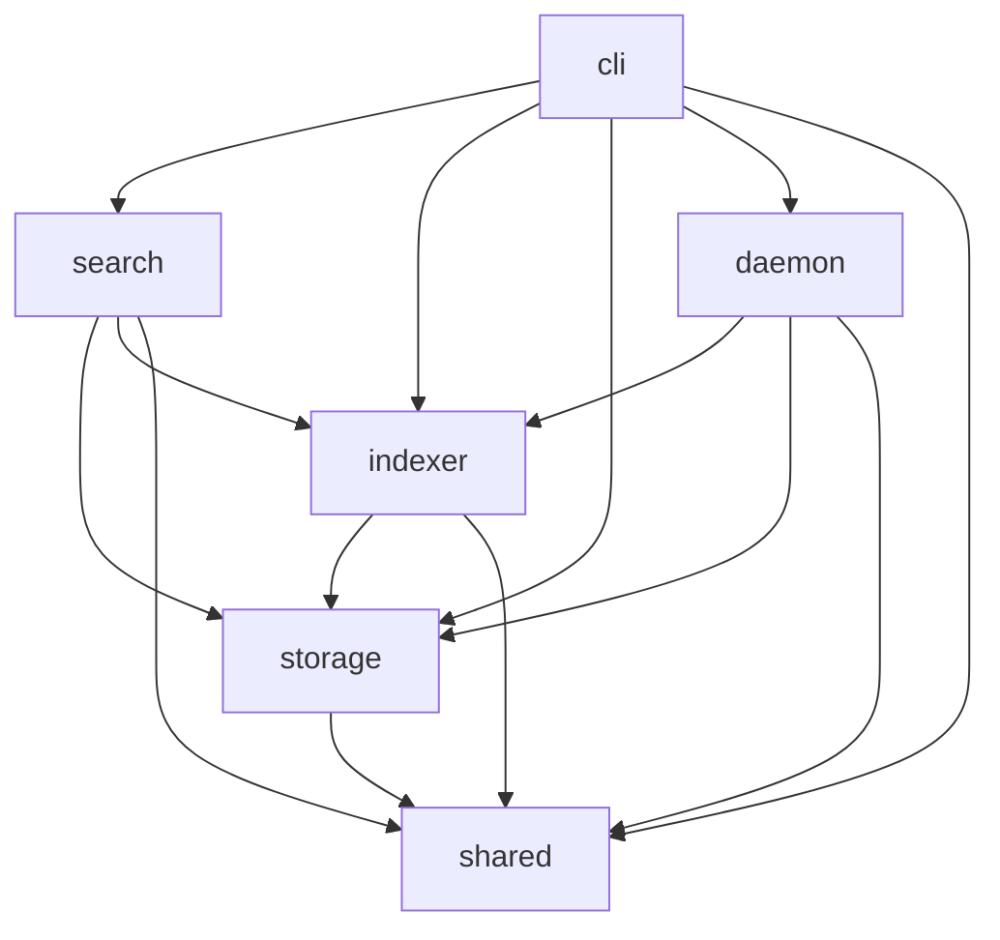

# Module & Component Breakdown

**Project**: 1up
**Analysis Date**: 2026-04-04
**Modules Analyzed**: 8

## Core Modules

### CLI (`src/cli/`)
**Purpose**: User-facing command parsing and output formatting via clap derive
**Files**: 12 | **Lines**: ~1,535

**Components**:
- **Cli** (`mod.rs`): Top-level CLI struct with `Command` enum dispatch, global `--format` (default human) and `--verbose` flags, `parse_positive_usize` validator for concurrency flags
- **SearchArgs** (`search.rs`): Hybrid search with `--limit` and auto-daemon-start
- **SymbolArgs** (`symbol.rs`): Symbol lookup with optional `--references` flag
- **ContextArgs** (`context.rs`): Context retrieval for `file:line` locations
- **StructuralArgs** (`structural.rs`): AST pattern search using tree-sitter S-expression queries
- **IndexArgs** (`index.rs`): Explicit indexing with `--jobs`, `--embed-threads`, embedder auto-download, progress spinners, and IndexingConfig resolution from CLI/env/registry
- **ReindexArgs** (`reindex.rs`): Force clear + full re-index with schema rebuild and `--jobs`/`--embed-threads` flags
- **StartArgs** (`start.rs`): Auto-init project, index with config, register project with IndexingConfig in registry, spawn daemon or SIGHUP existing
- **Formatter** (`output.rs`): Output formatting trait with JSON, Human, and Plain implementations; progress-aware rendering with parallelism and timing breakdown

**Dependencies**: search, indexer, storage, daemon, shared

### Search (`src/search/`)
**Purpose**: Search engines: hybrid semantic+FTS, symbol lookup, structural AST queries, and context retrieval
**Files**: 9 | **Lines**: ~2,993

**Components**:
- **HybridSearchEngine** (`hybrid.rs`): Orchestrates multi-signal search with RRF fusion; builds symbol name variants; degrades to FTS-only when embedder unavailable
- **RetrievalBackend** (`retrieval.rs`): Backend selection (SqlVectorV2 or FtsOnly) based on index state; auto-detects embedded embeddings
- **SymbolSearchEngine** (`symbol.rs`): Definition and reference lookup via SQL LIKE with Levenshtein fuzzy matching
- **ContextEngine** (`context.rs`): Source context retrieval using tree-sitter scope detection with line-range fallback
- **StructuralSearchEngine** (`structural.rs`): Tree-sitter S-expression queries across indexed files; fallback to directory scan
- **IntentDetector** (`intent.rs`): Signal-based query classification into Definition, Flow, Usage, Docs, General
- **Ranking** (`ranking.rs`): RRF fusion, intent-aware boosting using query string, path penalties, per-file caps
- **Formatter** (`formatter.rs`): Search result formatting utilities

**Dependencies**: storage, indexer (parser, scanner), shared

### Indexer (`src/indexer/`)
**Purpose**: Bounded staged indexing: scan, parse, embed, and single-writer persistence
**Files**: 6 | **Lines**: ~5,033

**Components**:
- **Pipeline** (`pipeline.rs`): Config-aware orchestrator accepting `IndexingConfig` for jobs/embed_threads/write_batch_files; hash preload, deleted-file cleanup, bounded `spawn_blocking` parse workers with sequence IDs, `BTreeMap` reorder buffer, batched embedding through single ONNX session, transactional file replacement, `TimingAccumulator` for per-stage metrics, persisted `IndexProgress`/`IndexParallelism`/`IndexStageTimings` to `.1up/index_status.json`
- **Parser** (`parser.rs`): Multi-language AST parsing via tree-sitter; 16 language grammars; role classification and symbol collection
- **Embedder** (`embedder.rs`): ONNX engine (all-MiniLM-L6-v2) with configurable intra-op `embed_threads`, auto-download, batch inference, mean pooling, L2 normalization
- **Scanner** (`scanner.rs`): Directory walking via ignore crate with .gitignore respect and binary filtering
- **Chunker** (`chunker.rs`): Sliding-window text chunking (60-line window, 10-line overlap) for unsupported languages flushed through the same staged pipeline

**Dependencies**: storage, shared

### Storage (`src/storage/`)
**Purpose**: Database access layer using libSQL with FTS5, vector indexing, and transactional file replacement helpers
**Files**: 5 | **Lines**: ~1,425

**Components**:
- **Db** (`db.rs`): Database connection wrapper with `open_rw`/`open_ro`/`open_memory` constructors, lock retry
- **Schema** (`schema.rs`): Schema initialization, validation, and rebuild with recovery guidance
- **Segments** (`segments.rs`): Segment CRUD, bulk file-hash preload, deleted-file cleanup, and single-file or multi-file transactional replacement helpers with configurable batch size
- **Queries** (`queries.rs`): SQL DDL and query constants for segments, FTS, meta, bulk hash preload, and vector retrieval

**Dependencies**: shared

### Daemon (`src/daemon/`)
**Purpose**: Background daemon for file watching, non-overlapping incremental re-indexing, and persisted per-project indexing settings
**Files**: 5 | **Lines**: ~1,167

**Components**:
- **Worker** (`worker.rs`): Main event loop with `tokio::select!`, per-project `ProjectRunState` (one active + one queued via dirty flag), burst-collapsing follow-up scheduling, SIGHUP reload of registry and settings, shared config resolution before dispatch into `run_with_config`
- **Lifecycle** (`lifecycle.rs`): Start/stop/ensure daemon with PID management, stale detection, and SIGHUP signaling
- **Watcher** (`watcher.rs`): Filesystem event monitoring via notify crate with debounce and non-blocking drain support
- **Registry** (`registry.rs`): Project registration with optional persisted `IndexingConfig` in JSON-based project list

**Dependencies**: indexer, storage, shared

### Shared (`src/shared/`)
**Purpose**: Cross-cutting types, config resolution, constants, error types, and project utilities
**Files**: 6 | **Lines**: ~875

**Components**:
- **Types** (`types.rs`): ParsedSegment, SearchResult, SymbolResult, ContextResult, StructuralResult, `IndexingConfig` (with `from_sources` resolution and validation), `IndexProgress`, `IndexParallelism`, `IndexStageTimings`, `IndexState`, `IndexPhase`, OutputFormat, SegmentRole, ReferenceKind
- **Config** (`config.rs`): XDG-compliant paths plus `resolve_indexing_config` with priority: CLI > env > registry > defaults; `read_positive_env` for env var validation
- **Constants** (`constants.rs`): Tuning constants, watcher debounce, env var names (`ONEUP_INDEX_JOBS`, `ONEUP_EMBED_THREADS`, `ONEUP_INDEX_WRITE_BATCH_FILES`), `MAX_AUTO_EMBED_THREADS`, `DEFAULT_INDEX_WRITE_BATCH_FILES`, embedding/search limits
- **Errors** (`errors.rs`): OneupError hierarchy with thiserror derives
- **Project** (`project.rs`): Project identity (UUID) and database path resolution

**Dependencies**: None (foundation module)

## Support Modules

### Tests (`tests/`)
**Files**: 3 | **Lines**: ~1,598
- `integration_tests.rs`: End-to-end pipeline and search tests with parallel parity tests (jobs=1 vs auto)
- `cli_tests.rs`: CLI subcommand tests via assert_cmd including concurrency flag validation
- `rewrite_sql_verification.rs`: SQL schema verification

### Benchmarks (`benches/`)
**Files**: 1 | **Lines**: ~400
- `search_bench.rs`: Criterion benchmarks for symbol lookup, FTS, retrieval backends

### Scripts (`scripts/`)
- `benchmark_parallel_indexing.sh`: Parallel indexing performance benchmarks via hyperfine (serial/auto/constrained), exposed as `just bench-parallel`

## Module Dependencies

## Module Metrics

| Module | Files | Lines | Components | Avg File Size |
|--------|-------|-------|------------|---------------|
| cli | 12 | 1,535 | 9 | 128 |
| search | 9 | 2,993 | 8 | 333 |
| indexer | 6 | 5,033 | 5 | 839 |
| storage | 5 | 1,425 | 4 | 285 |
| daemon | 5 | 1,167 | 4 | 233 |
| shared | 6 | 875 | 5 | 146 |
| tests | 3 | 1,598 | 3 | 533 |
| benches | 1 | 400 | 1 | 400 |

## Cross-Module Patterns

- **Layered Architecture**: CLI -> Search/Indexer -> Storage -> Shared; strict dependency hierarchy
- **Staged Pipeline with Bounded Parallelism**: Pipeline uses bounded spawn_blocking parse workers, sequence-ID reorder buffer, single embed session, transactional writer
- **Layered Config Resolution**: IndexingConfig resolved via priority chain: CLI flags > env vars > registry > computed defaults
- **Progress Persistence**: Pipeline persists IndexProgress to `.1up/index_status.json` at phase transitions; status reads them back
- **Graceful Degradation**: Missing embedder degrades hybrid search to FTS-only with user warnings
- **Auto-Start Daemon**: Search commands auto-start daemon via `lifecycle::ensure_daemon()`; start auto-inits project if needed
- **SIGHUP Reload**: Daemon handles SIGHUP to reload registry and per-project settings without restart

## External Dependencies

| Crate | Version | Purpose | Used By |
|-------|---------|---------|---------|
| clap | 4 | CLI argument parsing (derive) | cli |
| libsql | 0.9 | SQLite with vector + FTS5 | storage, search |
| tree-sitter | 0.26 | Multi-language AST parsing | indexer, search |
| ort | 2.0.0-rc.12 | ONNX runtime for embeddings | indexer |
| tokenizers | 0.22 | HuggingFace tokenizer | indexer |
| notify | 7 | Filesystem event watching | daemon |
| ignore | 0.4 | .gitignore-aware directory walking | indexer |
| reqwest | 0.13 | HTTP client for model download | indexer |
| sha2 | 0.11 | SHA-256 for incremental detection | indexer |
| nix | 0.31 | Unix signal/process management | daemon |
| thiserror | 2 | Derive-based error types | shared |
| nanospinner | - | Terminal progress spinners | cli |
| chrono | - | Timestamp serialization | shared |
