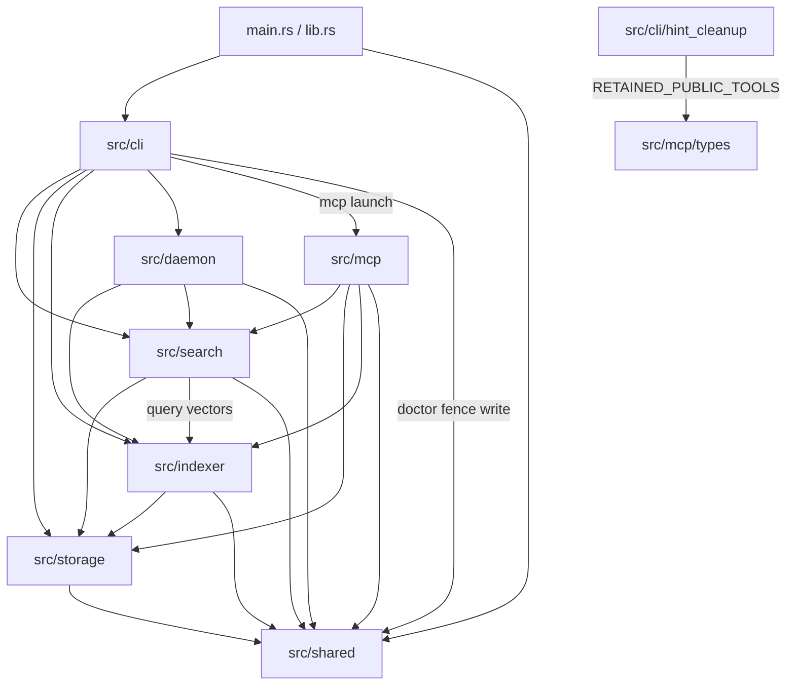

# Module & Component Breakdown

**Project**: 1up (v0.1.11)
**Analysis Date**: 2026-06-15
**Modules Analyzed**: 8 source modules (`src/*`) plus `tests`, `benches`, `evals`, `scripts`

> 1up is a local-first code-discovery substrate: a single Rust binary that indexes repositories with tree-sitter parsing, ONNX embeddings, and libSQL FTS/vector storage, then exposes search, get, symbol, context, structural, impact, and overview workflows to humans (CLI) and agents (MCP).

## Core Modules

### CLI (`src/cli/`)
**Purpose**: User-facing command surface and output rendering.
**Complexity**: Medium
**Dependencies**: `src/search`, `src/storage`, `src/indexer`, `src/daemon`, `src/mcp`, `src/shared`

Retained human discovery commands (`get`, `symbol`, `context`, `impact`) default to readable output and support `--plain` lean output; hidden compatibility discovery (`search`, `structural`) is lean-only. Maintenance commands (`init`, `index`, `reindex`, `start`, `stop`, `status`, `list`, `update`) render via `output` with worktree/context metadata. The module also owns `add-mcp`, the `mcp` launch path, and the now help-visible, opt-in `doctor` command.

**Key Components**:
- **`Cli` / `Command`** (`mod.rs`): Clap dispatch, visible help list, and default maintenance-format resolution. Rejects `--format` on core commands; hides `add-mcp`, `init`, `search`, `structural`, `mcp`, `index`, `reindex`, `update`, and internal `__worker`.
- **`DoctorCommand`** (`doctor.rs`): Opt-in, default-OFF diagnosis and cleanup of legacy 1up hints in `AGENTS.md`, `CLAUDE.md`, and `.github/copilot-instructions.md`. Read-only preview unless `--apply`; even then removes only a 1up-owned fenced span.
- **`hint_cleanup::classify`** (`hint_cleanup.rs`): Pure, filesystem-free classification and byte-exact fence-removal transform. Detects the owned `<!-- 1up:hint:begin -->`/`<!-- 1up:hint:end -->` fence, reports unfenced `oneup_*` tokens absent from `RETAINED_PUBLIC_TOOLS` as advisory-only findings, and is deterministic and idempotent.
- **`DiscoveryOutput`** (`discovery_output.rs`): Human-readable default rendering for `get`/`symbol`/`context`/`impact`; delegates `--plain` to the lean protocol.
- **`LeanRenderer`** (`lean.rs`): Stable lean grammar for hidden discovery commands and `--plain` output (search/symbol rows, get records, context blocks, structural snippets, impact `~P`/`~C` channels).
- **`Formatter` / `DoctorReport`** (`output.rs`): Human/plain/json maintenance output, progress/watch rendering, and the doctor report types (`DoctorReport`, `DoctorFileReport`, `DoctorFileStatus`, `StaleToken`).
- **`StartCommand`** (`start.rs`): Guarded daemon startup that resolves identity and `WorktreeContext`, skips redundant current-context indexing, and registers daemon settings.
- **`McpCommand`** (`mcp.rs`): Starts the MCP stdio server for a resolved project/worktree under a per-project lock and best-effort starts the daemon.

**Public Interface**:
```rust
pub async fn run(cli: Cli) -> anyhow::Result<()>;          // dispatch entry point
pub enum Command { Start, Status, List, Stop, Get, Symbol, Context, Impact, Doctor, /* hidden: AddMcp, Init, Search, Structural, Mcp, Index, Reindex, Update, Worker */ }
```

**Boundary**: `doctor` is the only path that ever writes to user instruction files — opt-in, default-OFF, `--apply`-gated, fence-only. `hello-agent` remains removed.

**Testing**: Inline `#[cfg(test)]` in `mod.rs` (help visibility, format resolution) and `hint_cleanup.rs` (classification/idempotency); black-box coverage in `tests/`.

### MCP Server (`src/mcp/`)
**Purpose**: Model Context Protocol stdio server — the canonical agent-facing discovery surface.
**Pattern**: rmcp tool router over a pure operation layer with structured envelopes.
**Dependencies**: `rmcp`, `src/search`, `src/storage`, `src/indexer`, `src/shared`

**Components**:
- **`OneupMcpServer`** (`server.rs`, `tools.rs`): Registers the retained **nine**-tool inventory and guidance that MCP search should precede broad grep/rg/find.
- **`McpOps`** (`ops.rs`): Pure operation layer for readiness, start/indexing, search, handle hydration, file-line context, symbol lookup, impact, structural search, and `compute_overview`.
- **`ToolEnvelope` / `NextAction` / `RETAINED_PUBLIC_TOOLS`** (`types.rs`): Deny-unknown-fields inputs, the canonical nine-tool constant array (the single source of truth reused by `hint_cleanup`), and the presentation-free `{ status, summary, data, next_actions }` envelope.

**Configuration**: `1up mcp --path <repo-or-worktree>` over stdio, one instance per project lock.
**Error Handling**: Every tool returns a `ToolEnvelope` with canonical follow-up actions; blocked readiness and indexing failures surface as structured `status`/`summary` rather than panics.

**Tools**: `oneup_status`, `oneup_start`, `oneup_search`, `oneup_get`, `oneup_symbol`, `oneup_context`, `oneup_impact`, `oneup_structural`, `oneup_overview` (new — a deterministic, read-only repository orientation digest).

### Search (`src/search/`)
**Purpose**: Retrieval and follow-up engines.
**Complexity**: High
**Dependencies**: `src/storage`, `src/indexer/embedder.rs`, `src/shared`

**Key Components**:
- **`HybridSearchEngine`** (`hybrid.rs`): Embeds queries when possible, detects query intent, combines vector/FTS/symbol candidates within a `SearchScope`, falls back to FTS on vector failure, ranks, and hydrates lean results.
- **`QueryIntent` / `detect_intent`** (`intent.rs`): Classifies a query into `Definition`, `Flow`, `Usage`, `Docs`, or `General` to bias ranking and symbol search.
- **`SearchScope`** (`scope.rs`): Encapsulates the `context_id` and `branch_status` that bound a search to one worktree context.
- **`OverviewEngine` / `RepositoryOverview`** (`overview.rs`): Deterministic, size-bounded orientation digest (statistics, most-referenced types, module map, cross-module dependencies, entry points) from bounded SQL aggregates over existing index tables. Pure read path: no schema changes, no embeddings, no persisted artifacts.
- **`SymbolSearchEngine`** (`symbol.rs`): Definitions/usages via exact, prefix, contains, and fuzzy fallback over normalized symbols.
- **`ImpactHorizonEngine`** (`impact.rs`): Bounded advisory impact from file/line/symbol/handle anchors using relation tails, owner fingerprints, edge identity, path affinity, role signals, and test-path guidance to split primary vs contextual results. Exposes `is_low_signal_path`, reused by overview.
- **`ContextEngine`** (`context.rs`): Reads source context around a location, preferring enclosing tree-sitter scopes.
- **`StructuralSearchEngine`** (`structural.rs`): Runs tree-sitter query patterns over context-scoped candidate files with ok/empty/error diagnostics.

**Public Interface**:
```rust
pub use hybrid::HybridSearchEngine;
pub use scope::SearchScope;
pub use structural::StructuralSearchEngine;
pub use symbol::SymbolSearchEngine;
```

**Boundary**: `search` stays discovery-oriented; `impact` returns advisory `expanded`/`empty`/`refused` envelopes with separate primary and contextual buckets; `overview` is a read-only digest.

### Indexer (`src/indexer/`)
**Purpose**: Repository scan, parse/chunk, embed, and storage pipeline.
**Complexity**: High
**Dependencies**: `src/storage`, `src/shared`, tree-sitter grammars, `ort`, `tokenizers`

**Key Components**:
- **`Pipeline`** (`pipeline.rs`): Full/scoped indexing with `WorktreeContext`, `indexed_files` metadata prefiltering, deleted-file cleanup, parser ordering, optional embedding, context-derived segment IDs, batched replacement, and progress telemetry. Routes markdown to the doc-section segmenter and source files to the parser.
- **Markdown doc-section segmenter** (`markdown.rs`): Parses markdown into heading-scoped `doc_section` segments with document-rooted breadcrumbs and `Docs` role, emits bounded deduped doc-to-code mention relations (`EDGE_IDENTITY_DOC_MENTION`), and falls back to plain doc chunks on parse failure.
- **`Parser`** (`parser.rs`): Multi-language tree-sitter parser for structural segments, complexity, roles, symbols, references, calls, conformance relations, and owner/edge evidence.
- **`Embedder` / `EmbeddingRuntime`** (`embedder.rs`): Verified local ONNX/tokenizer artifact lifecycle, secure model roots, download/activation, warm runtime reuse, and degraded-mode status (honors `ONEUP_DISABLE_MODEL_DOWNLOADS`).

**Testing**: Inline pipeline tests assert markdown routing to the doc segmenter and metadata-prefilter counters.

### Storage (`src/storage/`)
**Purpose**: libSQL persistence boundary (schema **v16**).
**Pattern**: Repository/transactional replace over a tuned project-local connection.
**Dependencies**: `libsql`, `src/shared`

**Data Models / Components**:
- **`Schema`** (`schema.rs`): Initializes/rebuilds/validates schema v16, checks `worktree_contexts`, `indexed_files.context_id`, and `segment_vectors.embedding_vec` type, and fails closed with `1up reindex` guidance for incompatible indexes.
- **`Segments`** (`segments.rs`): Stores/hydrates segments, generates context-derived IDs, resolves 12-char handles, replaces file batches transactionally, syncs vectors/symbols/relations, maintains `indexed_files`, and serves overview aggregates (`QualifyingTypeDefinition`).
- **`Relations`** (`relations.rs`): Persists call/reference/conformance/doc-mention descriptors with canonical target, lookup tail, qualifier fingerprint, and edge identity; serves directed lookups.
- **`queries.rs`**, **`db.rs`**: SQL constants and connection setup.

**Schema notes**: v16 changes markdown heading breadcrumbs to cleaned heading text (inline HTML stripped, link text kept, whitespace collapsed), so the embedding text shape changes and earlier indexes are incompatible. Vector writes/reads use `vector8(?)`; `segment_vectors.embedding_vec` is `FLOAT8(384)`; the vector index uses `compress_neighbors=float8`, `max_neighbors=32`.

**Error Handling**: Replace/delete flows keep segments, vectors, symbols, relations, FTS, and the `indexed_files` manifest transactionally aligned.

### Daemon (`src/daemon/`)
**Purpose**: Background indexing/search service with secure Unix IPC.
**Pattern**: Registry-backed watcher + framed-JSON search transport; non-Unix stubs.
**Dependencies**: `src/indexer`, `src/search`, `src/shared`, `notify`, `nix`

**Components**:
- **`DaemonWorker`** (`worker.rs`): Loads registered contexts, watches source roots, batches dirty scopes, indexes incrementally, serves bounded context-scoped search, and persists heartbeat/status.
- **`SearchService`** (`search_service.rs`): Secure Unix-domain transport with framed JSON `SearchRequest`/`SearchResponse`, request sanitization, version metadata, timeouts, and busy/unavailable responses.
- **`Registry`** (`registry.rs`): Concurrent-safe, context-aware project registry with non-destructive register/deregister/reload/mutate/save; provides `registration_context`.
- **`lifecycle.rs`**, **`watcher.rs`**, **`ipc.rs`**: Daemon lifecycle/lock handling, file watching, and IPC framing (each with non-Unix stubs where applicable).

**Boundary**: `impact` and `overview` run locally through CLI/MCP storage reads, not daemon IPC.

## Support Modules

### Shared (`src/shared/`)
**Shared Functions / Contracts**:
- **`types.rs`**: Result types, `WorktreeContext`, `OutputFormat`, search/symbol/structural/impact result contracts.
- **`project.rs`**: Project ID creation, initialized-state checks, `WorktreeContext` construction, and `state_root`/`source_root` resolution mapping linked worktrees to main-repo state.
- **`fs.rs`**: Secure filesystem boundary — XDG/project root validation, root-clamped path checks, secure dir creation, and atomic replace operations:
  - `atomic_replace` clamps to the `.1up` secure state dir with a restrictive 1up mode.
  - **`atomic_replace_within_project_root`** (new): clamps to the user project root, preserves the existing file mode, rejects symlink leaves and out-of-root targets, then writes temp + fsync + atomic rename. Backs the `doctor` fence removal.
- **`symbols.rs`**: Symbol normalization and edge-identity constants.
- **`constants.rs`**: `SCHEMA_VERSION = 16`, `DEFAULT_INDEX_CONTEXT_ID`, model/artifact constants, `ONEUP_DISABLE_MODEL_DOWNLOADS` env var.
- **`update.rs`**, **`progress.rs`**, **`errors.rs`**, **`config.rs`**: Self-update helpers, progress telemetry, error contracts, and config paths.

### Tests / Benches / Evals / Scripts
- **`tests/`**: Black-box and focused regression coverage for CLI, MCP, daemon, index/search correctness, release assets, installer script, security check, and SQL-rewrite invariants.
- **`benches/`**: Criterion guardrails for symbol lookup, FTS, chunked content search, retrieval backend selection, and impact horizon behavior.
- **`evals/`**: TypeScript/promptfoo evaluation support for search quality, recall, MCP tool-use assertions, and benchmark comparisons.
- **`scripts/` + `lefthook.yml`**: Indexing/vector benchmarks, installer, security/release evidence, update-manifest publication, MCP smoke verification, and main-branch protection.

## Module Dependencies

### Dependency Graph

```mermaid
graph TD
    Main[main.rs / lib.rs] --> CLI[src/cli]
    Main --> Shared[src/shared]
    CLI --> Search[src/search]
    CLI --> Storage[src/storage]
    CLI --> Indexer[src/indexer]
    CLI --> Daemon[src/daemon]
    CLI -->|mcp launch| MCP[src/mcp]
    CLI -->|doctor fence write| Shared
    MCP --> Search
    MCP --> Storage
    MCP --> Indexer
    Search --> Storage
    Search -->|query vectors| Indexer
    Indexer --> Storage
    Daemon --> Indexer
    Daemon --> Search
    Search --> Shared
    Storage --> Shared
    Indexer --> Shared
    Daemon --> Shared
    MCP --> Shared
    CLIhint["src/cli/hint_cleanup"] -->|RETAINED_PUBLIC_TOOLS| MCPtypes["src/mcp/types"]
```

### Import Analysis
- **Most Imported**: `src/shared` — every runtime module depends on its types, constants, secure FS, `WorktreeContext`, project identity, and error contracts.
- **Most Dependencies**: `src/cli` — fans out to search, storage, indexer, daemon, mcp, and shared.
- **Notable cross-module link**: `src/cli/hint_cleanup.rs` depends on `src/mcp/types.rs::RETAINED_PUBLIC_TOOLS` so the doctor staleness rule has a single source of truth (no hardcoded stale list).
- **Circular Dependencies**: None observed; the dependency direction is consistently CLI/MCP → search/indexer → storage → shared.

## Module Metrics

| Module | Files | Lines | Complexity | Test Coverage |
|--------|-------|-------|------------|---------------|
| src root (`main.rs`/`lib.rs`) | 2 | 107 | Low | Boot path; covered via integration |
| `src/cli` | 23 | 9,008 | Medium | Inline + black-box CLI suites |
| `src/mcp` | 5 | 3,451 | Medium | MCP smoke + tool-use evals |
| `src/search` | 12 | 10,394 | High | Inline + benches + recall evals |
| `src/indexer` | 7 | 9,934 | High | Inline pipeline/parser tests |
| `src/storage` | 6 | 7,318 | High | Inline schema/segment tests |
| `src/daemon` | 10 | 4,537 | Medium | Inline + integration |
| `src/shared` | 10 | 5,561 | Medium | Inline (incl. fs atomic-replace tests) |

## Code Quality Insights

### Well-Structured Modules
- **`src/cli` (doctor + hint_cleanup)**: Clean pure-core + thin-IO-shell split — `hint_cleanup` holds filesystem-free, unit-testable classification and byte-exact fence removal while `doctor.rs` owns reading, rendering, and the gated write.
- **`src/mcp`**: A real public contract — nine tools behind a presentation-free `ToolEnvelope` with canonical next actions, decoupled from rendering via the pure `McpOps` layer.
- **`src/search/overview.rs`**: Strictly bounded, deterministic read path that reuses existing index tables and impact heuristics (`is_low_signal_path`) with no schema or embedding side effects.

### Areas for Improvement
- **`src/search/impact.rs` (4,312 lines)** and **`src/storage/segments.rs` (3,722 lines)**: Large single files concentrating relation/edge logic and persistence; candidates for sub-module extraction as they continue to grow.
- **`src/indexer/parser.rs` / `pipeline.rs`**: High intrinsic complexity (multi-language parsing, worktree-scoped batching); benefits from the heavy inline test coverage already present.

### Architectural Patterns
- **CLI/MCP dual surface over shared engines**: Humans and agents use different transports while preserving one local indexing/search contract.
- **Single source of truth for tool identity**: `RETAINED_PUBLIC_TOOLS` (`src/mcp/types.rs`) defines the canonical nine tools and is reused by the doctor staleness rule.
- **Lean handle handoff**: `search → get/context → impact/symbol` flows use short durable segment handles instead of embedding full bodies.
- **Intent- and scope-aware candidate-first retrieval**: Query intent and worktree `SearchScope` bound and bias vector/FTS/symbol candidates before ranking.
- **Heading-scoped doc indexing with doc-to-code mentions**: Markdown becomes first-class `doc_section` segments linked to code, feeding search, impact, and overview.
- **Transactional search-index maintenance**: Batched replacement keeps segments, vectors, symbols, relations, FTS, and the manifest synchronized.
- **Secure local state with root-clamped writes**: `atomic_replace` clamps to `.1up` state; `atomic_replace_within_project_root` clamps to the user project root and preserves existing modes.
- **Worktree-aware project identity**: `source_root` can differ from `state_root` while `context_id` and branch metadata keep search/progress/status scoped.
- **Version-aware degraded paths**: Stale schema (v16), missing embeddings, daemon mismatch, and model failures degrade or refuse with explicit `1up reindex` guidance instead of silent corruption.
