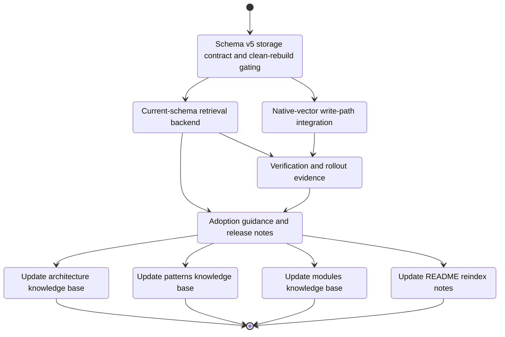

# Development Tasks: SQL Retrieval Layer Rewrite

**Feature ID**: rewrite-sql
**Status**: In Progress
**Progress**: 44% (4 of 9 tasks)
**Estimated Effort**: 4.25 days
**Started**: 2026-04-02

## Overview

Rewrite the SQL retrieval layer used by `1up search` so rebuilt schema-v5 indexes use
libsql-native vector storage and `vector_top_k(...)`, while stale pre-rewrite local index data is
treated as disposable cache. The active plan assumes a clean break: no migration bridge, no
backfill work, and no compatibility window remain in scope.

## Implementation DAG

**Parallel Groups**:

1. [T1] - Current-schema storage and clean-rebuild handling define the storage contract the rest of the rewrite uses
2. [T2, T3] - Read-path refactor and write-path integration can proceed in parallel once the schema contract is fixed
3. [T4] - Verification work depends on the new read and write paths being present
4. [T5] - Documentation should reflect the final implemented behavior and evidence gates

**Dependencies**:

- T2 -> T1 (reason: the retrieval backend needs the final vector column and SQL contract)
- T3 -> T1 (reason: the indexer must write to the new schema shape)
- T4 -> [T2, T3] (reason: latency, quality, and freshness checks require the full read and write path)
- T5 -> [T2, T4] (reason: docs should describe the shipped retrieval path and its rollout evidence)

**Critical Path**: T1 -> T2 -> T4 -> T5

## Task Subflow



## Task Breakdown

### Group 1: Storage Contract

- [x] **T1**: Introduce schema-v5 storage contract and clean-rebuild gating `[complexity:medium]`

    **Reference**: [design.md#schema-versioning-and-clean-break](design.md#schema-versioning-and-clean-break)

    **Effort**: 6 hours

    **Implementation Summary**:

    - **Files**: `src/storage/{schema.rs,queries.rs}`, `src/shared/constants.rs`, `src/cli/{index.rs,reindex.rs,search.rs,start.rs,status.rs,structural.rs,symbol.rs}`, `src/daemon/worker.rs`, `src/storage/segments.rs`, `tests/{cli_tests.rs,integration_tests.rs}`
    - **Approach**: Bumped the storage contract to schema v5, added `embedding_vec` plus vector-index DDL and required-object validation, replaced implicit reset/migration with explicit `prepare_for_write` and `rebuild` flows, and tightened missing/stale index handling to require `1up reindex`.
    - **Deviations**: None
    - **Tests**: `cargo test` 293/293 passing; `cargo clippy --all-targets -- -D warnings` still fails on pre-existing warnings in `src/indexer/{embedder.rs,parser.rs,pipeline.rs,scanner.rs}`

    **Validation Summary**:

    | Dimension | Status |
    |-----------|--------|
    | Discipline | ✅ PASS |
    | Accuracy | ✅ PASS |
    | Completeness | ✅ PASS |
    | Quality | ✅ PASS |
    | Testing | ✅ PASS |
    | Commit | ✅ PASS |
    | Comments | ✅ PASS |

    **Execution Flow**:

    ```mermaid
    stateDiagram-v2
        [*] --> T1
        state "Introduce schema-v5 storage contract and clean-rebuild gating" as T1
        T1 --> [*]
    ```

    **Acceptance Criteria**:

    - [x] `src/storage/schema.rs` and `src/storage/queries.rs` define schema v5 with `segments.embedding_vec`, the libsql vector index, and current-schema validation helpers required by the rewritten retrieval path.
    - [x] Fresh or explicitly rebuilt local indexes are created directly as schema v5 without any in-place migration path from pre-rewrite schemas.
    - [x] Stale, missing, or partially created local indexes fail closed with explicit `1up reindex` guidance instead of legacy reads, backfill steps, or compatibility-mode execution.
    - [x] Partial or failed schema-v5 creation leaves the local index marked unusable until an explicit clean rebuild succeeds.

### Group 2: Read and Write Path

- [x] **T2**: Refactor search around explicit current-schema retrieval backends `[complexity:medium]`

    **Reference**: [design.md#retrieval-backend-split](design.md#retrieval-backend-split)

    **Effort**: 8 hours

    **Implementation Summary**:

    - **Files**: `src/search/{hybrid.rs,retrieval.rs,mod.rs}`, `src/storage/queries.rs`
    - **Approach**: Added an explicit retrieval backend split, moved native vector and FTS SQL hydration into `src/search/retrieval.rs`, and kept `HybridSearchEngine` focused on intent detection, symbol lookup, backend dispatch, fusion, and degraded fallback when semantic retrieval is unavailable.
    - **Deviations**: None
    - **Tests**: `cargo test retrieval::tests --lib` 6/6 passing; `cargo test hybrid::tests --lib` 4/4 passing; `cargo test search --test integration_tests` 5/5 passing; `cargo clippy --all-targets -- -D warnings` still fails on pre-existing warnings in `src/indexer/{embedder.rs,parser.rs,pipeline.rs,scanner.rs}`

    **Validation Summary**:

    | Dimension | Status |
    |-----------|--------|
    | Discipline | ✅ PASS |
    | Accuracy | ✅ PASS |
    | Completeness | ✅ PASS |
    | Quality | ✅ PASS |
    | Testing | ✅ PASS |
    | Commit | ✅ PASS |
    | Comments | ✅ PASS |

    **Execution Flow**:

    ```mermaid
    stateDiagram-v2
        [*] --> T2
        state "Refactor search around explicit current-schema retrieval backends" as T2
        T2 --> [*]
    ```

    **Acceptance Criteria**:

    - [x] `src/search/hybrid.rs` delegates retrieval through an explicit backend split that supports `SqlVectorV2` and `FtsOnly` modes while preserving the existing CLI and `ranking.rs` contracts.
    - [x] `src/search/retrieval.rs` serializes query embeddings for `vector(?)`, calls `vector_top_k('idx_segments_embedding', vector(?), ?)` for semantic candidates, and hydrates segment rows by joined `v.id`.
    - [x] The local libsql query path preserves SQL candidate ordering without selecting `v.distance`, so fusion behavior remains deterministic.
    - [x] Current-schema FTS and symbol retrieval remain available in all supported modes, while stale indexes stop with explicit rebuild guidance rather than attempting compatibility fallback.

- [x] **T3**: Update the indexing write path for native vectors only `[complexity:medium]`

    **Reference**: [design.md#write-path-changes](design.md#write-path-changes)

    **Effort**: 6 hours

    **Implementation Summary**:

    - **Files**: `src/indexer/pipeline.rs`, `src/storage/{queries.rs,segments.rs}`, `src/search/{hybrid.rs,symbol.rs}`
    - **Approach**: Removed legacy embedding and q8 writes from the active schema-v5 path, stored embeddings only through `embedding_vec` via `vector(?)`, and updated the affected storage/search tests to cover the native-vector write contract.
    - **Deviations**: None
    - **Tests**: `cargo test --lib` 137/137 passing; `cargo clippy --all-targets -- -D warnings` still fails on pre-existing warnings in `src/indexer/{embedder.rs,parser.rs,scanner.rs}`

    **Validation Summary**:

    | Dimension | Status |
    |-----------|--------|
    | Discipline | ✅ PASS |
    | Accuracy | ✅ PASS |
    | Completeness | ✅ PASS |
    | Quality | ✅ PASS |
    | Testing | ✅ PASS |
    | Commit | ✅ PASS |
    | Comments | ✅ PASS |

    **Execution Flow**:

    ```mermaid
    stateDiagram-v2
        [*] --> T3
        state "Update the indexing write path for native vectors only" as T3
        T3 --> [*]
    ```

    **Acceptance Criteria**:

    - [x] `SegmentInsert`, `segments::upsert_segment`, and `src/indexer/pipeline.rs` populate `embedding_vec` through the schema-v5 storage contract used by rebuilt indexes.
    - [x] Legacy embedding columns, dual-write behavior, and compatibility-only backfill assumptions are removed from the active write path.
    - [x] Stale local indexes are recreated through explicit `1up reindex` before normal write flows resume; routine indexing does not attempt automatic upgrade work.
    - [x] Incremental add, edit, and delete indexing behavior remains intact on rebuilt schema-v5 indexes.

### Group 3: Verification

- [x] **T4**: Add automated verification and rollout evidence for the clean-break rewrite `[complexity:medium]`

    **Reference**: [design.md#testing-strategy](design.md#testing-strategy)

    **Effort**: 8 hours

    **Implementation Summary**:

    - **Files**: `tests/rewrite_sql_verification.rs`, `benches/search_bench.rs`, `scripts/benchmark_rewrite_sql.sh`, `.rp1/work/features/rewrite-sql/validation-artifacts.md`
    - **Approach**: Added rewrite-specific end-to-end coverage for stale and partial index guidance, degraded FTS-only behavior, freshness, and read-only source-file guarantees; expanded the benchmark surface with native-vector retrieval and hybrid-fusion benches; added a repeatable baseline-vs-candidate benchmark script and recorded the resulting latency and quality evidence in-repo.
    - **Deviations**: Used a generated mixed-language fixture for the benchmark corpus so baseline and candidate runs stay hermetic and directly comparable on the same local machine.
    - **Tests**: `cargo test` 171/171 passing; `cargo bench --bench search_bench --no-run` passing; `scripts/benchmark_rewrite_sql.sh` completed and wrote `target/rewrite-sql-bench/20260402-173829/summary.md`; `cargo clippy --all-targets -- -D warnings` still fails on pre-existing warnings in `src/indexer/{embedder.rs,parser.rs,scanner.rs}`

    **Execution Flow**:

    ```mermaid
    stateDiagram-v2
        [*] --> T4
        state "Add automated verification and rollout evidence for the clean-break rewrite" as T4
        T4 --> [*]
    ```

    **Acceptance Criteria**:

    - [x] Unit and integration coverage validate retrieval-mode selection, current-schema enforcement, native-vector hydration on v5 indexes, degraded `FtsOnly` fallback, and unchanged search-result JSON contracts.
    - [x] Integration coverage verifies that stale, missing, or partial local indexes return explicit `1up reindex` guidance and that rebuilt indexes preserve file add, edit, and delete freshness expectations.
    - [x] Benchmark artifacts capture baseline-versus-candidate median and p95 latency for representative semantic and hybrid queries, plus rebuild or startup cost where it materially affects adoption readiness.
    - [x] A representative query set or relevance corpus shows no material regression versus the current baseline before rollout is treated as ready.

### Group 4: Rollout Readiness

- [ ] **T5**: Capture adoption guidance and rollout evidence `[complexity:medium]`

    **Reference**: [design.md#deployment-design](design.md#deployment-design)

    **Effort**: 4 hours

    **Acceptance Criteria**:

    - [ ] Rollout notes describe the supported adoption path as explicit `1up reindex` for stale local indexes, with no migration bridge, legacy read mode, or compatibility window.
    - [ ] Adoption evidence summarizes latency, quality, degradation, freshness, and rebuild behavior in a form maintainers can use for go or no-go decisions.
    - [ ] User and operator guidance explains expected behavior for stale, missing, or partial local indexes and the recovered state after a clean rebuild.

### User Docs

- [ ] **TD1**: Update `.rp1/context/architecture.md` - Search data flow and storage schema `[complexity:simple]`

    **Reference**: [design.md#documentation-impact](design.md#documentation-impact)

    **Type**: edit

    **Target**: `.rp1/context/architecture.md`

    **Section**: Search data flow and storage schema

    **KB Source**: `architecture.md:Data Flow: Search`

    **Effort**: 30 minutes

    **Acceptance Criteria**:

    - [ ] The architecture doc describes the native-vector retrieval path, `v.id`-based row hydration, and the current-schema-only reindex-required policy for stale local indexes.

- [ ] **TD2**: Update `.rp1/context/patterns.md` - Database access and testing conventions `[complexity:simple]`

    **Reference**: [design.md#documentation-impact](design.md#documentation-impact)

    **Type**: edit

    **Target**: `.rp1/context/patterns.md`

    **Section**: Database access and testing conventions

    **KB Source**: `patterns.md:Database Access`

    **Effort**: 30 minutes

    **Acceptance Criteria**:

    - [ ] The patterns guide reflects `embedding_vec`, `vector_top_k(...)`, current-schema validation, and the required benchmark and verification coverage without migration or backfill guidance.

- [ ] **TD3**: Update `.rp1/context/modules.md` - `src/search/` and `src/storage/` `[complexity:simple]`

    **Reference**: [design.md#documentation-impact](design.md#documentation-impact)

    **Type**: edit

    **Target**: `.rp1/context/modules.md`

    **Section**: `src/search/` and `src/storage/`

    **KB Source**: `modules.md:src/search`

    **Effort**: 30 minutes

    **Acceptance Criteria**:

    - [ ] The module inventory includes `src/search/retrieval.rs`, updated current-schema gating responsibilities, and the native-vector write contract without legacy-read or backfill descriptions.

- [ ] **TD4**: Update `README.md` - Search and index reindex notes `[complexity:simple]`

    **Reference**: [design.md#documentation-impact](design.md#documentation-impact)

    **Type**: edit

    **Target**: `README.md`

    **Section**: Search and index reindex notes

    **KB Source**: `index.md:Quick Orientation`

    **Effort**: 30 minutes

    **Acceptance Criteria**:

    - [ ] The README explains that stale local indexes are disposable cache and that explicit `1up reindex` is the supported adoption and recovery path for the rewritten retrieval layer.

## Acceptance Criteria Checklist

- [ ] REQ-001: Current indexed-search entry points and machine-readable outputs remain stable on rebuilt current-schema indexes, with no mandatory CLI or JSON contract rewrite.
- [ ] REQ-002: Release readiness includes repeatable baseline-versus-candidate latency evidence showing lower median and p95 semantic or hybrid query latency on representative workloads.
- [ ] REQ-003: Representative query evaluation shows no material relevance regression versus the current baseline.
- [ ] REQ-004: Added, modified, and deleted repository content remains reflected in indexed search within current operational expectations after rebuild onto schema v5.
- [ ] REQ-005: When advanced retrieval is unavailable or impaired, supported commands still return the best available search behavior with clear degraded-mode signaling.
- [ ] REQ-006: Adoption review includes latency, quality, indexing stability, and rebuild or startup evidence strong enough for a go or no-go decision.
- [ ] REQ-007: Stale or missing local indexed data is recovered through explicit clean rebuild behavior; no migration bridge, backfill strategy, or compatibility window is required.
- [ ] REQ-008: Search, indexing, and rebuild flows preserve the product's read-only repository guarantee.
- [ ] REQ-009: Delivery includes the SQL retrieval-layer rewrite itself, not only assessment or benchmarking artifacts.

## Definition of Done

- [ ] All tasks completed
- [ ] All AC verified
- [ ] Code reviewed
- [ ] Docs updated
