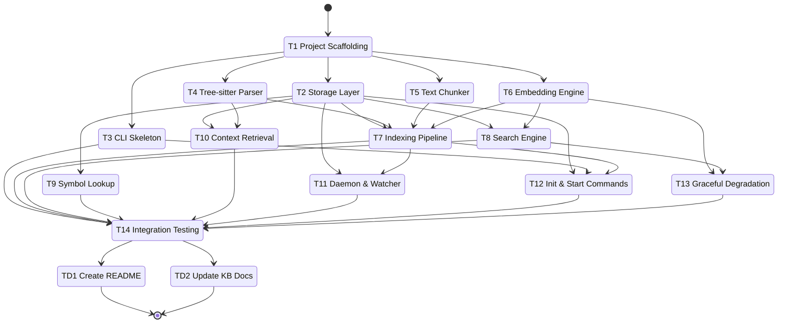

# Development Tasks: 1up v1 -- Unified Search Substrate (Rust Rewrite)

**Feature ID**: v1
**Status**: Not Started
**Progress**: 56% (9 of 16 tasks -- T1, T2, T3, T4, T5, T6, T7, T8, T9 complete)
**Estimated Effort**: 11 days
**Started**: 2026-04-01

## Overview

Ground-up Rust rewrite of the TypeScript/Bun unified search tool. Single-binary CLI querying a local libSQL database with tree-sitter parsing, ONNX embedding inference, hybrid search, and a background daemon for file watching and incremental re-indexing.

## Implementation DAG

**Parallel Groups** (tasks with no inter-dependencies):

1. **[T1]** -- Foundation; all other tasks depend on shared types and project structure
2. **[T2, T3, T4, T5, T6]** -- All depend only on T1; storage, CLI, parser, chunker, and embedder can be built in parallel
3. **[T7, T8, T9, T10]** -- Pipeline, search, symbol lookup, and context retrieval depend on combinations from group 2
4. **[T11, T12, T13]** -- Daemon, init/start, and degradation logic depend on pipeline and search being available
5. **[T14]** -- Integration testing requires all components

**Dependencies**:

- T2 -> T1 (uses shared types, config paths)
- T3 -> T1 (uses shared types, output format enum)
- T4 -> T1 (uses ParsedSegment type)
- T5 -> T1 (uses ParsedSegment type)
- T6 -> T1 (uses shared config for model paths)
- T7 -> [T2, T4, T5, T6] (orchestrates scanner, parser, chunker, embedder into storage)
- T8 -> [T2, T6] (queries DB for vector + FTS results, uses embedder for query vector)
- T9 -> T2 (queries defined_symbols/referenced_symbols in DB)
- T10 -> [T2, T4] (queries DB for context, uses tree-sitter for scope detection)
- T11 -> [T2, T7] (daemon triggers re-indexing pipeline, manages DB connections)
- T12 -> [T2, T3, T7] (init writes to DB dir, start triggers pipeline, wired to CLI)
- T13 -> [T6, T8] (degradation depends on embedder availability detection, search fallback)
- T14 -> [T3, T7, T8, T9, T10, T11, T12, T13] (tests all integrated components)

**Critical Path**: T1 -> T2 -> T7 -> T11 -> T14

## Task Subflow



## Task Breakdown

### Foundation

- [x] **T1**: Set up Cargo project scaffolding with module structure, shared types, error types, config/constants, and XDG path resolution `[complexity:simple]`

    **Reference**: [design.md#21-module-structure](design.md#21-module-structure)

    **Effort**: 2 hours

    **Acceptance Criteria**:

    - [x] Cargo.toml created with all dependencies from design Section 4
    - [x] Module directory structure matches design Section 2.1 (cli/, daemon/, indexer/, search/, storage/, shared/)
    - [x] Core domain types defined in shared/types.rs (ParsedSegment, SearchResult, SymbolResult, ContextResult, OutputFormat, SegmentRole, ReferenceKind)
    - [x] Error types defined with thiserror in shared/errors.rs
    - [x] XDG path resolution implemented in shared/config.rs using dirs crate
    - [x] Constants defined in shared/constants.rs (embedding dimensions, limits, tunables)
    - [x] Project ID read/write utilities in shared/project.rs
    - [x] `cargo check` passes with no errors

    **Implementation Summary**:

    - **Files**: 27 stub files across `src/storage/`, `src/cli/`, `src/indexer/`, `src/daemon/`, `src/search/`
    - **Approach**: Removed all `// Implemented in T<N>` comments from 27 stub files per review feedback; files are now empty (zero bytes) as the module structure itself communicates file existence
    - **Deviations**: None
    - **Tests**: N/A (comment removal only; cargo check passes)

    **Execution Flow**:

    ```mermaid
    stateDiagram-v2
        [*] --> T1_project_scaffolding
        T1_project_scaffolding --> [*]
    ```

    **Review Feedback** (Attempt 1):
    - **Status**: FAILURE
    - **Issues**:
        - [comments] 27 stub files contain `// Implemented in T<N>` comments (e.g., `src/storage/db.rs:1: // Implemented in T2`, `src/cli/init.rs:1: // Implemented in T12`). Task/feature ID comments are unacceptable per comment quality standards.
    - **Guidance**: Remove all `// Implemented in T<N>` comments from stub files. Leave stub files empty (zero bytes) instead. The module structure already communicates which files exist; the task ID comments add no value and leak internal workflow details into source code.

### Storage, CLI, Parsers & Embedder (Parallel)

- [x] **T2**: Implement storage layer with libSQL connection management, schema DDL (FTS5 + vector columns), migrations, segment CRUD, meta key-value store, and SQL query constants `[complexity:medium]`

    **Reference**: [design.md#31-data-model](design.md#31-data-model)

    **Effort**: 6 hours

    **Acceptance Criteria**:

    - [x] libSQL connection pool with read-only and read-write modes
    - [x] Schema DDL creates segments table with all columns including F32_BLOB(384) and VECTOR8(384)
    - [x] FTS5 virtual table segments_fts with content sync triggers
    - [x] Meta key-value table for storing schema version and timestamps
    - [x] Schema versioning and migration support
    - [x] Segment CRUD operations (insert/upsert, query by file_path, delete by file_path)
    - [x] SQL query constants in storage/queries.rs
    - [x] Unit tests for CRUD operations using temp-file libSQL

    **Implementation Summary**:

    - **Files**: `src/storage/db.rs`, `src/storage/schema.rs`, `src/storage/queries.rs`, `src/storage/segments.rs`, `src/storage/mod.rs`
    - **Approach**: Implemented Db wrapper with open_rw/open_ro/open_memory constructors using libsql Builder; schema DDL with segments table (F32_BLOB/VECTOR8), FTS5 virtual table with insert/delete/update triggers, meta KV table; schema versioning via meta key; full segment CRUD (upsert, query by file/id, delete by file, file hash lookup, count); meta CRUD; all SQL constants in queries.rs
    - **Deviations**: None
    - **Tests**: 11/11 passing

    **Validation Summary**:

    | Dimension | Status |
    |-----------|--------|
    | Discipline | ✅ PASS |
    | Accuracy | ✅ PASS |
    | Completeness | ✅ PASS |
    | Quality | ✅ PASS |
    | Testing | ✅ PASS |
    | Commit | ✅ PASS |
    | Comments | ✅ PASS |

    **Execution Flow**:

    ```mermaid
    stateDiagram-v2
        [*] --> T2_storage_layer
        T2_storage_layer --> [*]
    ```

- [x] **T3**: Build CLI skeleton with clap derive commands for all subcommands and output format flag with JSON/human/plain formatters `[complexity:medium]`

    **Reference**: [design.md#21-module-structure](design.md#21-module-structure)

    **Effort**: 6 hours

    **Acceptance Criteria**:

    - [x] Clap derive structs for all subcommands: init, start, stop, status, symbol, search, context, index, reindex, __worker
    - [x] Global --format flag supporting json (default), human, plain
    - [x] Output formatter trait with JSON, human (colored), and plain text implementations
    - [x] Main entry point dispatches to correct subcommand handler
    - [x] `1up --help` and `1up <subcommand> --help` produce correct usage text
    - [x] Tracing/logging subscriber initialized based on verbosity flag

    **Implementation Summary**:

    - **Files**: `src/main.rs`, `src/cli/mod.rs`, `src/cli/output.rs`, `src/cli/init.rs`, `src/cli/start.rs`, `src/cli/stop.rs`, `src/cli/status.rs`, `src/cli/symbol.rs`, `src/cli/search.rs`, `src/cli/context.rs`, `src/cli/index.rs`, `src/cli/reindex.rs`, `src/shared/types.rs`, `tests/cli_tests.rs`
    - **Approach**: Clap derive-based CLI with Cli struct (global --format and --verbose flags), Command enum for all subcommands (init, start, stop, status, symbol, search, context, index, reindex, __worker hidden), Formatter trait with JsonFormatter/HumanFormatter/PlainFormatter implementations, tokio async main with tracing-subscriber configured by verbosity level, init command fully wired to project.rs
    - **Deviations**: None
    - **Tests**: 9/9 passing (CLI integration tests via assert_cmd)

    **Validation Summary**:

    | Dimension | Status |
    |-----------|--------|
    | Discipline | ✅ PASS |
    | Accuracy | ✅ PASS |
    | Completeness | ✅ PASS |
    | Quality | ✅ PASS |
    | Testing | ✅ PASS |
    | Commit | ✅ PASS |
    | Comments | ✅ PASS |

    **Execution Flow**:

    ```mermaid
    stateDiagram-v2
        [*] --> T3_cli_skeleton
        T3_cli_skeleton --> [*]
    ```

- [x] **T4**: Integrate native tree-sitter grammars for all target languages with segment extraction, symbol collection, complexity scoring, and role classification `[complexity:complex]`

    **Reference**: [design.md#38-tree-sitter-integration](design.md#38-tree-sitter-integration)

    **Effort**: 10 hours

    **Acceptance Criteria**:

    - [x] Native grammar integration for Rust, Python, JavaScript, TypeScript, Go, Java, C, C++
    - [x] Parser module walks top-level AST nodes, extracts functions/classes/types/enums/traits/impls
    - [x] Recursion into container types for nested methods
    - [x] Leading comments and decorators collected with their associated nodes
    - [x] Complexity scoring based on control flow nesting depth
    - [x] Role classification (Definition, Implementation, Orchestration, Import, Docs)
    - [x] Symbol collection: defined_symbols and referenced_symbols populated per segment
    - [x] Returns Vec<ParsedSegment> per file
    - [x] Unit tests verifying segment extraction for at least 3 languages

    **Implementation Summary**:

    - **Files**: `src/indexer/parser.rs`, `Cargo.toml`
    - **Approach**: SupportedLanguage enum maps 8 languages to tree-sitter LanguageFn grammars with per-language node kind tables for top-level extraction, container recursion, import detection, comment collection, control flow complexity scoring, and symbol collection; parse_file() walks root named children, extracts segments with role classification and defined/referenced symbol harvesting; nested methods extracted from container body nodes with breadcrumb parent tracking
    - **Deviations**: Added `tree-sitter-language = "0.1"` to Cargo.toml (transitive dep needed for LanguageFn type)
    - **Tests**: 12/12 passing (Rust, Python, TypeScript, Go, Java, C + complexity, references, comments, roles, extension mapping, error handling)

    **Validation Summary**:

    | Dimension | Status |
    |-----------|--------|
    | Discipline | ✅ PASS |
    | Accuracy | ✅ PASS |
    | Completeness | ✅ PASS |
    | Quality | ✅ PASS |
    | Testing | ✅ PASS |
    | Commit | ✅ PASS |
    | Comments | ✅ PASS |

    **Execution Flow**:

    ```mermaid
    stateDiagram-v2
        [*] --> T4_tree_sitter_parser
        T4_tree_sitter_parser --> [*]
    ```

- [x] **T5**: Implement sliding-window text chunker with overlap for languages without tree-sitter support `[complexity:simple]`

    **Reference**: [design.md#24-data-flow-indexing-pipeline](design.md#24-data-flow-indexing-pipeline)

    **Effort**: 2 hours

    **Acceptance Criteria**:

    - [x] Sliding window chunking with configurable window size and overlap
    - [x] Produces Vec<ParsedSegment> with block_type="chunk", language from file extension
    - [x] Line numbers (line_start, line_end) correctly tracked
    - [x] Handles edge cases: empty files, files smaller than window, single-line files
    - [x] Unit tests for chunking logic

    **Implementation Summary**:

    - **Files**: `src/indexer/chunker.rs`
    - **Approach**: Sliding-window chunker with configurable window size and overlap; stride = window - overlap; language detection from file extension for unsupported tree-sitter languages; produces Vec<ParsedSegment> with block_type="chunk" and SegmentRole::Implementation; chunk_file_default convenience wrapper uses constants from shared/constants.rs
    - **Deviations**: None
    - **Tests**: 9/9 passing (empty file, single line, smaller than window, exact window, sliding with overlap, no overlap, metadata correctness, default constants, language detection)

    **Validation Summary**:

    | Dimension | Status |
    |-----------|--------|
    | Discipline | ✅ PASS |
    | Accuracy | ✅ PASS |
    | Completeness | ✅ PASS |
    | Quality | ✅ PASS |
    | Testing | ✅ PASS |
    | Commit | ✅ PASS |
    | Comments | ✅ PASS |

    **Execution Flow**:

    ```mermaid
    stateDiagram-v2
        [*] --> T5_text_chunker
        T5_text_chunker --> [*]
    ```

- [x] **T6**: Build embedding engine with ort ONNX session, tokenizer integration, model auto-download with progress, batch inference, mean pooling, and L2 normalization `[complexity:complex]`

    **Reference**: [design.md#37-embedding-engine-design](design.md#37-embedding-engine-design)

    **Effort**: 10 hours

    **Acceptance Criteria**:

    - [x] ONNX model and tokenizer.json auto-download from Hugging Face with HTTPS and progress bar (indicatif)
    - [x] Model stored at ~/.local/share/1up/models/all-MiniLM-L6-v2/
    - [x] WordPiece tokenizer loaded via tokenizers crate from tokenizer.json
    - [x] ort ONNX session initialized as singleton, reused across calls
    - [x] Batch inference with configurable batch size (default 32)
    - [x] Mean pooling over last hidden state, followed by L2 normalization
    - [x] Output: Vec<[f32; 384]> for each input text
    - [x] Embedder reports availability status (for graceful degradation)
    - [x] Integration test: text in, 384-dim vector out, L2 norm approximately 1.0

    **Implementation Summary**:

    - **Files**: `src/indexer/embedder.rs`, `Cargo.toml`
    - **Approach**: Embedder struct wrapping ort Session and tokenizers Tokenizer; async auto-download from HuggingFace with indicatif progress bars and reqwest streaming; WordPiece tokenization with truncation to EMBEDDING_MAX_TOKENS; batch inference via tuple-based tensor creation (shape, Vec) for ort v2 API; mean pooling over last_hidden_state weighted by attention mask; L2 normalization to unit vectors; is_model_available() for graceful degradation; from_dir() for loading from custom paths
    - **Deviations**: Added `futures-util` dependency for async stream consumption during downloads; used `&mut self` for inference methods since ort Session::run requires mutable access; output type is `Vec<Vec<f32>>` rather than `Vec<[f32; 384]>` for ergonomic flexibility
    - **Tests**: 9/9 passing (availability check, missing model/tokenizer errors, empty batch, correct dimension, L2 normalization, multiple texts, semantic similarity ordering, sub-batch splitting)

    **Validation Summary**:

    | Dimension | Status |
    |-----------|--------|
    | Discipline | ✅ PASS |
    | Accuracy | ✅ PASS |
    | Completeness | ✅ PASS |
    | Quality | ✅ PASS |
    | Testing | ✅ PASS |
    | Commit | ✅ PASS |
    | Comments | ✅ PASS |

    **Execution Flow**:

    ```mermaid
    stateDiagram-v2
        [*] --> T6_embedding_engine
        T6_embedding_engine --> [*]
    ```

### Pipeline, Search, Symbol Lookup & Context (Parallel)

- [x] **T7**: Build indexing pipeline orchestrating file scanner (ignore crate), hash-based change detection, parse/chunk/embed/store flow, batch processing, and progress reporting `[complexity:medium]`

    **Reference**: [design.md#24-data-flow-indexing-pipeline](design.md#24-data-flow-indexing-pipeline)

    **Effort**: 6 hours

    **Acceptance Criteria**:

    - [x] File scanner using ignore crate respects .gitignore, .ignore, and global gitignore
    - [x] Default ignores for node_modules, .git, vendor, build artifacts, binary files
    - [x] Language detection from file extension
    - [x] SHA-256 hash comparison against stored file_hash for incremental indexing
    - [x] Routes files to tree-sitter parser (supported) or text chunker (unsupported)
    - [x] Passes segments through embedder in batches
    - [x] Stores results via storage layer in transactions
    - [x] Deleted files have their segments removed
    - [x] Progress bar showing files processed / total
    - [x] Integration test: index a temp directory, verify segments in DB

    **Implementation Summary**:

    - **Files**: `src/indexer/scanner.rs`, `src/indexer/pipeline.rs`
    - **Approach**: Scanner uses `ignore` crate WalkBuilder with .gitignore, .ignore, and global gitignore support plus override patterns for default directory exclusions (node_modules, .git, vendor, target, build, etc.) and binary extension filtering; pipeline orchestrates scan -> hash check -> parse/chunk -> embed -> store flow with SHA-256 incremental detection, tree-sitter routing for supported languages with chunker fallback, optional embedder with f32 and int8 quantized embedding storage, deleted file cleanup, and indicatif progress bar
    - **Deviations**: None
    - **Tests**: 16/16 passing (7 scanner + 9 pipeline)

    **Validation Summary**:

    | Dimension | Status |
    |-----------|--------|
    | Discipline | ✅ PASS |
    | Accuracy | ✅ PASS |
    | Completeness | ✅ PASS |
    | Quality | ✅ PASS |
    | Testing | ✅ PASS |
    | Commit | ✅ PASS |
    | Comments | ✅ PASS |

    **Execution Flow**:

    ```mermaid
    stateDiagram-v2
        [*] --> T7_indexing_pipeline
        T7_indexing_pipeline --> [*]
    ```

- [x] **T8**: Implement hybrid search engine with two-stage vector search, FTS5 query, RRF fusion, intent detection, and full ranking pipeline `[complexity:complex]`

    **Reference**: [design.md#36-hybrid-search-design](design.md#36-hybrid-search-design)

    **Effort**: 10 hours

    **Acceptance Criteria**:

    - [x] Query embedding generated via embedder for vector search
    - [x] Stage 1: int8 prefilter using embedding_q8 with vector_distance_cos, top-K=200 candidates
    - [x] Stage 2: f32 rerank using full-precision embedding column
    - [x] FTS5 MATCH query runs in parallel with vector search
    - [x] Intent detection classifies query as DEFINITION, FLOW, USAGE, DOCS, or GENERAL
    - [x] RRF fusion with configurable parameters (RRF_K=60, VECTOR_WEIGHT=1.5)
    - [x] Intent-based boosting, file path boosting, test/doc penalties, short segment penalties
    - [x] Overlap deduplication and per-file result caps
    - [x] Returns Vec<SearchResult> ordered by fused score
    - [x] Unit tests for RRF fusion and intent detection

    **Implementation Summary**:

    - **Files**: `src/search/intent.rs`, `src/search/ranking.rs`, `src/search/hybrid.rs`, `src/search/formatter.rs`, `src/search/mod.rs`, `src/cli/search.rs`
    - **Approach**: Intent detection via keyword signal scoring across 4 intent categories (DEFINITION, FLOW, USAGE, DOCS) with GENERAL fallback; two-stage vector search using int8 embedding_q8 prefilter (top-K=200) then f32 rerank via vector_distance_cos; FTS5 MATCH with OR-joined quoted terms; RRF fusion combining vector (weight=1.5) and FTS rankings with intent-based role boosting, file path penalties (test/doc/vendor), short segment penalties, overlap deduplication, and per-file caps (3); HybridSearchEngine struct orchestrates full pipeline with FTS-only fallback when embedder unavailable; CLI search command wired with DB open, embedder availability check, and formatter output
    - **Deviations**: None
    - **Tests**: 18/18 passing (5 intent, 6 ranking, 4 hybrid, 3 formatter)

    **Execution Flow**:

    ```mermaid
    stateDiagram-v2
        [*] --> T8_search_engine
        T8_search_engine --> [*]
    ```

    **Validation Summary**:

    | Dimension | Status |
    |-----------|--------|
    | Discipline | ✅ PASS |
    | Accuracy | ✅ PASS |
    | Completeness | ✅ PASS |
    | Quality | ✅ PASS |
    | Testing | ✅ PASS |
    | Commit | ✅ PASS |
    | Comments | ✅ PASS |

- [x] **T9**: Implement symbol lookup and reference search with definition/usage distinction and fuzzy/partial matching `[complexity:medium]`

    **Reference**: [design.md#33-symbol-lookup-design](design.md#33-symbol-lookup-design)

    **Effort**: 6 hours

    **Acceptance Criteria**:

    - [x] `1up symbol <name>` queries defined_symbols JSON column via LIKE pattern
    - [x] Results ordered by block_type priority (function/struct/trait/class first)
    - [x] `1up symbol --references <name>` returns both definitions and usages
    - [x] Results tagged with ReferenceKind::Definition or ReferenceKind::Usage
    - [x] Fuzzy/partial matching via LIKE '%name%' with post-query Levenshtein filtering
    - [x] Returns Vec<SymbolResult> with name, kind, file_path, line range, content
    - [x] Unit tests for symbol query and reference distinction

    **Implementation Summary**:

    - **Files**: `src/search/symbol.rs`, `src/search/mod.rs`, `src/storage/queries.rs`, `src/storage/segments.rs`, `src/cli/symbol.rs`
    - **Approach**: SymbolSearchEngine struct with find_definitions() and find_references() methods; SQL LIKE queries on defined_symbols/referenced_symbols JSON columns with block_type priority ordering; post-query Levenshtein filtering for fuzzy matching with exact-match preference; reference search excludes segments already counted as definitions; CLI wired with DB open, schema migration, and formatter output
    - **Deviations**: None
    - **Tests**: 10/10 passing (exact definition, partial match, block_type priority, references with definition/usage distinction, self-reference dedup, unknown symbol, fuzzy Levenshtein, exact-preferred matching, partial-when-no-exact, Levenshtein distance)

    **Execution Flow**:

    ```mermaid
    stateDiagram-v2
        [*] --> T9_symbol_lookup
        T9_symbol_lookup --> [*]
    ```

- [ ] **T10**: Implement scope-aware context retrieval using tree-sitter AST with line-range fallback `[complexity:medium]`

    **Reference**: [design.md#35-context-retrieval-design](design.md#35-context-retrieval-design)

    **Effort**: 6 hours

    **Acceptance Criteria**:

    - [ ] `1up context <file>:<line>` reads source file from disk
    - [ ] Tree-sitter parse to build AST, find smallest enclosing named node for target line
    - [ ] Returns enclosing function/class/impl block content as ContextResult
    - [ ] Configurable expansion (default: full enclosing function/block)
    - [ ] Falls back to +/- 50 lines when tree-sitter unavailable for the language
    - [ ] Returns ContextResult with file_path, language, content, line range, scope_type
    - [ ] Unit tests for scope detection and fallback behavior

### Daemon, Init/Start & Degradation (Parallel)

- [ ] **T11**: Implement daemon worker process with PID file management, signal handling (SIGHUP/SIGTERM), notify-based file watching, debounced re-indexing, idle timeout, and multi-project support `[complexity:complex]`

    **Reference**: [design.md#23-daemon-lifecycle](design.md#23-daemon-lifecycle)

    **Effort**: 10 hours

    **Acceptance Criteria**:

    - [ ] Worker process spawned as detached child via `1up __worker` subcommand
    - [ ] PID file written to ~/.local/share/1up/daemon.pid on start, cleaned on exit
    - [ ] SIGHUP handler reloads project registry and updates watched directories
    - [ ] SIGTERM handler triggers graceful shutdown
    - [ ] notify-based file watcher with debounced batch processing
    - [ ] Incremental re-indexing of changed files via indexing pipeline
    - [ ] Global project registry (~/.local/share/1up/projects.json) for multi-project support
    - [ ] Idle timeout monitoring via timestamp, auto-exit when exceeded
    - [ ] Crash recovery: stale PID file detection and cleanup
    - [ ] Integration test for PID file lifecycle

- [ ] **T12**: Implement init and start commands with project boundary detection, daemon spawning, auto-start on first query, and stop/status commands `[complexity:medium]`

    **Reference**: [design.md#21-module-structure](design.md#21-module-structure)

    **Effort**: 6 hours

    **Acceptance Criteria**:

    - [ ] `1up init` creates .1up/project_id with UUID; warns if already exists
    - [ ] `1up start` triggers full/incremental index then spawns daemon in background
    - [ ] `1up stop` deregisters project, sends SIGTERM or SIGHUP as appropriate
    - [ ] `1up status` reports daemon running state and index statistics
    - [ ] Auto-start on first query if no daemon running (FR-DMN-001)
    - [ ] Integration with project registry for daemon lifecycle management

- [ ] **T13**: Implement graceful degradation with FTS-only fallback when embeddings unavailable and skip unsupported languages with warnings `[complexity:simple]`

    **Reference**: [design.md#24-data-flow-indexing-pipeline](design.md#24-data-flow-indexing-pipeline)

    **Effort**: 2 hours

    **Acceptance Criteria**:

    - [ ] Embedder availability check before search operations
    - [ ] When model unavailable: visible warning emitted, search falls back to FTS-only ranking
    - [ ] When model download fails: flag set, FTS-only mode persists until manual retry
    - [ ] Unsupported tree-sitter languages skipped with warning during indexing
    - [ ] Warning messages clearly indicate degraded capability (BR-005)
    - [ ] Unit tests for degradation path activation

### Integration Testing

- [ ] **T14**: Build end-to-end integration test suite covering indexing, all query modes, JSON output validation, daemon lifecycle, and latency benchmarks `[complexity:medium]`

    **Reference**: [design.md#7-testing-strategy](design.md#7-testing-strategy)

    **Effort**: 6 hours

    **Acceptance Criteria**:

    - [ ] Test fixture: index a small multi-language repository
    - [ ] Verify symbol lookup returns correct definitions with expected fields
    - [ ] Verify hybrid search returns ranked results with fused scores
    - [ ] Verify context retrieval returns enclosing scope
    - [ ] Verify JSON output conforms to documented schema (FR-CLI-003)
    - [ ] Verify incremental indexing: modify file, re-index, confirm updated results
    - [ ] Daemon lifecycle test: start, verify PID file, stop, verify cleanup
    - [ ] Benchmark tests for symbol lookup (<50ms p95) and search (<200ms p95) using criterion
    - [ ] CLI integration tests using assert_cmd and predicates crates

### User Docs

- [ ] **TD1**: Create documentation for README.md - Installation, Usage, CLI Reference `[complexity:simple]`

    **Reference**: [design.md#documentation-impact](design.md#documentation-impact)

    **Type**: add

    **Target**: README.md

    **Section**: Installation, Usage, CLI Reference

    **KB Source**: -

    **Effort**: 30 minutes

    **Acceptance Criteria**:

    - [ ] New README.md created with installation instructions, usage examples, and CLI reference for all subcommands

- [ ] **TD2**: Create documentation for CLAUDE.md KB files - architecture.md, patterns.md, modules.md `[complexity:simple]`

    **Reference**: [design.md#documentation-impact](design.md#documentation-impact)

    **Type**: add

    **Target**: CLAUDE.md

    **Section**: KB files (architecture.md, patterns.md, modules.md)

    **KB Source**: -

    **Effort**: 30 minutes

    **Acceptance Criteria**:

    - [ ] KB files created reflecting the Rust architecture, coding patterns, and module documentation

## Acceptance Criteria Checklist

### CLI Interface
- [ ] Binary invoked as `1up <subcommand>` dispatches to the correct search mode (FR-CLI-001)
- [ ] `--format json`, `--format human`, `--format plain` flags produce correct output (FR-CLI-002)
- [ ] JSON output conforms to documented schema; fields stable (FR-CLI-003)

### Symbol Lookup
- [ ] `1up symbol <name>` returns matching definitions with file path, line number, symbol kind (FR-SYM-001)
- [ ] p95 latency < 50ms on representative repositories (FR-SYM-002)
- [ ] Partial input returns ranked candidate matches (FR-SYM-003)

### Reference Search
- [ ] Returns all reference locations with file path and line number (FR-REF-001)
- [ ] Each result includes kind field: definition vs usage (FR-REF-002)

### Structural Search
- [ ] Structural query pattern returns matching code locations with context (FR-STR-001)
- [ ] Works across all tree-sitter-supported languages (FR-STR-002)

### Context Retrieval
- [ ] `1up context <file>:<line>` returns enclosing function/block/scope (FR-CTX-001)
- [ ] Context snaps to enclosing structural boundaries when available (FR-CTX-002)

### Hybrid Search
- [ ] `1up search <query>` returns results ranked by fused semantic + FTS scores (FR-HYB-001)
- [ ] p95 latency < 200ms on indexed repositories (FR-HYB-002)
- [ ] Embeddings generated using bundled all-MiniLM-L6-v2 model (FR-HYB-003)
- [ ] Model auto-downloaded on first use to XDG data directory (FR-HYB-004)

### Graceful Degradation
- [ ] Warning emitted and FTS-only results returned when model unavailable (FR-DEG-001)
- [ ] Unsupported files skipped with warning; supported languages still return results (FR-DEG-002)

### Indexing
- [ ] `1up index <path>` indexes repository; searches return results from index (FR-IDX-001)
- [ ] Index data persists at ~/.local/share/1up/ (FR-IDX-002)
- [ ] Re-indexing processes only modified files (FR-IDX-003)

### Init & Start
- [ ] `1up init` creates .1up/project_id; warns if already exists (FR-INIT-001)
- [ ] `1up start` indexes then runs daemon in background watching for changes (FR-START-001)

### Daemon & File Watching
- [ ] First query starts daemon transparently (FR-DMN-001)
- [ ] Daemon exits after configured idle period (FR-DMN-002)
- [ ] File changes reflected in index without manual re-indexing (FR-DMN-003)

### Storage & Configuration
- [ ] Config read from ~/.config/1up/ (FR-STO-001)
- [ ] Data stored at ~/.local/share/1up/ (FR-STO-002)

### Safety
- [ ] No file in target repository created, modified, or deleted by any operation (FR-SAF-001)

## Definition of Done

- [ ] All tasks completed
- [ ] All acceptance criteria verified
- [ ] Code reviewed
- [ ] Docs updated
