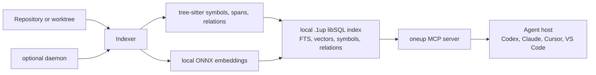

<p align="center">
  
</p>

<p align="center">
  <strong>Local code intelligence that helps agents finish code-discovery tasks 33% faster and 25% cheaper.</strong>
</p>

<p align="center">
  
  &nbsp;&nbsp;
  
  &nbsp;&nbsp;
  
  &nbsp;&nbsp;
  
  &nbsp;&nbsp;
  
</p>

<p align="center">
  Stop asking agents to guess with <code>grep</code>/<code>rg</code>. 1up provides a high-fidelity semantic layer for coding tools, replacing broad searches with focused local intelligence to navigate and trace repositories with surgical precision.
</p>

`1up` is a local MCP plugin for Codex, Claude Code, Cursor, VS Code, and other MCP-capable agents. Install it once, point it at a repository or linked worktree, and the agent gets eight `oneup_*` tools to check readiness, search by intent, read exact spans, verify symbols, trace impact, and inspect structure.

Under the hood, `1up` builds a local `.1up` index from tree-sitter parsed symbols and spans, local ONNX embeddings for vector search, full-text search, and relation metadata for impact analysis.

In the pinned [Product Proof](#product-proof) benchmark, `1up` finished the same code-discovery tasks **33% faster** and **25% cheaper** than raw `rg` workflows, with a **7/7 pass rate** versus **5/7** for baseline.

Setup is intentionally small: install `1up` once, connect it from each project you want your agent to understand, then keep using your agent as normal. For single-project config details and host-specific examples, see [docs/mcp-installation.md](docs/mcp-installation.md).

##  Start Here

The fastest setup is to paste the prompt below into the host or harness you want to configure (for example, Claude Code).

### Option 1: Paste This Prompt Into Your Agent

This is the fastest path. Paste this into that host or harness, and let it handle the setup.

````markdown
# Configure 1up MCP for this repository.

§RULES
- Install or update `1up` globally.
- Configure the `oneup` MCP server in project/workspace scope.
- Use explicit `--path` config only when project/workspace config is not available.
- Add the repository instruction hint only if equivalent guidance does not already exist.
- Do not try to restart this active host or verify newly added MCP tools from it.

§PROC
1. Install or update the global `1up` binary:
   - If `1up` is not installed, install it with: `curl -fsSL https://1up.rp1.run/setup.sh | bash`
   - If present: `1up update`
   - Verify: `1up --version`
2. Add or update project/workspace MCP config:
   - Server name: `oneup`
   - Command: `1up`
   - Args: `["mcp"]`
   - JSON shape: `{"mcpServers":{"oneup":{"command":"1up","args":["mcp"]}}}`
   - For TOML hosts, create the equivalent `oneup` server entry.
3. Insert this minimal 1up hint into the repo instruction file only if equivalent guidance does not already exist (`AGENTS.md`, `CLAUDE.md`, `.github/copilot-instructions.md`, or host equivalent). Prefer an existing file; create the host's normal repo instruction file only if none exists. Do not duplicate the hint.

  ```markdown
  For code-discovery questions in this repo, use the `oneup` MCP tools before broad raw search. Use `oneup_status` when readiness is unknown, `oneup_start` only when indexing or rebuilding is needed, `oneup_search` for ranked discovery, `oneup_get` to hydrate result handles, `oneup_context` for precise file-line context, `oneup_symbol` for definitions/references, `oneup_impact` for likely blast radius, and `oneup_structural` for tree-sitter pattern searches. Use `rg`, `grep`, or `find` first only for exact literals, regexes, non-code files, or when the MCP server is unavailable.
  ```

4. If MCP config was added or changed, ask the user to restart/reload this host so it can load `oneup`. The active host cannot restart itself. Ask the user to approve/trust `oneup` if the host prompts after restart.

§OUT
- `1up --version`
- MCP config file changed
- repo instruction file changed
- restart/approval message given to user, if needed
````

For host-specific examples, approval steps, and troubleshooting, see [docs/mcp-installation.md](docs/mcp-installation.md).

### Option 2: Install 1up Yourself

Use this human quick setup path when you want to install the binary from your terminal before adding the manual MCP server entry.

Install `1up`:

```sh
curl -fsSL https://1up.rp1.run/setup.sh | bash
```

If the installer says it updated your shell `PATH`, follow its printed instruction or open a new shell before verifying.

Verify the install:

```sh
1up --version
```

Then use the manual MCP setup reference to connect a repository or active worktree to your host or harness.

### Option 3: Manual MCP Config

Manual setup is useful when a team wants to review config changes before applying them. Use the focused reference in [docs/mcp-installation.md](docs/mcp-installation.md) for Claude Code, Cursor, VS Code, Copilot, generic MCP JSON clients, approval steps, and troubleshooting.

##  Use 1up From The Terminal

`1up` is primarily built as an agent tool, but the same index is useful from a human shell.

If you use `1up` directly from a shell, the basic loop is:

```sh
1up start
1up status
1up list
1up stop
```

By default, these commands print readable labels and summaries. Add `--plain` when you need stable script output:

```sh
1up start --plain
1up status --plain
1up list --plain
1up stop --plain
```

`--plain` is only for shell scripts and terminal automation. Agents should use the `oneup_*` MCP tools through the configured `oneup` server.

##  What The Agent Gets

Once connected, your agent gets one canonical MCP server named `oneup` and eight retained tools:

| Agent need | MCP tool |
|---|---|
| Check whether the repository is ready | `oneup_status` |
| Create, refresh, or rebuild the local index | `oneup_start` |
| Search by meaning or intent | `oneup_search` |
| Read selected result handles | `oneup_get` |
| Find definitions and references | `oneup_symbol` |
| Read precise file-line context | `oneup_context` |
| Explore likely blast radius | `oneup_impact` |
| Run tree-sitter structural pattern searches | `oneup_structural` |

A good agent flow looks like this:

1. Call `oneup_status`.
2. Call `oneup_start` only if readiness says indexing or rebuilding is needed.
3. Use `oneup_search` to find the right area of the codebase.
4. Use `oneup_get` to inspect selected result handles.
5. Use `oneup_context` when precise file-line context is needed.
6. Use `oneup_symbol` when definitions or references must be complete.
7. Use `oneup_impact` when planning a change and checking likely follow-up files.
8. Use `oneup_structural` for explicit tree-sitter pattern searches.

`oneup_search` is for discovery, not proof of completeness. Agents should switch to `oneup_symbol` for definition and reference completeness, and they should keep `rg`, `grep`, or `find` for exact literal checks after 1up has narrowed the scope.

##  Architecture

`1up` is a single local binary with three visible pieces: an indexer, an optional daemon, and an MCP server. The indexer turns source files into a local libSQL index with FTS, vectors, symbols, source spans, and relation rows. The MCP server exposes that index as read-only `oneup_*` tools that guide agents from readiness to ranked discovery to exact evidence.



The important boundary is locality: source code, embeddings, and index state stay on the developer machine. Agent hosts talk to `1up` through MCP tools instead of receiving broad raw search dumps.

##  What 1up Does Locally

`1up` indexes the repository you configure and keeps that index local. The MCP server helps agents find relevant code without dumping huge raw search results into context.

It can:

- Build and refresh a local `.1up` index for the configured repository.
- Share `.1up` state from the main worktree while keeping linked worktree results scoped to the active source root and branch context.
- Search by intent with semantic and keyword ranking.
- Return compact handles that agents can hydrate with `oneup_get`.
- Return repository-scoped file-line context through `oneup_context`.
- Follow symbols and references when a ranked search is not enough.
- Suggest likely impact areas from a result handle, symbol, or file anchor.

It does not:

- Edit source files.
- Refactor code.
- Run tests for the agent.
- Execute arbitrary shell commands through MCP.
- Mutate host MCP configuration.

Host configuration remains owned by the host itself or by the user through manual config review.

##  What To Expect

- The first semantic run may download verified [`all-MiniLM-L6-v2`](https://huggingface.co/sentence-transformers/all-MiniLM-L6-v2) model artifacts from Hugging Face.
- The first index of a medium-size repository can take 5 to 10 minutes on a modern machine. After that, changes are indexed incrementally in the background.
- On macOS and Linux, one background daemon can watch all registered projects. Connecting an MCP server or running `1up start` in another repository registers that project and asks the existing daemon to reload.
- Linked Git worktrees share the main worktree `.1up` directory, but status, list, readiness, indexing, and search are scoped to the active worktree context.
- Windows currently focuses on local indexing workflows rather than daemon-backed `start`.
- If embeddings are unavailable, `1up` can fall back to full-text search instead of failing outright.
- If the agent cannot see the `1up` binary, use an absolute binary path in the host config or launch the host from an environment where `1up --version` works.

The install script targets macOS on Apple Silicon and Linux on arm64 or x86_64. Intel macOS and other platforms are not in the published release matrix yet.

##  Update 1up

Run:

```sh
1up update
```

This downloads the latest release, verifies it, and replaces the installed binary in place. Re-running `1up update` when you are already current is a no-op and exits 0.

To pin a specific install version:

```sh
curl -fsSL https://1up.rp1.run/setup.sh | env 1UP_VERSION=v0.1.8 bash
```

##  Product Proof

The public benchmark and eval corpus for this repo is the pinned `emdash` repository. Search comparisons use raw `rg` workflows as the baseline, not another semantic search tool.

```sh
just bench
just bench-parallel
just eval-parallel --summary
```

`just bench` runs the search comparison on pinned `emdash` checkouts and reports `1up` against raw `rg` command sequences for the same tasks. `just bench-parallel` runs the parallel indexing benchmark on the same pinned `emdash` corpus and reports release-built wall-clock medians for full index, mostly unchanged incremental, write-heavy incremental, and daemon refresh scenarios.

The current adoption evals score retained MCP tool calls and chains: `oneup_status`, `oneup_start`, `oneup_search`, `oneup_get`, `oneup_symbol`, `oneup_context`, `oneup_impact`, and `oneup_structural`. They fail broad raw `grep`, `rg`, or `find` discovery in the 1up variant, while still allowing exact literal verification after MCP discovery narrows scope.

Archived result (Sonnet, 2026-04-19, lean CLI; both agents forbidden from sub-agent delegation for apples-to-apples comparison):

| Task | 1up | baseline | Winner (time) |
|------|:---:|:--------:|:------:|
| Search Stack | 61s / $0.37 | 108s / $0.55 | 1up |
| WordPress Import | 90s / $0.48 | 130s / $0.70 | 1up |
| Plugin Architecture | 82s / $0.41 | 126s / $0.73 | 1up |
| Live Content Query | 70s / $0.44 | 81s / $0.60 | 1up |
| FTSManager Impact | 54s / $0.36 | 54s / $0.28 | 1up (tie) |
| Schema Registry Impact | 96s / $0.55 | 113s / $0.43 | 1up |
| Plugin Runner Impact | 62s / $0.31 | 155s / $0.62 | 1up |
| **Total** | **515s / $2.93** | **768s / $3.91** | **1up** |

**1up vs baseline: -33% time, -25% cost.** 1up wins time on 6 of 7 tasks and ties the 7th. Quality average: 1up 0.787 vs baseline 0.705. Pass rate: 7/7 for 1up, 5/7 for baseline. Full results and cross-run history: [`evals/results/`](evals/results/).

##  Project Docs

- MCP setup guide: [docs/mcp-installation.md](docs/mcp-installation.md)
- Release history: [CHANGELOG.md](CHANGELOG.md)
- Release runbook: [RELEASE.md](RELEASE.md)
- Contributor policy and merge expectations: [CONTRIBUTING.md](CONTRIBUTING.md)
- Source-build and engineering reference: [DEVELOPMENT.md](DEVELOPMENT.md)

##  Building From Source

Build from source only if you are hacking on `1up` itself:

```sh
git clone https://github.com/rp1-run/1up.git
cd 1up
cargo install --path .
```

See [DEVELOPMENT.md](DEVELOPMENT.md) for the full contributor setup.

##  License

Apache 2.0. See [LICENSE](LICENSE).
